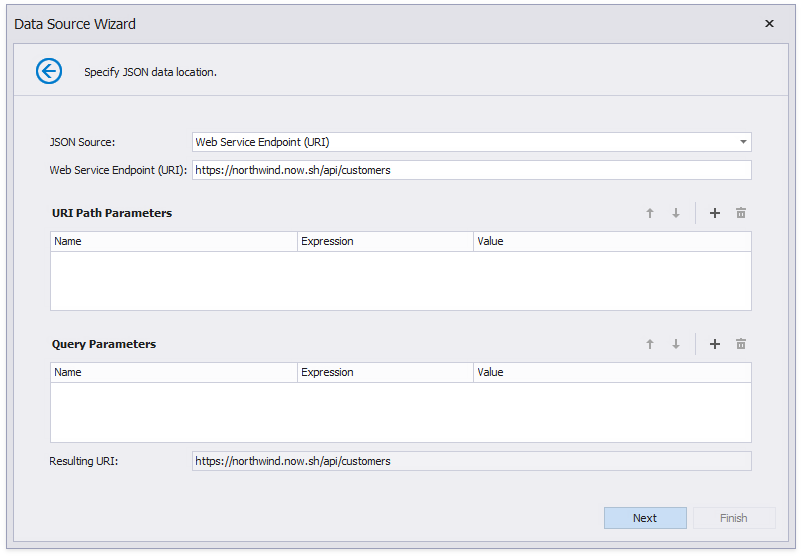
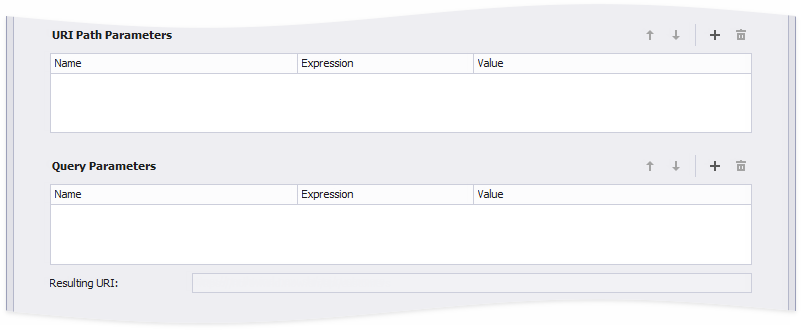

# Bind a Report to JSON Data

This topic describes how to bind a report to JSON data at design time.

## Create JsonDataSource

1. [Create a new report](../add-new-reports.md).

2. Click the report's smart tag. In the invoked actions list, expand the drop-down menu for the **DataSource** property and click **Add New Data Source...**
	
	

    This invokes the [Data Source Wizard](../report-designer-tools/data-source-wizard.md).

3. Choose the **JSON** option and click **Next**.
	
	

    > [!Note]
    > The Report Designer's Report Wizard provides the JSON option if the application has a reference to the open-source Newtonsoft.Json library.

4. The next wizard page allows you to specify a Web Service Endpoint, a filename, or a string with JSON data. In this example, the JSON data is obtained from a [JSON sample data location](https://northwind.now.sh/api/customers).

    - Choose **Web Service Endpoint** and specify the endpoint data.

        

    - Choose **JSON File** and specify the JSON file location.

        

    - Choose **JSON String** and provide the JSON data string.

         

    If you choose the **Web Service Endpoint** option, you can configure a web service endpoint, URI path parameters, query parameters, and header parameters.

    4.1. Specify path parameters and query parameters.

    

    You can enable the new parameter's **Expression** property and [use expressions](../use-expressions.md) to set path parameter and query parameter values.

    - Select Expression Editor from the Value property's drop-down list, specify the expression in the invoked [Expression Editor](../use-expressions.md#expression-editor), and click OK.

    

    - Expressions can include [report parameters](../shape-report-data/use-report-parameters.md). Select New Report Parameter from the Value property's drop-down list, configure the report parameter in the invoked Report Parameter dialog, and click OK.

    

    > [!NOTE]
    > The Data Source Wizard sends a request to the endpoint with the specified parameters to populate the data source and build the data source schema. Ensure that the parameters are always set to the values that the endpoint expects. Otherwise, the Data Source Wizard generates an error on the next steps.  
    > For instance, if a user specifies the name of a JSON file in a parameter, specify the default file name in order to avoid the *File Not Found* error.

    Path parameters and query parameters are included in endpoint requests in the same order as they are listed. Move a parameter up or down in the list to change its position in endpoint requests.

    The **Resulting URI** read-only field shows how the resulting JSON URI looks.

    

    Click **Next** to proceed to the Wizard's next page.

    4.2. Configure the Basic HTTP Authentication credentials and HTTP header parameters. Use the same steps as in P.4.1. above to configure a header parameter.

    

    4.3. Choose whether to save the created connection string to the application's configuration file. If not, the connection parameters are saved to the report's definition.

    

    > [!Tip]
    > If the path parameters, query parameters, and header parameters you specified do not contain sensitive data, you can save them along with the connection parameters. Otherwise, the path parameters, query parameters, and header parameters are used once to retrieve JSON data to an object in memory. This object is accessible until you close the Report Designer.

5. On the next page, the wizard shows the specified JSON data's structure. You can choose all nodes or a subset of nodes.

    

    Uncheck the data fields that your report does not require.

    You can rename data fields if necessary.

    

After you finish the wizard, it creates the **JsonDataSource** component. This component retrieves the checked data fields that the selected JSON element includes. The [Field List](..\report-designer-tools\ui-panels\field-list.md) reflects the data source structure.
 

## Customize the JSON Data Source

Right-click the **JsonDataSource** component in the Field List or Report Explorer and choose **Edit...**. Specify another JSON data location and reconfigure data fields in the invoked wizard.

## Customize the JSON Data Source Schema

Right-click the **JsonDataSource** component in the Report Explorer and choose **Edit Schema...**. Reconfigure data fields in the invoked wizard page.

