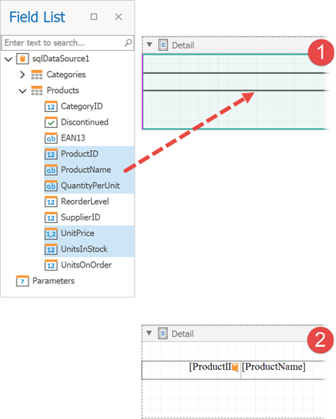
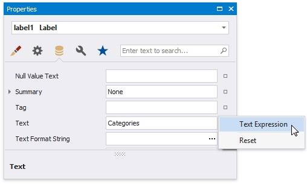

# Bind Report Controls to Data (Data Bindings)

> [!Warning]
> Use the approach below if expression bindings **are not enabled** in the Report Designer (the [Property Grid](../report-designer-tools/ui-panels/property-grid.md) does not provide the **Expressions**  tab).
>
> See [Bind Report Controls to Data (Expression Bindings)](bind-controls-to-data-expression-bindings.md) if expression bindings **are enabled** in the Report Designer (the [Property Grid](../report-designer-tools/ui-panels/property-grid.md) provides the **Expressions**  tab).

You can use the following approaches to include a data source's information in your report:

* [Use the Field List](#use-the-field-list)
* [Use the Smart Tag](#use-the-smart-tag)
* [Use the Property Grid](#use-the-property-grid)

## Use the Field List

After you [bind your report to data](../bind-to-data.md), the [Field List](../report-designer-tools/ui-panels/field-list.md) panel displays the data source's hierarchy and provides access to the available data fields. 

Drop a data field from this panel onto a report's surface to create a new report control bound to the corresponding field.

Drop a data field onto an existing control to bind this control to the corresponding field.

You can do one of the following to create a data-bound control of a specific type:

* Hold down the SHIFT key and drop a data field onto a report's surface.
* Right-click a corresponding data field and drop it onto a report's surface.

This invokes a context menu that enables you to select which control to create.

You can also drop an entire data table onto a report to create a [Table](../use-report-elements/use-tables.md) control with its cells bound to the corresponding data table fields. 

To select multiple fields in the Field List, hold CTRL or SHIFT and click the fields. Drop these fields onto a report to create a new table.

## Use the Smart Tag

Click a control's smart tag, expand the **Data Binding** drop-down list and select a data field.

## Use the Property Grid

In the [Property Grid](../report-designer-tools/ui-panels/property-grid.md), expand the **(Data Bindings)** category and specify a data field for a required property (for instance, **Text**).

