# Data Binding Modes

The Report Designer uses one of the following modes to provide dynamic content to your reports: expression bindings or standard data bindings.

## Expression Bindings

Expression bindings enable you to use complex [expressions](../use-expressions.md) that include two or more fields and various functions. Expressions also allow you to calculate complex summaries without scripts and conditionally shape your data without formatting rules.

This mode is enabled in the Report Designer if the [Property Grid](../report-designer-tools/ui-panels/property-grid.md) provides the **Expressions**  tab.

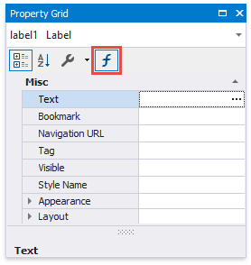

##  Data Bindings

Standard data bindings enable you to assign a single data field to a report control or use [report scripts](../use-report-scripts.md) to provide custom logic.

This mode is enabled in the Report Designer if the [Property Grid](../report-designer-tools/ui-panels/property-grid.md) does not provide the **Expressions**  tab.

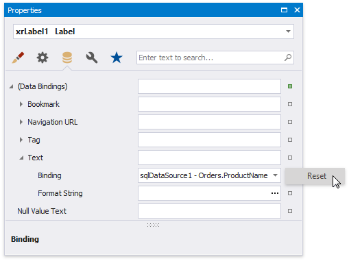

## Conversion Dialog

The following dialog appears only when [expression bindings](#expressions) are enabled in the Report Designer, and you [open an existing report](../open-reports.md) that uses standard [data bindings](#databindings):

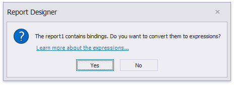

This dialog prompts you to convert your report to use expressions (the new binding mechanism). Click **Yes** to run the report conversion, click **No** to open the report without changes.

See the section below for information on how to use expressions instead of data bindings.

## Binding Mode Comparison

### **Bind to a Single Data Field**

* The [Field List](../report-designer-tools/ui-panels/field-list.md) panel allows you to drop fields onto the design surface or existing report controls. All binding ways are identical in the **data bindings** and **expression bindings** modes. 

    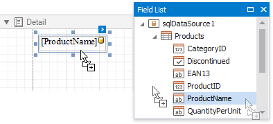

* The control's smart tag enables you to select the target data field in the corresponding drop-down list.

    | Expression Bindings | Data Bindings |
    |---|---|
    | 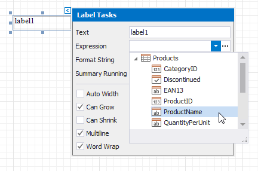 |  |

* You can select a report control and bind it to data in the [Property Grid](../report-designer-tools/ui-panels/property-grid.md).

    <table><tr><th>
Expression Bindings

    </th><th>
Data Bindings

    </th></tr><tr><td>
Switch to the <strong>Expressions</strong> tab and specify a data field for the <strong>Text</strong> property.

    
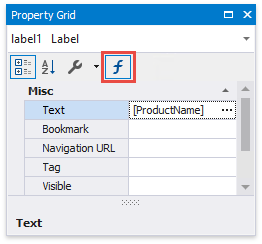

    </td><td>
Expand the <strong>(Data Bindings)</strong> category and assign a data field to the <strong>Text</strong> property.

    
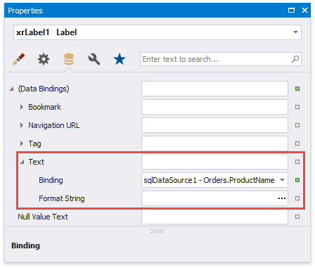

    </td>
    </tr></table>

See the following topics for more information:

* [Bind Report Controls to Data (Expression Bindings)](bind-controls-to-data-expression-bindings.md)
* [Bind Report Controls to Data (Data Bindings)](bind-controls-to-data-data-bindings.md)

### **Bind to Multiple Data Fields**

<table><tr><th>
Expression Bindings

</th><th>
Data Bindings

</th></tr><tr><td>
Use the <a class="xref" href="use-embedded-fields-mail-merge.md">mail merge</a> functionality.

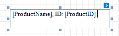

Click the <strong>Expression</strong> property's ellipsis button and specify the expression.

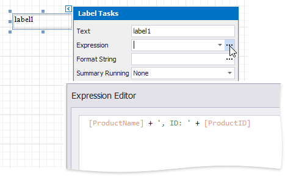

</td><td>
Use the <a class="xref" href="use-embedded-fields-mail-merge.md">mail merge</a> functionality.

</td>
</tr></table>

### **Calculate Summary**

<table><tr><th>
Expression Bindings

</th><th>
Data Bindings

</th></tr><tr><td>
 Select the summary function in the <strong>Expression Editor</strong>'s <strong>Summary</strong> section. 

All functions has the 'sum' prefix.

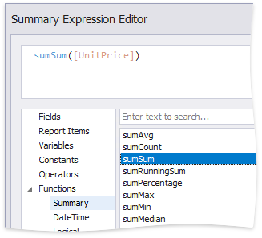

See <a class="xref" href="..\shape-report-data\shape-data-expression-bindings\calculate-a-summary.md">Calculate a Summary</a> for more information.

</td><td>
Select the summary function in the <strong>Summary Func</strong> drop-down list.

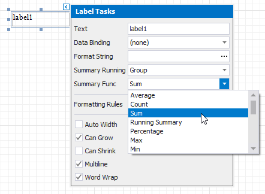

See <a class="xref" href="..\shape-report-data\shape-data-data-bindings\calculate-a-summary.md">Calculate a Summary</a> for more information.

</td>
</tr></table>

### **Complex Bindings, Custom Summary**

<table><tr><th>
Expression Bindings

</th><th>
Data Bindings

</th></tr><tr><td>
Use the <strong>Expression Editor</strong> to construct an <a class="xref" href="..\use-expressions.md">expression</a> of any complexity.

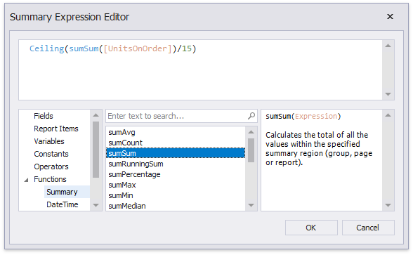

Refer to <a class="xref" href="..\shape-report-data\shape-data-expression-bindings\calculate-an-advanced-summary.md">Calculate an Advanced Summary</a> for an example.

</td><td>
Use <a class="xref" href="..\use-report-scripts.md">report scripts</a>.

Refer to <a class="xref" href="..\shape-report-data\shape-data-data-bindings\calculate-a-custom-summary.md">Calculate a Custom Summary</a> for an example.

</td>
</tr></table>

### **Conditionally Customize Appearance**

<table><tr><th>
Expression Bindings

</th><th>
Data Bindings

</th></tr><tr><td>
Use the <strong>Expression Editor</strong> to construct <a class="xref" href="..\use-expressions.md">expressions</a> for a control's appearance and style properties.

Refer to <a class="xref" href="..\shape-report-data\shape-data-expression-bindings\conditionally-change-a-control-appearance.md">Conditionally Change a Control Appearance</a> for an example.

</td><td>
Create formatting rules and assign them to report controls.

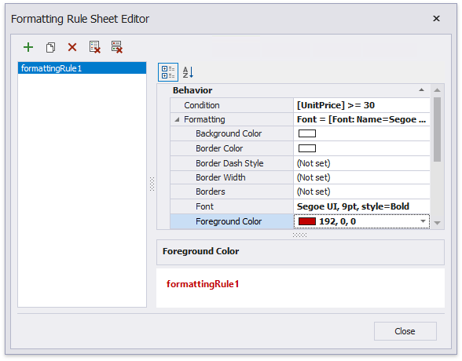

Refer to <a class="xref" href="..\shape-report-data\shape-data-data-bindings\conditionally-change-a-control-appearance.md">Conditionally Change a Control Appearance</a> for an example.

</td>
</tr></table>
