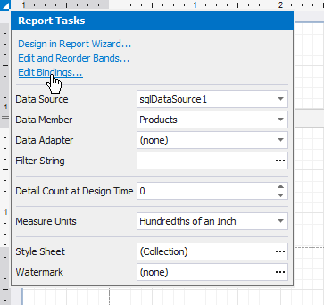
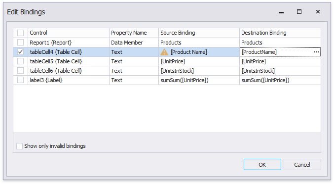

# Update Report Data Bindings

After you assign a new data source to a loaded report, the report tries to automatically resolve all data bindings. When the field names of your data source do not coincide with the report controls' bindings, you can maintain them yourself.

To do this, click the report's smart tag and in the invoked actions list, select the **Edit Bindings** link.

In the invoked **Edit Bindings** dialog, you can view the bindings that are currently assigned to every report control (in the **Control**, **Property Name** and **Source Binding** columns).

Enable the **Show only invalid bindings** option to exclude properly bound controls from this list.

To update a control's data bindings, enable the corresponding check box in the first column and assign the required bindings from the report's data source (in the **Destination Bindings** column).

After you have finished updating the bindings, click **OK** to close the dialog and apply the changes.