# Create a Balance Sheet

This tutorial describes how to use the Cross Tab control to create a **Balance Sheet** report.

> [!Tip]
> This tutorial shows how to configure a Cross Tab using the [Report Wizard](../report-designer-tools/report-wizard.md). See [Create a Cross-Tab Report](create-a-cross-tab-report.md) for information on how to use the Cross-Tab Report Wizard.

## Add a Cross Tab and Bind It to Data

1. Invoke the Report Wizard and [add a blank report](../add-new-reports.md) to your application.

1. Drop the Cross Tab control from the Toolbox onto the report's [Detail band](../introduction-to-banded-reports.md).

    

3. Click the Cross Tab's smart tag, expand the **Data Source** property's drop-down menu and click **Add New Data Source**.

    

4. (4.1-4.5) Use the invoked [Data Source Wizard](../report-designer-tools/data-source-wizard.md) to bind the Cross Tab to a data source.

Click **Finish** to complete the Data Source Wizard and assign the created data source to the Cross Tab.

The data source structure becomes available in the [Field List](../report-designer-tools/ui-panels/field-list.md).

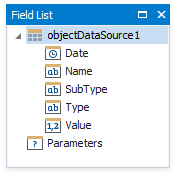

> [!Note]
> Ensure that the report's **Data Source** property is not set if you place a Cross Tab into the [Detail band](../introduction-to-banded-reports.md). Otherwise, the Cross Tab data is printed as many times as there are rows in the report data source.

## Define the Cross Tab Layout

1. Drop the **Type** data field from the Field List onto the Cross Tab's **Rows** area to display field values as row headers.

    

    One Cross Tab cell becomes bound to this data field. The corresponding row is printed in the document as many times as there are field values in the data source. The cell in the top left corner displays the data field header.

    One more row is added to the bottom of the Cross Tab to display grand total values calculated against this field.

2. Drag the **SubType** data field from the Field List and drop onto the row area next to the cell bound to the **Type** field.

    

    The CrossTab arranges the **Type** and **SubType** field values into a hierarchy. The top left corner displays headers for both data fields.

    One more row is added to the Cross Tab to display total values calculated against the **SubType** field. Grand total value is calculated against all rows.

3. Drag the **Name** data field from the Field List and drop onto the row area next to the cell bound to the **SubType** field.

    

    The **Name** field values are displayed at the third hierarchical level. One more row is added to display totals against this field as well.

4. Drop the **Date** data field from the Field List onto the **Columns** area to display field values as column headers.

    

    One Cross Tab cell becomes bound to this data field. One more column is added to the right of the Cross Tab to display grand total values calculated against this field.

5. Drop the **Value** data field from the Field List onto the **Data** area.

    

    Data from this field is used to calculate summary values at the intersection of rows and columns. If the data area contains only one field, no field headers are displayed.

Switch to Print Preview to see the Cross Tab populated with data.

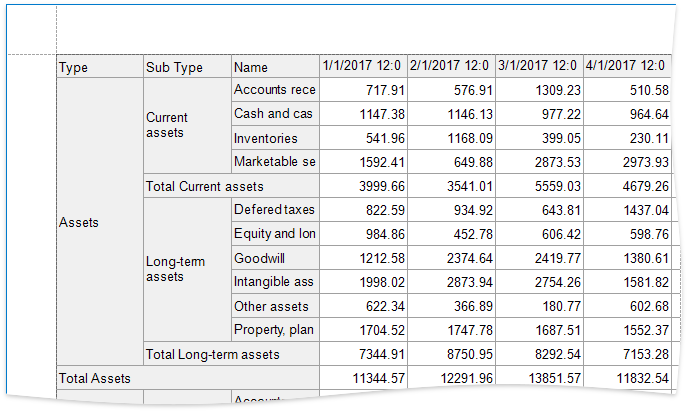

## Specify Group Settings

As you can see in the image above, the Cross Tab displays data for individual days.

Select the Cross Tab cell bound to the **Date** field and click its smart tag. Set the **Group Interval** property to **Year** to group data by years.

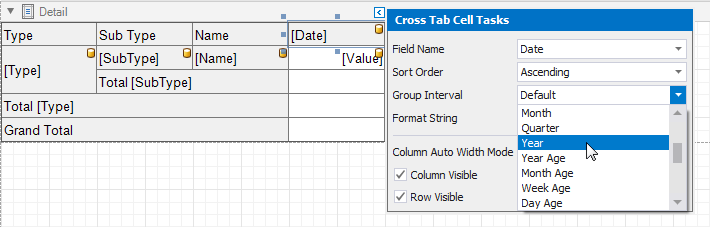

## Specify Layout Options

1. The Cross Tab control stacks row headers horizontally. You can change the view so that parent values span the entire row header panel width.

    Select the Cross Tab and switches to the [Property Grid](../report-designer-tools/ui-panels/property-grid.md). Expand the [LayoutOptions](xref:DevExpress.XtraReports.UI.XRCrossTab.LayoutOptions) group and enable the [HierarchicalRowLayout](xref:DevExpress.XtraReports.UI.CrossTab.CrossTabLayoutOptions.HierarchicalRowLayout) property.

    

2. Set the **CornerHeaderDisplayMode** property to **None** to merge cells in the top-left corner into a single empty cell.

    

Switch to Print Preview to see the result.

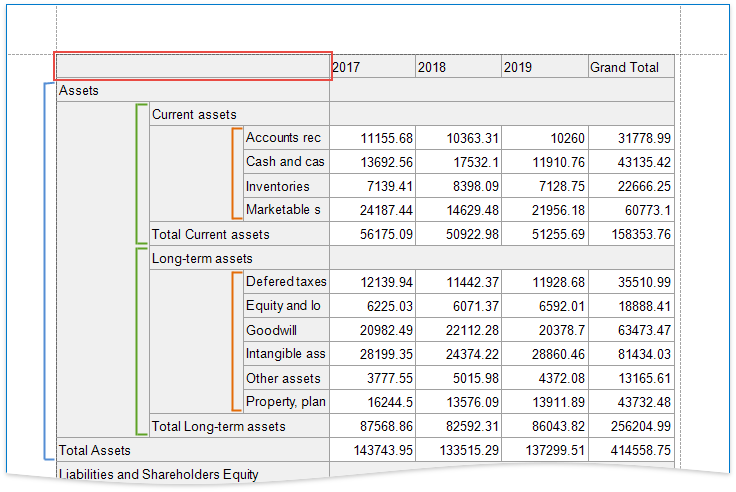

## Hide Grand Totals

1. Select the bottom right cell and click its smart tag. Disable the [RowVisible](xref:DevExpress.XtraReports.UI.CrossTab.XRCrossTabCell.RowVisible) and [ColumnVisible](xref:DevExpress.XtraReports.UI.CrossTab.XRCrossTabCell.ColumnVisible) properties to hide the row and column that display grand total values. Invisible cells are filled with a hatch brush.

    

2. Resize the Cross Tab. You can also resize individual rows and columns.

    

The Cross Tab control no longer displays grand total values.

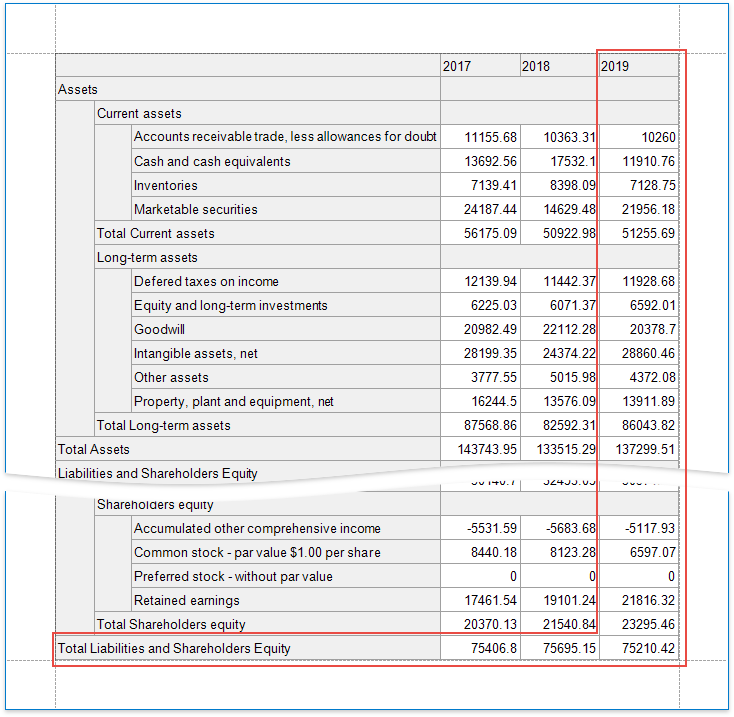

## Sort and Format Data

1. Select the cell bound to the **Name** field and change its sort order. The Cross Tab sorts row and column field values in ascending order. Set the **Sort Order** property to **None** to restore the original data source order.

    

2. Format currency data. Hold down SHIFT or CTRL and select the cells that display data and total values. Set the [TextFormatString](xref:DevExpress.XtraReports.UI.CrossTab.XRCrossTabCell.TextFormatString) property to **{0:#,##0.00;(#,##0.00);-}**. This string consists of three formats separated by semicolons: for positive values, negative values and null values.

    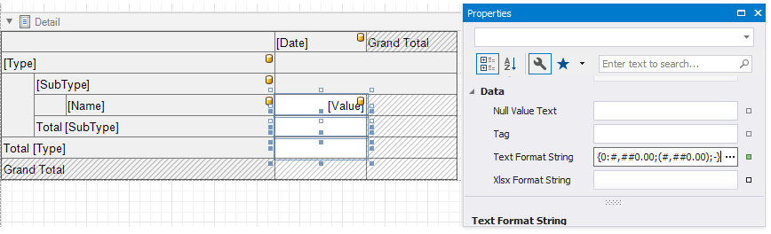

## Customize Appearance

1. Select the Cross Tab, switch to the **Properties** window and expand the **Styles** property. Use the **General Style** property to specify common appearance settings that apply to all Cross Tab cells. Set the following properties:

    * **Background Color** to **White**
    * **Border Color** to **SlateGray**
    * **Font** to **Tahoma, 8.25pt**
    * **Foreground Color** to **SlateGray**

    

2. Expand the **Header Area Style** property and do the following:

    * reset the **Background Color** property value to inherit the color from the general style;
    * set the **Foreground Color** property to **MidnightBlue** to override the general foreground color;
    * set the **Font** property to **Tahoma, 8.25, Bold** to override the general font.

    

3. Expand the [TotalAreaStyle](xref:DevExpress.XtraReports.UI.CrossTab.CrossTabStyles.TotalAreaStyle) property and set the following properties to override general settings:

    * **Font** to **Tahoma, 8.25, Bold**
    * **Foreground Color**  to **MidnightBlue**

    

4. Select the cell bound to the **Name** data field and set the following appearance properties:

    * **Foreground Color**  to **SlateGray**
    * **Font** to **Tahoma, 8.25**

    These values apply to the selected cell only and override values specified for the entire header area.

    

5. Select the cells in the top row and in the rows with total values. Set the **Borders** property to **Bottom** and **BorderWidth** property to **2**.

    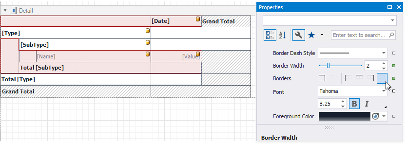

6. Select the cells you did not customize in the previous step and set the **Borders** property to **None**.

    

7. Select the cells in the top row and set the **Background Color** property to **LightSteelBlue**.

    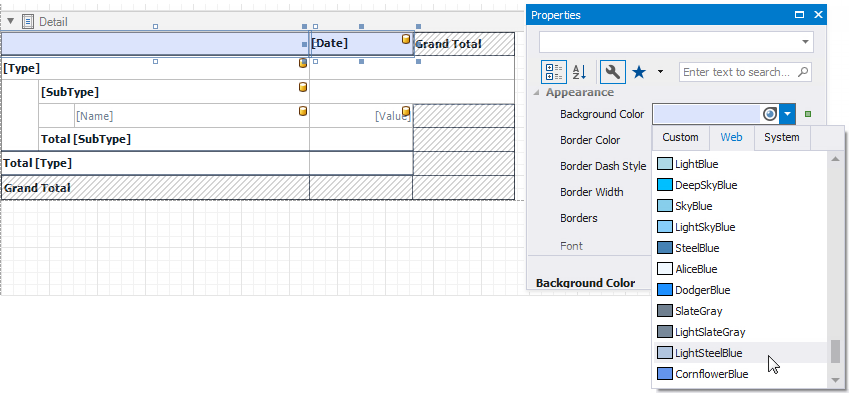

8. Select the cell bound to the **SubType** field and the next cell in the data area. Set their **Background Color** property to **AliceBlue**.

    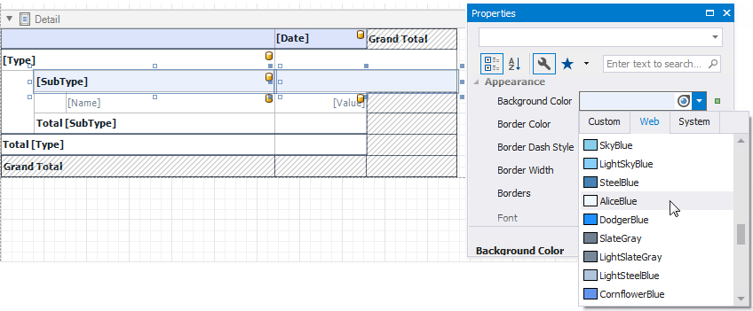

## Apply Odd and Even Row Styles

Use the **GroupRowIndex** variable in [expressions](xref:120091) to identify odd and even rows.

Select the cell bound to the **Name** field and the next cell in the data area. Go to the **Properties** window and open the **Expressions** tab. Click the **Background Color** property's marker, select **Background Color Expression** and specify the following expression:

_iif([Arguments.GroupRowIndex] % 2 == 1, Rgb(235, 241, 252), ?)_

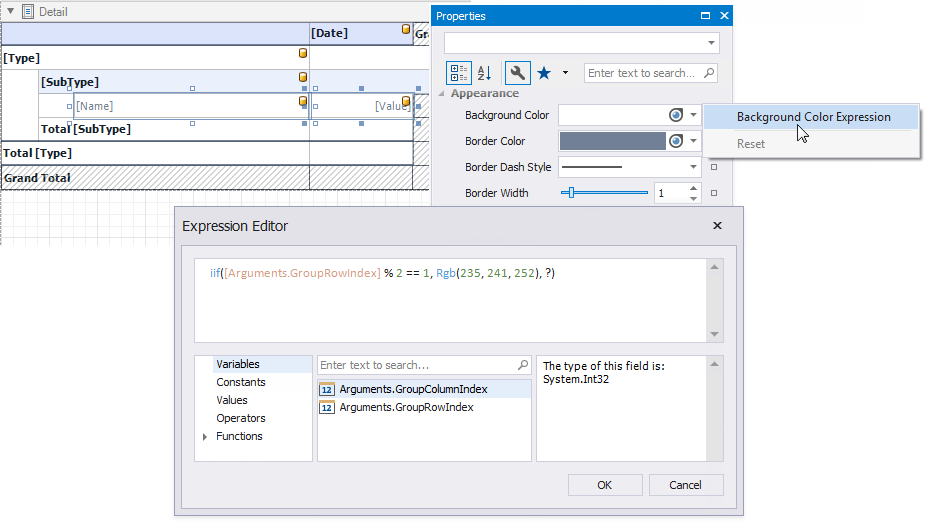

As you can see, the row backgrounds do not start from the page's left border, but have indents. These indents correspond to auxiliary cells in a tree.

Select these auxiliary cells and disable the **Column Visible** property.

To add indents to row field values and imitate a tree-like view, set the **Padding** property of the following cells:

* The cell bound to the **SubType** field: **24, 2, 0, 0**.
* The cell bound to the **Name** field: **42, 2, 0, 0**.
* The cell that displays totals against the **SubType** field: **24, 2, 0, 0**.

## Add a Report Title

1. Right-click the report and select **Insert Band / ReportHeader** from the context menu.

    

2. Drop a [Label](../use-report-elements/use-basic-report-controls/label.md) from the Toolbox onto the created Report Header.

    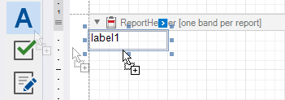

3. Double-click the label and type the report title. Specify appearance settings.

    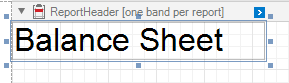

Switch to Print Preview to see the final result.

