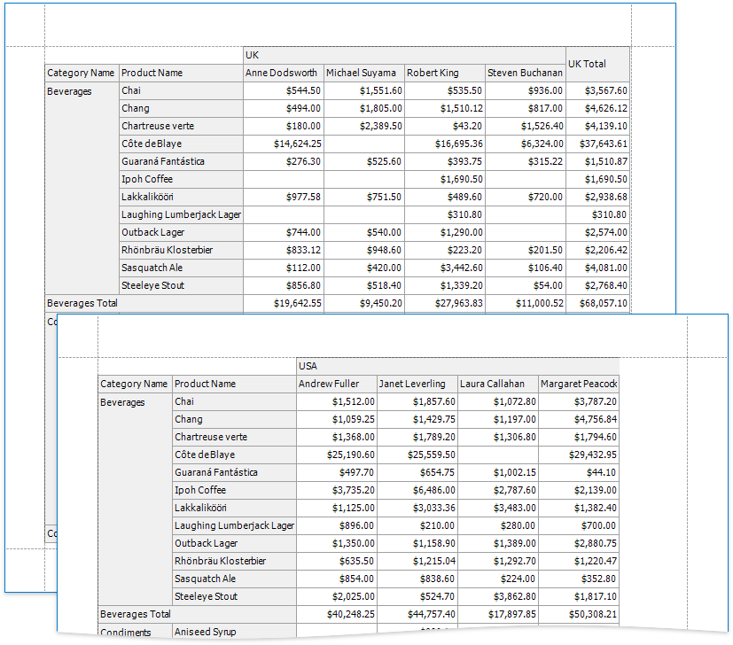
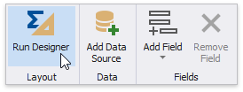
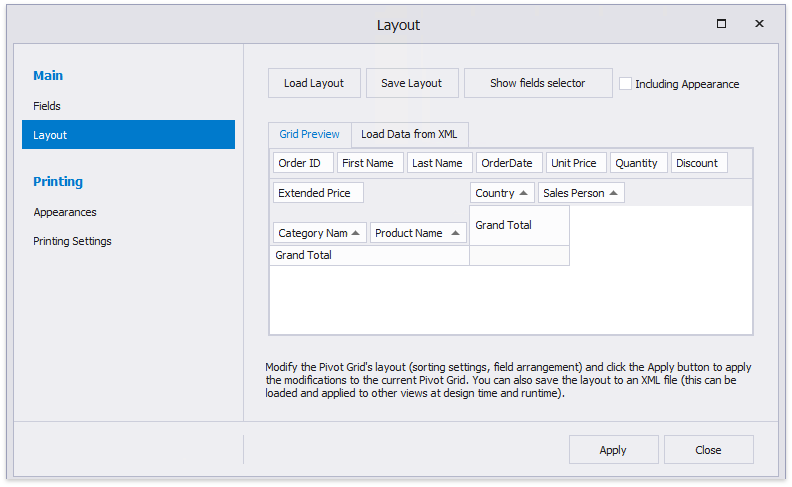
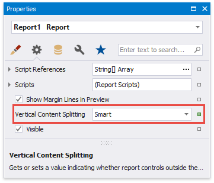
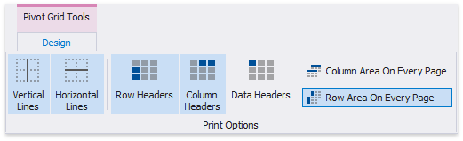

# Create a Cross-Tab Report

A cross-tab report displays complex multi-dimensional data, such as summary statistics, surveys, and market research information. This report uses a Pivot Grid control that calculates automatic summaries and grand totals across grouped rows and columns.

## Add a Pivot Grid and Bind It to Data

1. [Create a new report](../add-new-reports.md) or [open an existing one](../open-reports.md).

2. Drop the **Pivot Grid** control from the [Toolbox](../report-designer-tools/toolbox.md) onto the [Detail band](../introduction-to-banded-reports.md).

    

    You cannot place a Pivot Grid in another report control (for example, [Table Cell](../use-report-elements/use-tables.md) or [Panel](../use-report-elements/use-basic-report-controls/panel.md)) because its width cannot be determined at design time.

3. Open the [Toolbar](../report-designer-tools/toolbar.md)'s **Pivot Grid Tools** contextual tab and click **Add Data Source** to bind the pivot grid to data.

    

4. Navigate through the invoked [Data Source Wizard](../report-designer-tools/data-source-wizard.md)'s pages to set up the data source. See the [Bind to Data](../bind-to-data.md) section for more information.

    After the data source is created, the Pivot Grid's **Data Source** and **Data Member** properties are assigned automatically.

    > [!NOTE]
    > Ensure that a report's **Data Source** property is not set if you place the Pivot Grid in the Detail band. Otherwise, the Pivot Grid data is printed as many times as there are rows in the report data source.

## Define the Pivot Grid's Content
1. Customize the Pivot Grid's layout. To do this, switch the **Pivot Grid Tools** toolbar tab and click **Run Designer**. 
	
	

2. In the Pivot Grid Designer's **Fields** page, click the **Retrieve Fields** button to obtain fields from the control's data source.
	
	

3. Switch to the **Layout** page in the navigation bar on the left and drag-and-drop the required fields onto the appropriate areas to define the Pivot Grid's layout. 
	
	
	
	Click **Apply** to apply the changes and close the Designer.

> [!Note]
> To see how the pivot grid looks when it is populated with data, switch to the report's Preview. 
>
> Return to the Report Designer and invoke the Pivot Grid Designer. The pivot grid fields are now populated with actual data and you can customize the grid.

## Adjust the Pivot Grid's Layout
Set the report's **Vertical Content Splitting** property to **Smart** to split the Pivot Grid along the column borders if it does not fit the report's page in Print Preview.

## Specify the Pivot Grid's Print Options
Use the **Pivot Grid Tools** toolbar tab's **Print Options** section to specify print options and define which Pivot Grid elements are printed.

* Disable the **Data Headers** option to prevent data fields' headers from being printed.

- Enable the **Row Area On Every Page** option to repeat row headers on each document page when the Pivot Grid's layout is divided horizontally across several pages.

Switch to [Print Preview](../preview-print-and-export-reports.md) to see the resulting report.
