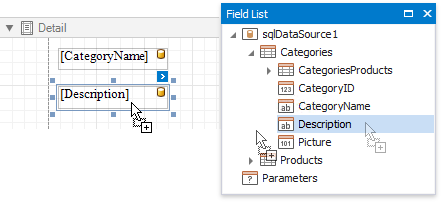
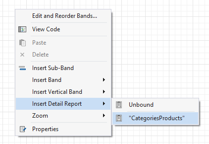
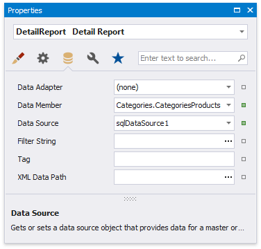
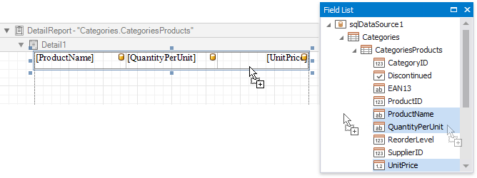

# Create a Master-Detail Report (Use Detail Report Bands)

This tutorial illustrates how to display hierarchical data in a master-detail report using nested [Detail Report bands](../introduction-to-banded-reports.md). This approach is effective if your data source contains master-detail relationship. Another way is described at [Create a Master-Detail Report (Use Subreports)](create-a-master-detail-report-use-subreports.md).

1. [Create a new report](../add-new-reports.md) or [open an existing one](../open-reports.md).

2. [Bind the report](../bind-to-data.md) to a required data source and provide it with a master-detail relationship as described in the [Bind a Report to a Database](../bind-to-data/bind-a-report-to-a-database.md) topic.

3. Drop the required data fields from the [Field List](../report-designer-tools/ui-panels/field-list.md) onto the [Detail](../introduction-to-banded-reports.md) band.

    

4. Create a [Detail Report Band](../introduction-to-banded-reports.md) by right-clicking the report's surface. In the invoked context menu, select **Insert Detail Report**, and then, select the master-detail relationship's name.

    

    This sets the detail report's **Data Source** and **Data Member** properties automatically.

    

5. Switch to the **Field List**, select the data fields while holding down CTRL or SHIFT and drag-and-drop them onto the Detail band.

    

    > [!NOTE]
    > You should drag-and-drop fields from the category corresponding to the master-detail relationship to correctly generate the detail report's data. Otherwise, the report will display only the first record of the detail table as many times as there are records in this table.

6. If required, customize the report's [appearance](../customize-appearance.md) and [format values](../shape-report-data/shape-data-expression-bindings/format-data.md).

Switch to [Print Preview](../preview-print-and-export-reports.md) to see the resulting report.

