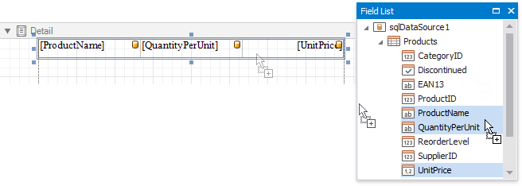
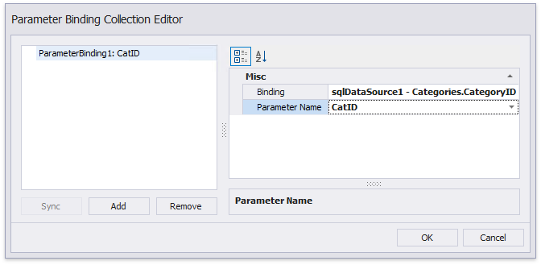

# Create a Master-Detail Report (Use Subreports)

This tutorial demonstrates how to create a master-detail report using the [Subreport](../use-report-elements/use-basic-report-controls/subreport.md) control. This approach is useful if your data source does not contain master-detail relationship or you prefer to store master and detail reports in different files. Another approach is described at [Create a Master-Detail Report (Use Detail Report Bands)](create-a-master-detail-report-use-detail-report-bands.md).

## Create a Master Report

1. [Create a new report](../add-new-reports.md) or [open an existing one](../open-reports.md) to use it as a master report.

2. [Bind the report](../bind-to-data.md) to a required data table.

3. Drop the required data fields from the [Field List](../report-designer-tools/ui-panels/field-list.md) onto the [Detail](../introduction-to-banded-reports.md) band.

    

## Create the Detail Report

1. [Add one more blank report](../add-new-reports.md) to use it as a detail report.

2. [Bind it to data](../bind-to-data.md). For instance, use another table of the same database as for the master report. 

3. Switch to the **Field List**, select the data fields while holding down CTRL or SHIFT and drag-and-drop them onto the Detail band.
	
	

4. Add parameter to the detail report. Right-click the **Parameters** section in the **Field List** and choose **Add Parameter** in the context menu.
	
	

5. In the invoked **Add New Parameter** dialog, specify the parameter's **Name** and **Type** as well as disable the **Show in the parameters panel** option.
	
	

6. Click the report's smart tag, and in its actions list, click the **Filter String** property's ellipsis button.
	
	In the invoked **FilterString Editor**, construct an expression where the required data field is compared to the created parameter. To access the parameter, click the icon on the right until it turns into a question mark.
	
	

7. [Save the detail report](../save-reports.md) by selecting **Save** | **Save As** in the toolbar. In the invoked standard **Save** dialog, specify the folder and file name.

	

## Embed the Subreport
1. Switch back to the master report and drop the [Subreport](../use-report-elements/use-basic-report-controls/subreport.md) control from the [Toolbox](../report-designer-tools/toolbox.md) onto the **Detail** band.
	
	

2. Click the subreport's smart tag and clcik the **Report Source URL** property's ellipsis button. In the invoked **Open** dialog, select the previously saved detail report.
	
	
	
3. Bind the subreport's parameter used as a filter criterion to the master report's corresponding data field, which serve as a source of the parameter value. To do this, click the subreport's smart tag and select **Edit Parameter Bindings** in the invoked actions list.
	
	
	
4. In the invoked **Parameter Binding Collection Editor**, click **Add** to add new binding. In the property list, specify the data field to which you want to bind a subreport parameter and the name of the parameter that you want to bind.
	
	

5. If required, customize the report's [appearance](../customize-appearance.md) and [format values](../shape-report-data/shape-data-expression-bindings/format-data.md).

## View the Result

Switch to [Print Preview](../preview-print-and-export-reports.md) to see the resulting report.

