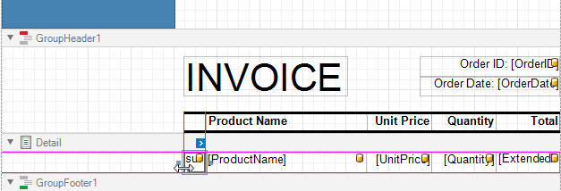

# Create a Report with Cross-Band Content and Populated Empty Space

This tutorial describes how to create an invoice report with the following layout options:

- Print part of the content across bands (the blue panel);
- Populate the empty space between the detail and footer information with blank rows.

## Initial Report

[Create](../add-new-reports.md) or [open](../open-reports.md) a [table report](../create-popular-reports/create-a-table-report.md) that has an empty space between the _Detail_ band and the footer, like the invoice report below.

## Add Line Numbers

1. Right-click the first cell in the [Detail band](../introduction-to-banded-reports.md)'s table and select **Insert** / **Column to Left** from the context menu.

	

1. Select the new cell and specify the following property values:

	* **Summary**: _Group_
	* **Expression**: _sumRecordNumber()_

	

Each row now includes a number.

## Populate the Empty Space

Populate the empty space between the _Detail_ band's data and the totals.

Click the _Detail_ band's smart tag and check the **Fill Empty Space** property.

Invoices now include numbered lines that continue until the totals.

> [!NOTE]
> Set the **Text** properties of the _Detail_ band's controls to display static text within the added lines.

## Add Cross-Band Data

Follow the steps below to display content across report groups.

1. Right-click the design surface. Select **Insert Band** / **GroupHeader** from the context menu.

	

	> [!Tip]
	> Choose a _PageHeader_ band instead to display the cross-band content on an entire page.

1. Click the added band's smart tag and set the **Print Across Bands** property.  This displays the band content on the background of the report group.

	

2. Assign group fields to the added band to include it in each group, and un-assign these fields are specified from the initial _GroupHeader_. Click the new band's smart tag, click the **Group Fields** property's ellipsis button and add group fields in the invoked **Group Field Collection Editor**.

	

1. Add a [Panel](../use-report-elements/use-basic-report-controls/panel.md) control to the _GroupHeader_. Specify the panel's **Background Color** and drop fields onto the panel.

	

4. Adjust the panel's width and height. The height should match the page height, as the footer is printed at the bottom of the page (the _GroupFooter_'s **Print At Bottom** property is enabled).

	

1. Switch to Print Preview. The panel is printed on the background of the group content.

	

1. Resize the content in other bands to print it side-by-side with the panel.

	

See the final report in Print Preview.

