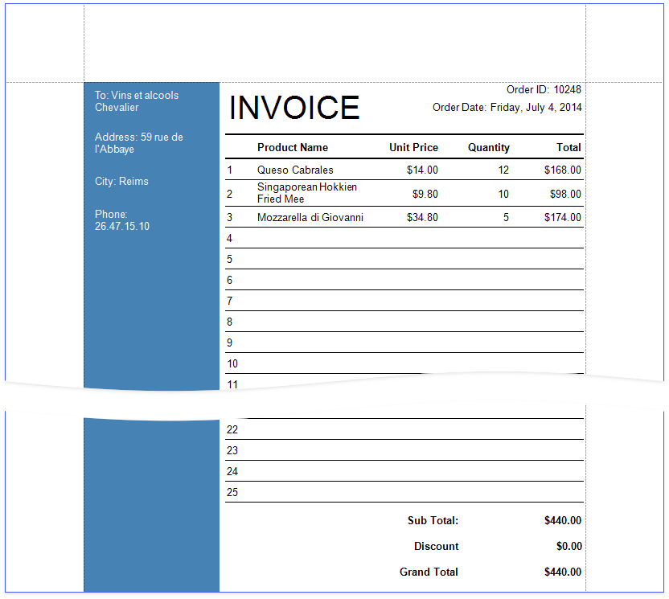
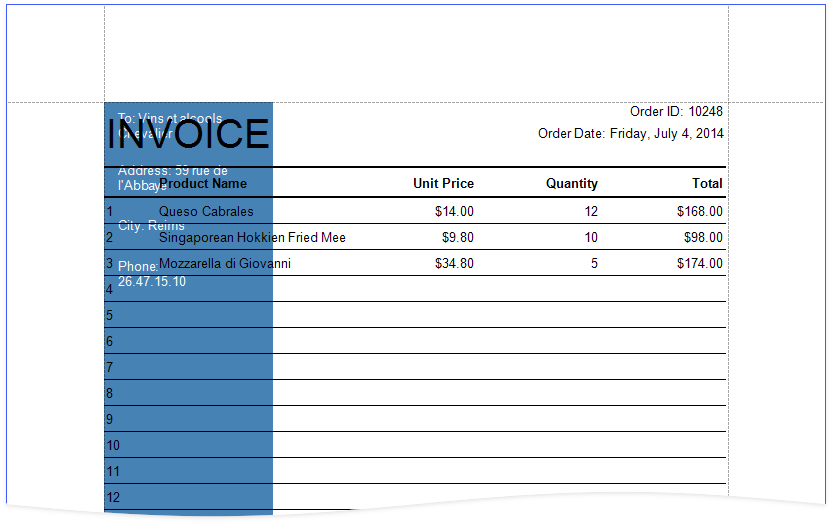

# Create a Report with Cross-Band Content and Populated Empty Space

This tutorial describes how to create an invoice report with the following layout options:

- Print part of the content across bands (the blue panel);
- Populate the empty space between the detail and footer information with blank rows.

1. [Add a new blank report](xref:14989) to your application.

1. [Bind](xref:2554) the report to a data source.

## Add a Data Table

1. Switch to the [Field List](../report-designer-tools/ui-panels/field-list.md) and select data fields. Hold CTRL or SHIFT and click the fields to select multiple fields and drop them onto the Detail band.

    

    This creates a table with each cell bound to a data field.

1. Add line numbers. Right-click the first cell and select **Insert** / **Column to Left** from the context menu.

    

1. Select the new cell and specify the following property values:

	* **Summary**: _Report_
	* **Expression**: _sumRecordNumber()_

    

The resulting report lists all data from the data source.

## Group Data

Group table data by units (for instance, group order data by orders).

1. Right-click the design surface. Select **Insert Band** / **GroupHeader** from the context menu.

    

1. Click the **Group Fields** property's ellipsis button in the _GroupHeader_'s smart tag to invoke the **Group Field Collection Editor**.

	

1. Click the **Add** button to add a group field. Expand the **Field Name** property's drop down and select a field from the list.

	

1. Correct the line numbers, as the records are now arranged in groups. Select the cell that displays line numbers and change the **Summary** property to _Group_.

	

The _GroupHeader_ band is printed for each group. Use it to add a heading that includes column titles and other group information.

5. Switch to the **Field List** and select the fields for which you want to create column titles. Drag the selected fields onto the _GroupHeader_ band with the right mouse button.

	

The records are now grouped by units.

## Add Totals

Add a footer to display totals and other summary data on invoices.

1. Right-click the design surface. Select **Insert Band** / **GroupFooter** from the context menu.

	

1. Drop a table from the **Toolbox**. Configure the table's cells to display group totals.

	

1. Align the invoice totals at the page bottom. Click the _GroupFooter_'s smart tag and check the **Print At Bottom** property.

	

Each invoice is now printed on a separate page.

## Populate the Empty Space

Add empty lines to invoices to populate the empty space between the _Detail_ band's data and the totals.

Click the _Detail_ band's smart tag and check the **Fill Empty Space** property.

Each invoice now includes the numbered lines that continue until the totals.

## Add Cross-Band Data

Add a panel with recipient details across the entire invoice. Place the panel on a separate _GroupHeader_ band that is printed on the background of other bands.

1. Add another _GroupHeader_ band to the top of the report. Click the added band's smart tag and set the **Print Across Bands** property. This makes the band content start at the top of the _GroupHeader1_ and end at the bottom of the _GroupFooter1_ band.

	

	> [!Tip]
	> Choose a _PageHeader_ band instead of the _GroupHeader_ to limit the cross-band content to a page, even if the _GroupFooter_ is on the next page.

2. As the new _GroupHeader_ band is above the invoice header, it is not grouped. To include it in the grouping, remove the group field from the _GroupHeader1_ band, and [add it to GroupHeader2](#group-data).

1. Add a [Panel](../use-report-elements/use-basic-report-controls/panel.md) control to the _GroupHeader_. Specify the panel's **Background Color** and drop fields onto the panel.

	

4. Adjust the panel's width and height. The height should match the page height, as the _GroupFooter_ is printed at the bottom of the page.

	

1. Switch to Print Preview. The panel is printed on the background of the group content.

	

1. Adjust the content in other bands to print it side-by-side with the panel.

	

See the final report in Print Preview.

