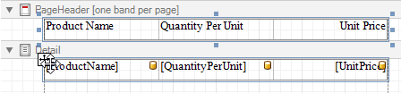
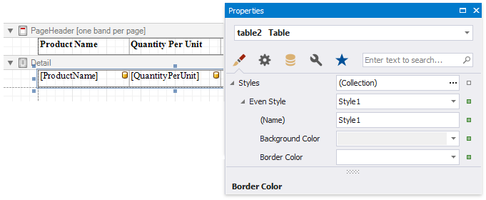

# Create a Table Report

This tutorial describes how to create a data-bound report displaying information in a tabular format. Table reports should not be confused with hierarchical [master-detail reports](create-a-master-detail-report-use-detail-report-bands.md), nor with [cross-tab reports](create-a-cross-tab-report.md).

1. [Create a new report](../add-new-reports.md) or [open an existing one](../open-reports.md).

2. [Bind the report](../bind-to-data.md) to a required data source.

3. Add the [Page Header](../introduction-to-banded-reports.md) band to the report to print the column headers at the top of every document page. To do this, right-click the report's surface, and select **Insert Band** | **PageHeader** in the context menu.

    

4. Switch to the [Field List](../report-designer-tools/ui-panels/field-list.md) and select the required fields by clicking them while holding the CTRL or SHIFT key. Then, drop them onto the Page Header band with the right mouse button to quickly create column headers.

    

    This creates a [Table](../use-report-elements/use-tables.md) in which each cell shows a field name.

5. To provide dynamic content to the report, switch to the Field List again and select the same fields. Click the selected fields and drag-and-drop them onto the Detail band.

    

    This creates a table with the same number of cells as the number of fields selected with each cell bound to the appropriate data field.

6. Select a table by clicking its handle, which appears when you hover the table with the mouse cursor. To select both tables simultaneously, click their handles while holding the CTRL key.

    

7. Use the [Toolbar](../report-designer-tools/toolbar.md)'s **Font**, **Alignment** and  **Borders** sections to customize the tables' appearance.

    

9. Define a currency format for the **UnitPrice** cell. Click the cell's smart tag, and then, click the **Format String** property's ellipsis button. Select the appropriate format in the invoked **Format String Editor** editor and click **OK**.

    

10. To further improve the table readability, you can apply different visual styles to its odd and even rows. See [Report Visual Styles](../customize-appearance/report-visual-styles.md) to learn more. 

    
	
	See the [Use Tables](../use-report-elements/use-tables.md) section to learn how to add or remove the table's rows and cells, as well as convert the table's cells to separate label controls.

Switch to [Print Preview](../preview-print-and-export-reports.md) to see the resulting report.

