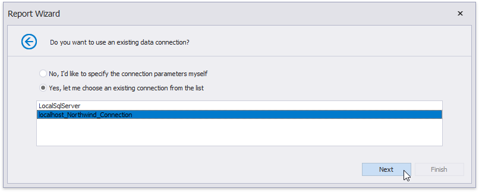

# Create an Invoice Based on a Template

This document describes how to create an invoice report based on a predefined template using the [Report Wizard](../report-designer-tools/report-wizard.md).

> [!Note]
> See the [Create an Invoice Manually](create-an-invoice-manually.md) topic to learn how to create an invoice report with a custom layout from scratch.

Do the following to select an invoice template and configure its settings:

1. Click [New Report via Wizard](../add-new-reports.md) in the [Toolbar](../report-designer-tools/toolbar.md)'s **Home** tab.

    

2. On the first wizard page, select **Template Report** and click **Next**.
	
	

3. On the next wizard page, choose the report template that specifies elements' arrangement and appearance settings.
	
	
	
	Click **Next** to proceed to the next wizard page.

4. The following page allows you to select a data source's type that provides data to your report. Choose **Database** and click **Next**.
	
	

5. On the next wizard page, specify whether you want to use an existing data connection or create a new one. For this tutorial, select an existing connection and click **Next**.
	
	

6. The following wizard page has a list on the right-hand side displaying the selected template's available fields. On the left-hand side, you can choose a table, view or stored procedure containing the data fields corresponding to the template fields. You do not need to provide data to all template fields.
	
	You can combine several different tables' or views' data fields by creating a custom query. Click the **Queries** category's plus button, and in the invoked [Query Builder](../report-designer-tools/query-builder.md), join data tables and views based on key columns.
	
	
	
	Click **Next** on the wizard page to continue report creation.

7. The next wizard page enables you to specify the relationships between the data source' s fields and predefined template fields.
	
	Drag and drop the required data field form the tree on the left-hand side onto the corresponding template field's column.
	
	
	
	You can also select a data field from the **Template Field Value** drop-down list or manually enter a static field value in this column.
	
	If you do not provide values to specific template fields, the corresponding elements are automatically added to the resulting report.
	
	Click **Next** to proceed.

8. On the last wizard page, select the currency symbol and price values' format.
	
	You can also specify the following discount/tax options:
	
	* **Range** - Defines whether the discount/tax value should not be taken into account (**None**), or should be used for individual items (**Unit**) or the entire order (**Total**).
	* **Value**- Specifies the discount/tax value that can be static or bound to the data source field.
	* **Type** - Specifies the type of the discount/tax value (flat, fixed or percentage).
	* **Inclusive** (for the tax only) - Indicates whether the tax value is included in product prices.
	
	

Click **Finish** to complete the wizard and get the report layout according to the selected template and specified options.

Switch to [Print Preview](../preview-print-and-export-reports.md) to see the result.

