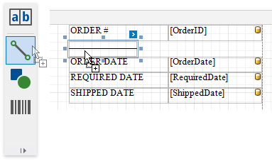
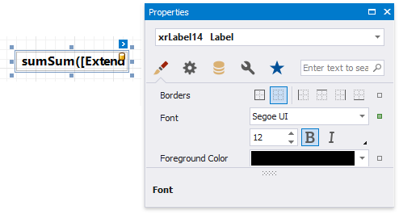
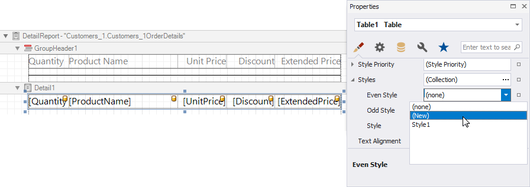

# Create an Invoice Manually

This tutorial describes how to create a simple invoice report displaying information about customers and their orders. You can perform similar steps to create various invoice layouts depending on your requirements.

> [!Note]
> See the [Create an Invoice based on a Template](create-an-invoice-based-on-template.md) topic to learn how to create an invoice report based on a predefined layout.

## Create a Report and Bind It to Data

1. [Create a new report](../add-new-reports.md) or [open an existing one](../open-reports.md).

2. Click the report's smart tag. In the invoked actions list, expand the drop-down menu for the **Data Source** property and click **Add New DataSource**.
	
	

3. On the first page of the invoked **Data Source Wizard**, you can choose the required data source type. Select **Database** and click **Next** to proceed.
	
	

4. The following page allows you to specify whether you want to use an existing data connection or create a new one. For this example, select an existing connection and click **Next**.
	
	

5. On the next page, you can choose which tables, views and/or stored procedures to add to the report.
	
	Obtain data from two different tables to display information about customers and orders at the same hierarchical level in the report. Click the plus button for the **Queries** category to create a custom query. In the invoked [Query Builder](../report-designer-tools/query-builder.md), add the required data tables to a query and join them based on a key column.
	
	

5. On the same wizard page, select the data view providing order details for listing products included in each order in the invoice. Click the **Manage Relations** button to specify a master-detail relationship between the queries. In the invoked dialog, connect the required key columns using drag-and-drop.
	
	

6. Click **Finish** to complete the wizard.

After these steps, make sure that an appropriate data member is assigned to the report.

## Prepare the Master Report Layout
Create the master report layout to display basic information about customers and their orders.

1. Switch to the [Field List](../report-designer-tools/ui-panels/field-list.md) and drop the required data fields onto the [Detail band](../introduction-to-banded-reports.md). New controls of appropriate types are automatically created and bound to the corresponding fields.
	
	

2. Drop [Label](../use-report-elements/use-basic-report-controls/label.md) controls from the [Toolbox](../report-designer-tools/toolbox.md) onto the band to display static captions for specific data fields.
	
	

3. Double-click the added labels one after another and enter the required text.
	
	

4. Use the [Line](../use-report-elements/draw-lines-and-shapes/draw-lines.md) control to separate data.
	
	

## Prepare the Detail Report Layout
Perform the following steps to create a detail report and construct its layout to show the order details in a tabular form:

1. Create a [Detail Report Band](../introduction-to-banded-reports.md) by right-clicking the report's surface. In the invoked context menu, select **Insert Detail Report**, and then, select the master-detail relationship's name.
	
	

2. Add dynamic content to the detail report. Go to the **Field List**, select the data fields while holding down CTRL or SHIFT and drag-and-drop them onto the Detail band. This automatically creates a [Table](../use-report-elements/use-tables.md) control with table cells bound to the corresponding fields.
	
	You should drag-and-drop fields from the category corresponding to the master-detail relationship to correctly generate the detail report's data.
	
	

3. Add the Group Header band to the detail report to display captions for table columns. Right-click the detail report, and in the context menu, select **Insert Band | GroupHeader**.
	
	

4. To create column headers, select the same data fields in the **Field List** and drag-and-drop them onto the Group Header band using the right mouse button.
	
	

5. Click the Detail Report band's smart tag, and in the invoked actions list, set the band's **Page Break** property to **After the Band** to print each order on a separate page.
	
	

## Create a Calculated Field
This section demonstrates how to create a [custom field](../shape-report-data/use-calculated-fields.md) whose values are calculated using a pre-defined expression.

Do the following to evaluate an extended price based on the price, quantity and discount values obtained from a database:

1. In the [Field List](../report-designer-tools/ui-panels/field-list.md), right-click any item inside the data relationship node, and in the invoked context menu, select **Add Calculated Field**.
	
	

2. Select the created calculated field, and in the [Property Grid](../report-designer-tools/ui-panels/property-grid.md), change its name to **ExtendedPrice**. Click the **Expression** property's ellipsis button, and in the invoked **Expression Editor**, construct the expression based on the **UnitPrice**, **Quantity** and **Discount** fields.
	
	

3. You can use the created calculated field as an ordinary data field. Add a cell to a table in the Detail band and drop the calculated field onto this cell. Additionally, create one more table cell in the Group Header for displaying the corresponding caption.
	
	

## Format Data
The next step is to specify report elements' [value formatting](../shape-report-data/shape-data-expression-bindings/format-data.md) to improve displaying their incoming data.

1. In the master report's Detail band, select controls bound to date fields while holding down CTRL or SHIFT. Switch to the [Property Grid](../report-designer-tools/ui-panels/property-grid.md) and click the **Text Format String** property's ellipsis button. In the invoked **Format String Editor**, activate the **DateTime** category and select the format, for example, display dates as a month (name) followed by the day (number) and year (four digits).
	
	

2. Select the table cell bound to the **Discount** data field in the detail report's Detail band and click its smart tag. Click the **Format String** property's ellipsis button, and in the invoked **Format String Editor**, apply the **Percent** format. In this case, field values are multiplied by 100 and displayed with a percent symbol.
	
	

3. In the detail report's Detail band, select the cells bound to the **UnitPrice** and **ExtendedPrice** fields. Invoke the **Format String Editor** once again and choose the format preset from the **Currency** category (for instance, **c2**).

## Calculate a Summary
Do the following to calculate a total price for each order as a sum of **Extended Price** values:

1. Add the Group Footer band to the detail report in the same way as the Group Header.

2. Drop the Label control onto the added band and click its smart tag. Set the **Summary Running** property to **Report** to calculate the summary for the entire detail report and click the **Expression** property's ellipsis button. In the invoked **Expression Editor**, specify the following expression to calculate the total price:
	
	

3. Use the **Format String** property to format the summary's value (for instance, set it to **Total: {0:c2}**).
	
	

## Sort Data
Perform the following steps to sort data in the detail report:

1. Select the **Detail** band in the detail report and switch to the [Group and Sort Panel](../report-designer-tools/ui-panels/group-and-sort-panel.md). Click **Add a Sort**, and in the invoked drop-down window, select the required data field.
	
	

2. Use the **Sort Order** drop-down list to define the sort order.
	
	

## Customize the Report Appearance
Do the following to customize the report and its elements' appearance:

1. Click the gray area around the design surface to select the report, and in the [Property Grid](../report-designer-tools/ui-panels/property-grid.md), specify the font settings. These settings are distributed to all report elements.
	
	

2. You can adjust a control's font independently from its parent (for instance, make summary values bold).
	
	

3. Change specific controls' (bound to date fields, price fields, etc.) text alignment using the **Text Alignment** property.
	
	

4. Create a global [visual style](../customize-appearance/report-visual-styles.md) to apply it afterwards to multiple controls. Click the caption button in the [Toolbar](..\report-designer-tools\toolbar.md)'s **Styles** section.

    

5. In the invoked **Styles Editor**, click the plus button and specify appearance properties for the newly created style.

    

6. Apply a style to report elements by selecting them and clicking the created style in the **Styles** gallery.

    

7. You can provide different appearances to alternating (odd and even) table rows in the detail report. Select the table and expand the **Styles** property in the Property Grid. Invoke the drop-down list for the **EvenStyle** property and select **New**.
	
	
	
	Specify the created style's appearance settings (for example, background color).

## Add Additional Information
Do the following to provide additional information to your invoices, such as the report name and current date:

1. Add the Page Header band to the master report to display the required information on each invoice page.

2. Drop the Label control from the **Toolbox** onto the Page Header, double-click the control and type "**Invoice**". Specify the required appearance settings (font, foreground color, etc.).
	
	

3. Add the [Page Info](../use-report-elements/use-basic-report-controls/page-info.md) control to the Page Header band to display system date in the report.
	
	

4. Click the control's smart tag, and in the invoked actions list, set the **Page Information** property to **Current Date and Time**.
	
	

5. Click the **Text Format String** property's ellipsis button, and in the invoked **Format String Editor**, select a date format as in the [Format Data](#format) section above.

    

## View the Result
The invoice report is now ready. Switch to [Print Preview](../preview-print-and-export-reports.md) to see the result.

