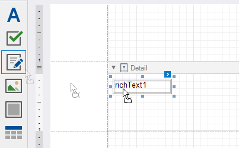
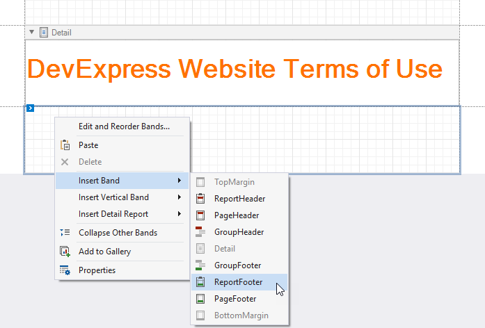
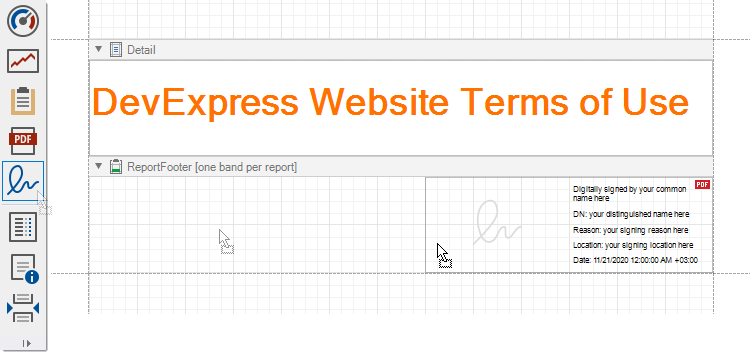
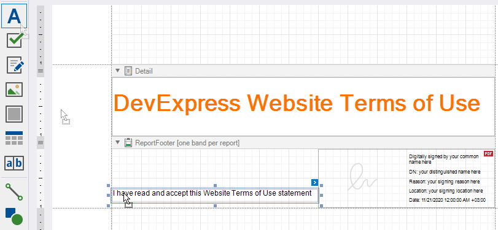
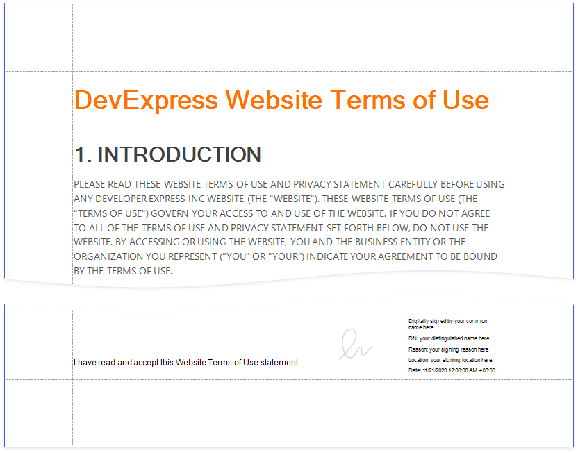
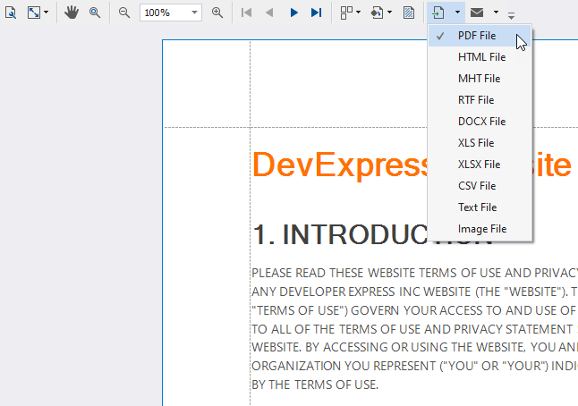
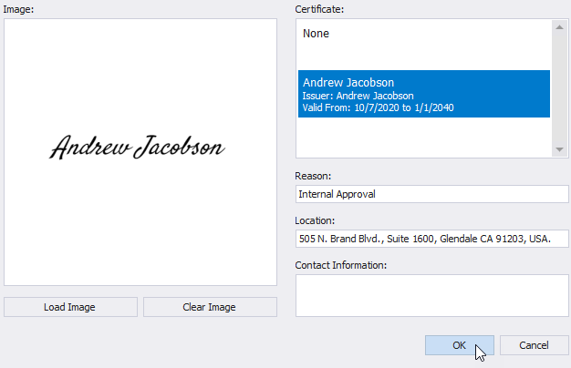
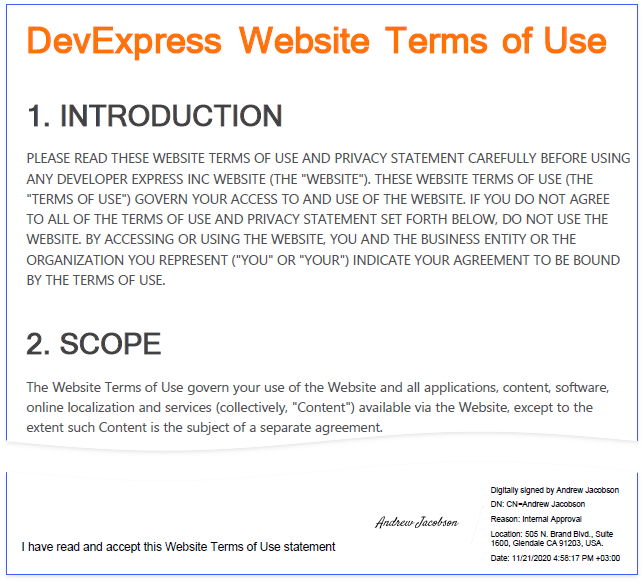

# Reports with a Visual PDF Signature

This tutorial describes how to create a report with a visual PDF signature.

## Create a Report Layout

1. Drop the **RichText** control from the report controls Toolbox tab onto the **Detail** band.

    

2. Double-click the control and insert the [DevExpress Website Terms of Use](https://www.devexpress.com/aboutus/legal.xml) text.

    

3. Right-click the design surface. Select **Insert Band / ReportFooter** from the context menu. Enable the footer band's **Print at Bottom** property.

    

4. Drop the **PdfSignature** control from the report controls Toolbox tab onto the **Report Footer** band.

    

5. Place the **Label** control to the left of the **PdfSignature** control and add the following text: _I have read and accept this Website Terms of Use statement_.

    

Click the **Preview Tab** to show the result.

## Export and Sign the Report

1. In **Preview**, click **Export Document** and select **PDF File**.

    

2. In the invoked **PDF Export Options** dialog, click the **Digital Signature** option's ellipsis button.

    

3. In the invoked **Signature Options** dialog, choose a certificate and specify signature details.

    

Save and open the document to show the final result.

