# Create Reports

This section contains tutorials that explain how to create different reports.

## Basic Reports

### [Table Reports](create-reports/create-a-table-report.md)
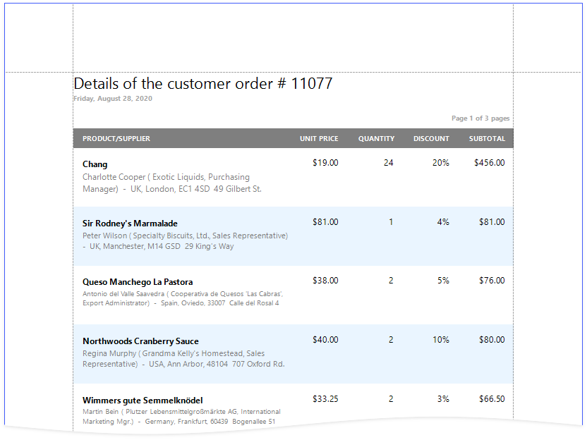

### [Vertical Reports](create-reports\create-a-vertical-report.md)
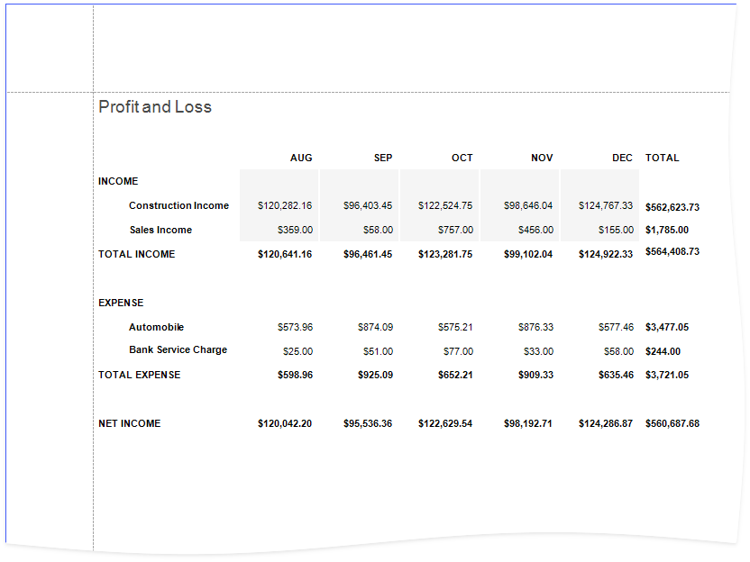

## Reports with Hierarchical Data

### [Master-Detail Reports with Detail Report Bands](create-reports/create-a-master-detail-report-use-detail-report-bands.md)

### [Master-Detail Reports with Subreports](create-reports/create-a-master-detail-report-use-subreports.md)
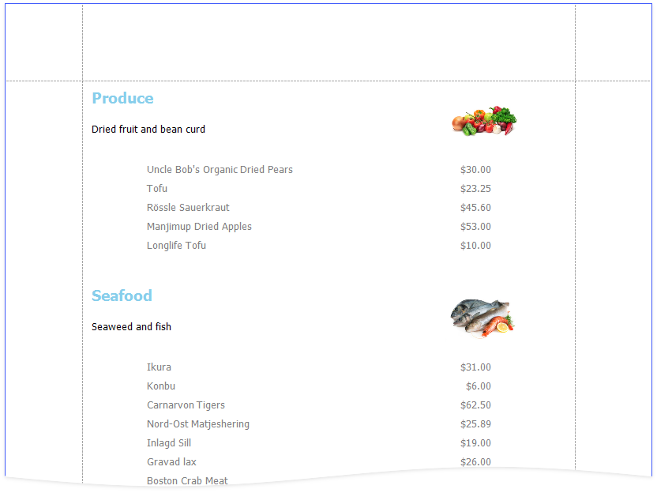

### [Hierarchical Reports](create-reports/create-a-hierarchical-report.md)
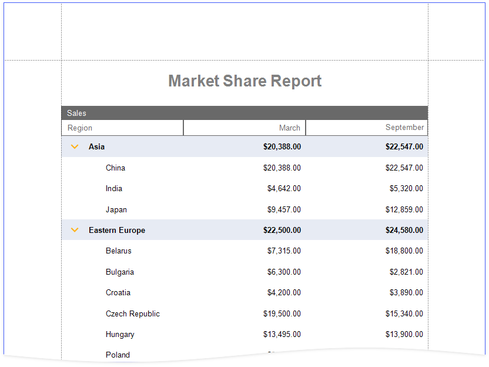

## Invoice Reports

### [Invoices](create-reports/create-an-invoice-manually.md)
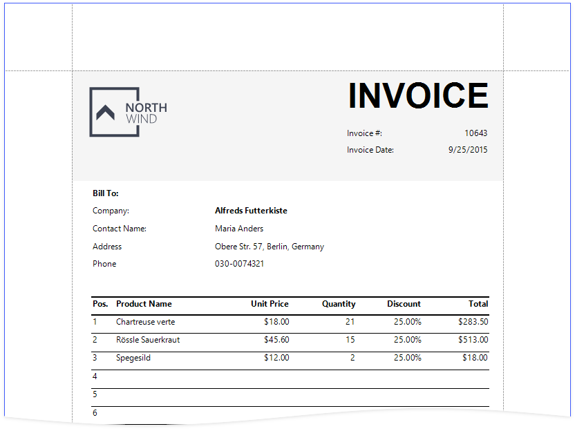

### [Invoices from Templates](create-reports/create-an-invoice-based-on-template.md)
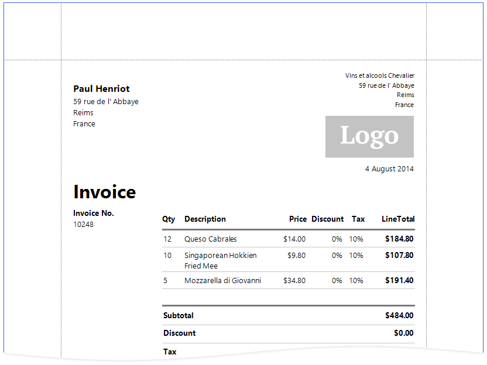

## Cross-Tab Reports

### [Cross-Tab Reports](create-reports/create-a-cross-tab-report.md)
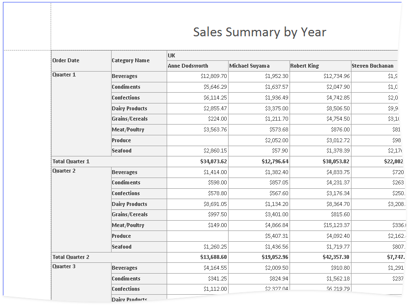

### [Balance Sheets](create-reports/create-a-balance-sheet.md)
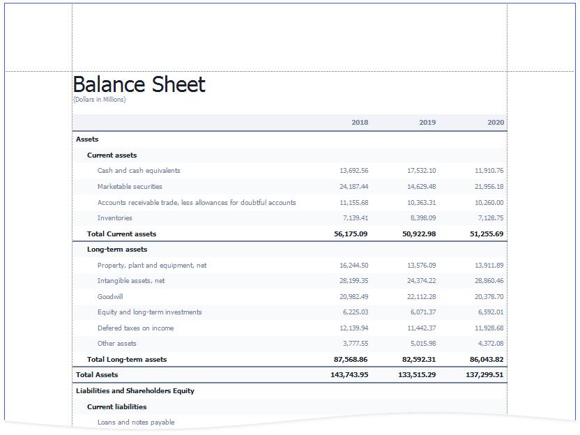

## Multi-Column Reports

### [Labels and Badges](create-reports/create-labels-and-badges.md)
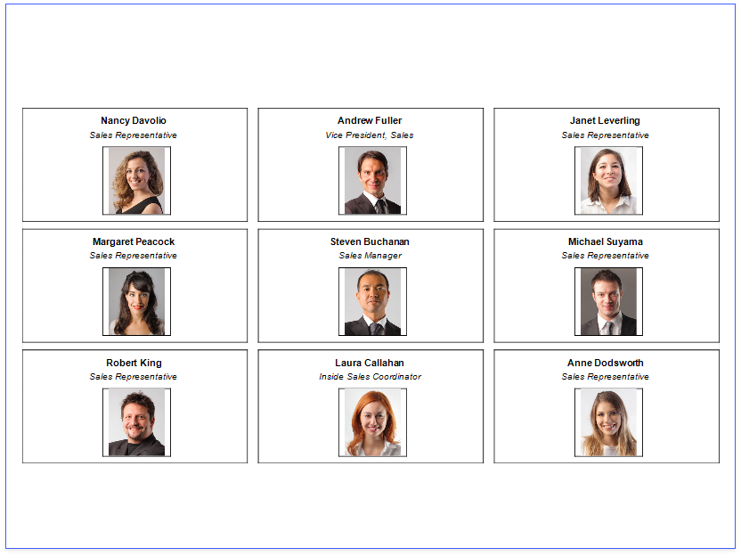

### [Multi-Column Reports](create-reports/create-a-multi-column-report.md)

## Interactive Reports

You can add interactive elements to your report to customize it in Print Preview:

### [Interactive E-Forms](create-reports/create-an-interactive-e-form.md)
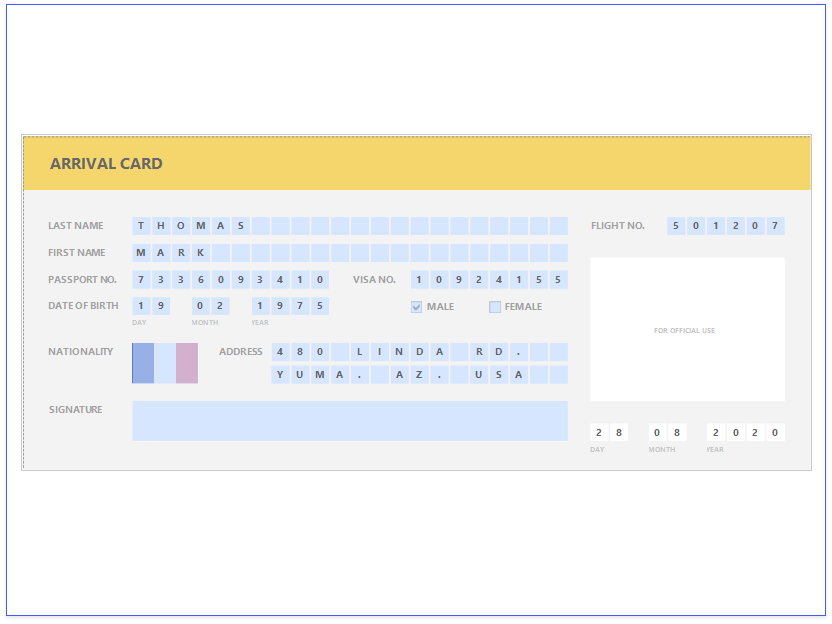

> [!Note]
> See the [Provide Interactivity](provide-interactivity.md) section for information on how to provide drill-down and drill-through functionality in your reports.
> 
> See [Use Report Parameters](shape-report-data/use-report-parameters.md) for instructions on how to submit parameter values in Print Preview to customize your reports.

## Layout Features

### [Reports with Cross-Band Content and Populated Empty Space](create-reports/create-a-report-with-cross-band-content-and-populated-empty-space.md)

### [Reports with PDF content](create-reports/create-a-report-with-pdf-content.md)
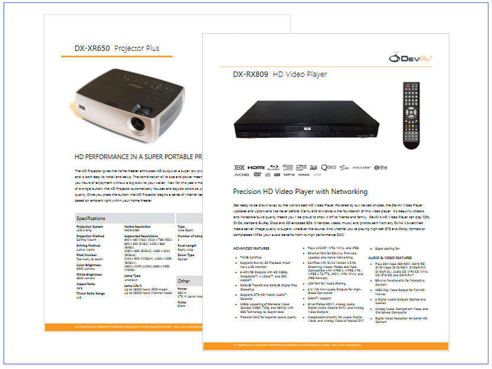
