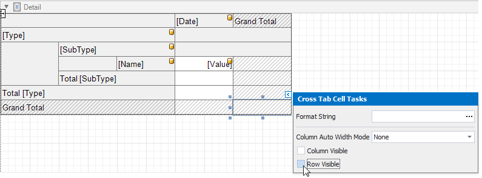

# Balance Sheets

This tutorial describes how to use the Cross Tab control to create a **Balance Sheet** report.

> [!Tip]
> This tutorial shows how to configure a Cross Tab using the [Report Wizard](../report-designer-tools/report-wizard.md). See the [Cross-Tab Reports](cross-tab-reports.md) tutorial for information on how to use the Cross-Tab Report Wizard.

## Add a Cross Tab and Bind It to Data

1. Invoke the Report Wizard and [add a blank report](../add-new-reports.md) to your application.

1. Drop the Cross Tab control from the Toolbox onto the report's [Detail band](../introduction-to-banded-reports.md).

    

3. Click the Cross Tab's smart tag, expand the **Data Source** property's drop-down menu and click **Add New Data Source**.

    

4. Use the invoked [Data Source Wizard](../report-designer-tools/data-source-wizard.md) to bind the Cross Tab to a data source.

Click **Finish** to complete the Data Source Wizard and assign the created data source to the Cross Tab.

The data source structure becomes available in the [Field List](../report-designer-tools/ui-panels/field-list.md).

> [!Note]
> Ensure that the report's **Data Source** property is not set if you place a Cross Tab into the [Detail band](../introduction-to-banded-reports.md). Otherwise, the Cross Tab data is printed as many times as there are rows in the report data source.

## Define the Cross Tab Layout

1. Drop data fields from the Field List onto the Cross Tab's areas to define the Cross Tab's rows, columns, and data.

    A row is added to the bottom of the Cross Tab to display grand total values calculated against the added row or column header.

    

    Drop nested row headers next to the parent header cells to create a hierarchy.

    

Switch to Print Preview to see the Cross Tab populated with data.

## Specify Group Settings

As you can see in the image above, the Cross Tab displays data for individual days.

Select the column header cell and click its smart tag. Set the **Group Interval** property to group data.

## Specify Layout Options

1. The Cross Tab control stacks row headers horizontally. You can change the view so that parent values span the entire row header panel width.

    Select the Cross Tab and switch to the [Property Grid](../report-designer-tools/ui-panels/property-grid-tabbed-view.md). Expand the **Layout Options** group and enable the **Hierarchical Row Layout** property.

    

2. Set the **Corner Header Display Mode** property to **None** to merge cells in the top-left corner into a single empty cell.

    

Switch to Print Preview to see the result.

## Hide Grand Totals

1. Select the bottom right cell and click its smart tag. Disable the **Row Visible** and **Column Visible** properties to hide the row and column that display grand total values. Invisible cells are filled with a hatch brush.

    

2. Resize the Cross Tab. You can also resize individual rows and columns.

    

The Cross Tab control no longer displays grand total values.

## Sort and Format Data

1. Select the row sub-header cell and change its sort order. The Cross Tab sorts row and column field values in ascending order. Set the **Sort Order** property to **None** to restore the original data source order.

    

2. Format the data. Hold down SHIFT or CTRL and select cells. Specify the cells' **Text Format String** property.

    

## Customize Appearance

1. Select the Cross Tab, switch to the **Properties** window and expand the **Styles** property. Use the **General Style** property to specify common appearance settings that apply to all Cross Tab cells. Set the following properties:

    * **Background Color** to **White**
    * **Border Color** to **SlateGray**
    * **Font** to **Tahoma 8.25**
    * **Foreground Color** to **SlateGray**

    

2. Expand the **Header Area Style** property and do the following:

    * reset the **Background Color** property value to inherit the color from the general style;
    * set the **Foreground Color** property to **MidnightBlue** to override the general foreground color;
    * set the **Font** property to **Tahoma 8.25** to override the general font.

    

3. Expand the **Total Area Style** property and set the following properties to override general settings:

    * **Font** to **Tahoma 8.25 Bold**
    * **Foreground Color**  to **MidnightBlue**

    

4. Select the row sub-header cell and set the following appearance properties:

    * **Foreground Color**  to **SlateGray**
    * **Font** to **Tahoma 8.25**

    These values apply to the selected cell only and override values specified for the entire header area.

    

5. Select the cells in the top row and in the rows with total values. Set the **Borders** property to **Bottom** and **Border Width** property to **2**.

    

6. Select the cells you did not customize in the previous step and set the **Borders** property to **None**.

    

7. Select the cells in the top row and set the **Background Color** property to **LightSteelBlue**.

    

8. Select the row sub-header cell and the next cell in the data area. Set their **Background Color** property to **AliceBlue**.

    

## Apply Odd and Even Row Styles

Use the **GroupRowIndex** variable in [expressions](../use-expressions.md) to identify odd and even rows.

Select the row sub-header cell and the next cell in the data area. Go to the **Properties** window and open the **Expressions** tab. Click the **Background Color** property's marker, select **Background Color Expression** and specify the following expression:

_iif([Arguments.GroupRowIndex] % 2 == 1, Rgb(235, 241, 252), ?)_

As you can see, the row backgrounds do not start from the page's left border, but have indents. These indents correspond to auxiliary cells in a tree.

Select these auxiliary cells and disable the **Column Visible** property.

To add indents to row field values and imitate a tree-like view, set the **Padding** property for the Cross Tab's cells.

## Add a Report Title

1. Right-click the report and select **Insert Band / ReportHeader** from the context menu.

    

2. Drop a [Label](../use-report-elements/use-basic-report-controls/label.md) from the Toolbox onto the created Report Header.

    

3. Double-click the label and type the report title. Specify appearance settings.

    

Switch to Print Preview to see the final result.

