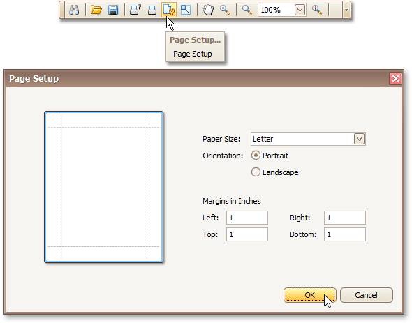

In the Report Designer, page settings of a report can be specified in one of two ways. The first approach forces the default printer settings to be used when the report is printed, while the other one enables you to alter page settings independently.
* **Using settings of the default printer**
	
	For the orientation, margins and paper size, you can specify a requirement that applies the corresponding printer settings instead of the report's. In this instance, the page properties in the [Property Grid](../../../../../../interface-elements-for-desktop/articles/report-designer/report-designer-for-winforms/report-designer-reference/report-designer-ui/property-grid.md) are disabled and displayed as grayed out. This may be useful when the report is printed in several places with different printers and printer settings.
	
	
* **Specify the report's page settings**
	
	While designing the report, you can specify the page settings via the Property Grid:
	
	
	
	You can set the page orientation and modify the margins. The margin values are expressed in the report's [measurement units](../../../../../../interface-elements-for-desktop/articles/report-designer/report-designer-for-winforms/create-reports/basic-operations/change-measurement-units-of-a-report.md). You can select from the predefined paper sizes (**Paper Kind** property), choose **Custom** and create your own paper size, or select one which is already defined for this printer (**Paper Name** property).
	
	These settings affect the layout of the report's design surface. After their modification, you may notice red warning marks, indicating that the controls go beyond the page width. These warnings can be switched off by setting the **Show Printing Warnings** property of the report to **No**.
	
	
* **Modify the settings in Preview Tab**
	
	The report's [Preview Tab](../../../../../../interface-elements-for-desktop/articles/report-designer/report-designer-for-winforms/report-designer-reference/report-designer-ui/preview-tab.md) toolbar has a corresponding button that enables you to modify the page settings. Clicking this button invokes the **Page Setup** dialog, which allows you to adjust the page layout before printing or exporting, and select the printer.
	
	
	
	The margins can also be set visually by dragging the dashed lines in the Preview Tab as needed.
	
	To change the measurement units shown in the margins tooltips, customize the report's **Measure Units** property.

| **Measure Units = Hundredths of an Inch** |
|---|
|  |
| **Measure Units = Tenths of a Millimeter** |
|  |

To learn about other options available for a report, refer to [Report Settings](../../../../../../interface-elements-for-desktop/articles/report-designer/report-designer-for-winforms/report-designer-reference/report-settings.md).