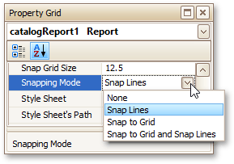
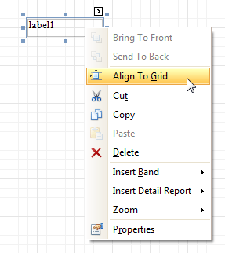
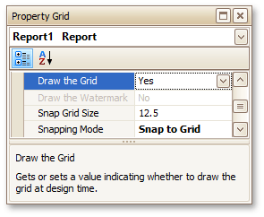
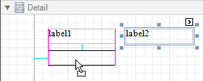

# Controls Positioning
This document describes how to easily construct professionally looking reports by precisely aligning their elements to each other. These are useful when creating new reports from scratch or when fixing cluttered report layouts with dozens of randomly scattered controls.

To select an appropriate alignment mode for report elements, use a report's **Snapping Mode** property.

## Snap Grid
When a report is being edited in the Report Designer, it is lined up by the snap grid. This helps to establish the distance between report elements and align them to each other.

To quickly align a report control to the snap grid, right-click it and select **Align To Grid** in the context menu. Alternatively, use the **Align to Grid** toolbar button.

In the **Snap to Grid** mode, a report control that is being relocated using the mouse or the ARROW keys is automatically aligned with the nearest grid cell. When resizing the report control using the mouse or by pressing the SHIFT+ARROW keys, its size is discretely changed by one grid cell. You can temporarily ignore snapping to the grid when moving and resizing controls. For this, hold down the ALT key when using the mouse and the CTRL key when using the keyboard.

You can select whether or not the snap grid should be drawn over a report surface by setting the **Draw the Grid** option in the [Property Grid](../../report-designer-reference/report-designer-ui/property-grid.md).

You also can adjust the **Snap Grid Size**, which is measured in the [measurement units](change-measurement-units-of-a-report.md) set for your report.

## Snap Lines
If the **Snap Lines** mode is selected, report elements are aligned using snap lines. These are special guide lines, which appear around the report control that is being moved or resized and indicate the distance to other report elements (controls and bands).

When you move a report control using the ARROW keys or resize it by pressing the SHIFT+ARROW keys, this control is aligned using snap lines to the nearest report element in that direction.

To help maintain a uniform distance between elements, the snap lines maintain the inner paddings of report bands and the outer margins of report controls specified by the band's **Snap Line Padding** and control's **Snap Line Margin** properties, respectively.

To disable snapping using snap lines for controls being relocated or resized, additionally hold down the ALT key when using the mouse and the CTRL key when using the keyboard.

## Snap Lines and Snap Grid
The **Snap to Grid and Snap Lines** mode enables snapping to both the snap grid and snap lines.

## No Snapping
To disable snapping in your report, set the **Snapping Mode** property to **None**. In this case, report controls are moved and resized by one measurement unit defined by the **ReportUnit** property.