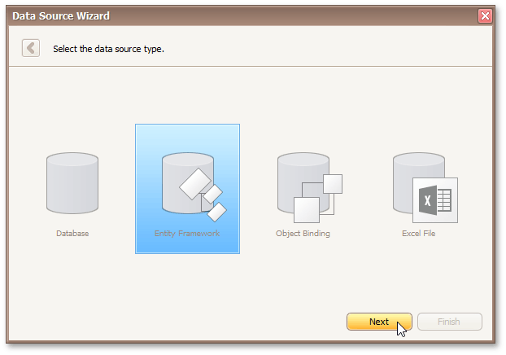
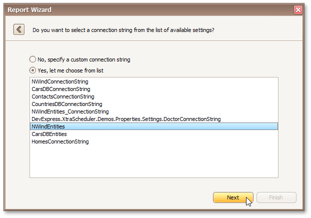
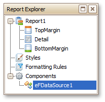

# Bind a Report to an Entity Framework Data Source
This document describes the steps required to connect a report to data provided by an Entity Framework data context.

To bind a report to an Entity Framework data source, do the following.
1. [Create a new report](../basic-operations/create-a-new-report.md).
2. Click the report's [Smart Tag](../../report-designer-reference/report-designer-ui/smart-tag.md). In the invoked actions list, expand  the **Data Source** drop-down list and click **Add New DataSource**.
	
	
3. The first page of the invoked **Data Source Wizard** allows you to specify the data source type. Select **Entity Framework** and click **Next** to proceed.
	
	
4. On the next page, select the required data context from the list of available data contexts and click **Next**.
	
	
5. Select a connection string to be used to establish a data connection.
	
	
	
	Click **Next** to proceed to the next page.
6. The following wizard page is available only if the current entity data model contains stored procedures. To bind to a stored procedure, click **Add**. Then, in the invoked window, select a required stored procedure and click **OK**.
	
	
7. Configure the parameters to be passed to the selected stored procedure. Be sure to specify the correct parameter **Type**. Click **Finish** to exit the wizard.
	
	

The newly created Entity Framework data source will be displayed in the **Components** node of the [Report Explorer](../../report-designer-reference/report-designer-ui/report-explorer.md). Additionally, the hierarchy of the data source will be reflected by the [Field List](../../report-designer-reference/report-designer-ui/field-list.md).

