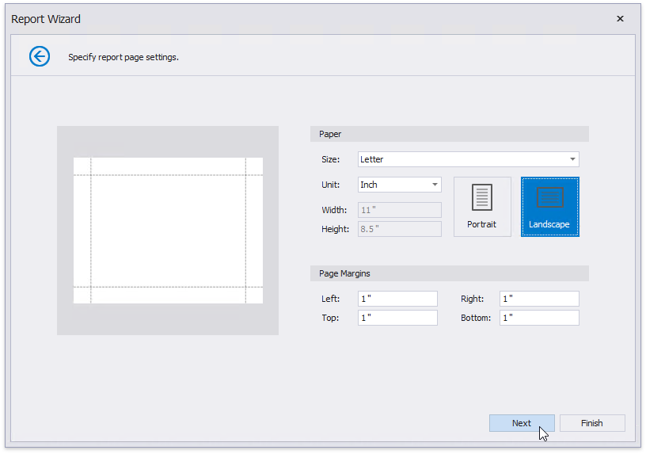
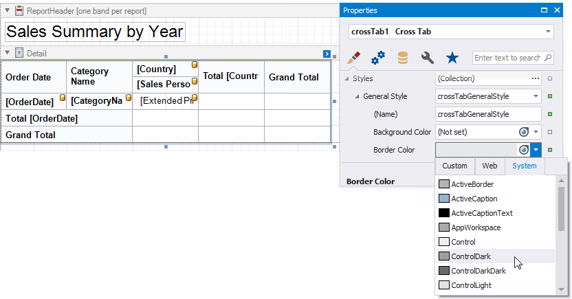
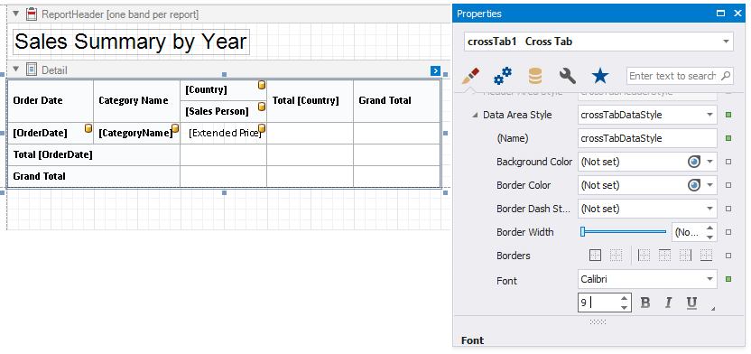
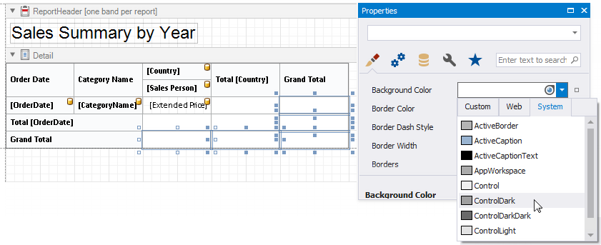
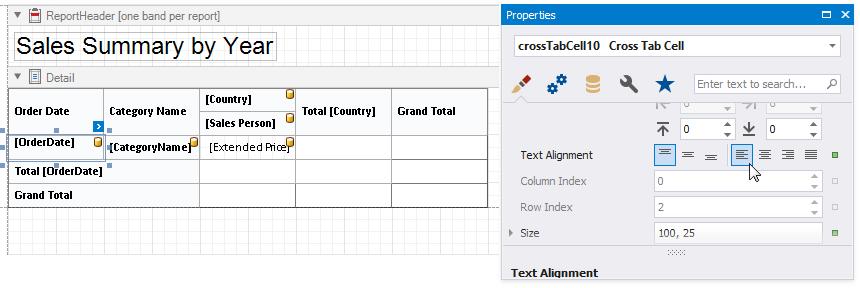
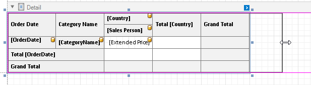

# Cross-Tab Reports

This tutorial describes how to use the Cross Tab control to create a **Sales Summary** report.

> [!TIP]
> This tutorial demonstrates how to use the Cross-Tab Report Wizard. See [Balance Sheets](balance-sheets.md) tutorial for information on how to configure a Cross Tab on the Design Surface.

## Add a Cross-Tab Report

1. Invoke the [Report Wizard](../report-designer-tools/report-wizard.md).

1. Select **Cross-Tab Report** and click **Next**.

    

1. Bind the report to a data source as described in the [Bind to Data](../bind-to-data.md) section.

1. Select a data member that stores data for each sales person's sales. Click **Next**.

    

1. Drop data fields onto cross-tab areas to define row/column headers and data.

    

    The field order defines the hierarchy in the resulting cross-tab report. The higher the field on the list, the higher the level in the field hierarchy.

1. Change the report page layout to landscape to ensure the cross-tab content fits the report well. Click **Next**.

    

1. Set the report's color scheme and click **Next**.

    

1. Specify the report's title and click **Finish**.

    

The generated report contains a Cross Tab that is configured based on the specified settings. The Cross Tab calculates automatic totals and grand totals across row and column fields.

> [!TIP]
> Ensure that the report's **Data Source** property is not set if you place the Cross Tab into the Detail band. Otherwise, the Cross Tab data is printed as many times as there are rows in the report data source.

Switch to the Preview tab to see an intermediate result.

As you can see in the image above, the Cross Tab displays data for individual days. The next section shows how you can adjust the report so that it summarizes values by quarters.

## Specify Group Settings

Select the row header cell and click its smart tag. Specify the **Group Interval** property to group data.

## Format Data

Apply data formatting to cells. Hold down SHIFT or CTRL to select multiple cells, then go to the **Properties** window and specify the **Text Format String** property.

## Customize Appearance

1. Select the Cross Tab, switch to the **Properties** window and expand the **Styles** property. Expand the **General Style** property and set **Border Color** to **ControlDark**. This value applies to all Cross Tab cells.

    

1. Expand the **Header Area Style** property and set the following properties:

    * Background Color to **Control**
    * Font to **Calibri 9 Bold**

    

1. Expand the **Total Area Style** property and set **Font** to **Calibri 9 Bold**.

    

1. Expand the **Data Area Style** property and set Font to **Calibri 9**.

    

1. Hold down SHIFT or CTRL, and select the cells that display the grand total values. Go to the **Properties** window and set **Background Color** to **ControlDark**. This value applies to the selected cells only and overrides the value specified at the area level.

    

1. Select the row header cell and set **Text Alignment** to **Top Left**.

    

## Adjust the Content Size

1. Use a cell's **Column Auto Width Mode** property to specify a cell width calculation method. The Report Wizard sets this property to **Shrink And Grow** for row headers and to **None** for other cells.

    

1. Resize the Cross Tab. You can also resize the individual rows and columns.

    

1. Move the report title to the [Top Margin band](../introduction-to-banded-reports.md) to repeat the title on each page and make the Cross Tab occupy the entire page area.

    

