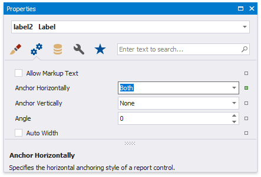
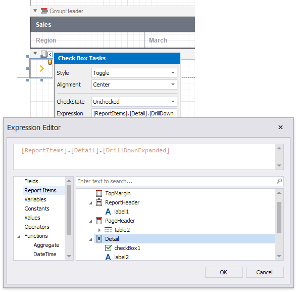

# Hierarchical Reports

This tutorial describes how to use the [detail band](..\introduction-to-banded-reports.md)'s **Hierarchy Print Options** property to create a hierarchical report.

 

1. [Create a new report](../add-new-reports.md) or [open an existing one](../open-reports.md).

2. [Bind the report](../bind-to-data.md) to a required data source.

    The following image demonstrates an empty report bound to an [ObjectDataSource](..\bind-to-data\bind-a-report-to-an-object-data-source.md).

    

    Each record in this data source includes the "parent ID" field that defines the parent-child relationship and thus builds the hierarchy.

3. Arrange controls on the report.

    - Add the [Report Header](..\introduction-to-banded-reports.md) and [Page Header](..\introduction-to-banded-reports.md) bands (see the **Manage Report Bands | Add Bands** section in the [Introduction to Banded Reports](..\introduction-to-banded-reports.md) document for details)
    - Add [data-bound labels](..\use-report-elements\use-basic-report-controls\label.md) to the **Detail** band.

    

    Switch to the [Preview](..\preview-print-and-export-reports.md) tab to see an intermediate result.

    

4. Specify the Detail band's **Hierarchy Print Options** property.

    

    Set the following options:

    - **Key Field Name** and **Parent Field Name**, or **Child List Field Name**  
    Set the **Key Field Name** and **Parent Field Name** properties if your report's data has the Id-ParentID related fields.  
    Set the **Child List Field Name** property if your report's data is recursive. Assign the collection of child objects (records) if they have the same type as the parent objects (records).
    
    - **Indent**   
    Specify the child level node offset.

    - **Keep Together with First Child**  
    Specify whether to print a parent node together with its first child node on the next page if these nodes do not fit at the end of a page.

    

    As you can see in the image above, the **Detail** band that contains child rows is printed with the specified indent. However, the row (the sum of the label widths) does not fit the page now.

5. Align labels.

    - Anchor the first data-bound label to the Detail band's left and right edges. Set the label's **Anchor Horizontally** property to **Both**.

        

    - Anchor the rest of the data-bound labels to the right edge of the Detail band (their container). Set their **Anchor Horizontal** property to **Rignt**.    

        

    

6. Add a drill-down control to expand/collapse child rows.

    - Add the [Check Box](..\use-report-elements\use-basic-report-controls\check-box.md) control to the **Detail** band at the left-most position.

        

    - Set the **Check Box** control's glyph options. Use custom glyphs for the *checked* and *unchecked* checkbox states.

        

    - Set the **Detail** band's **Drill Down Control** property to the added **Check Box** control.

        

    - Set the **Check Box**'s **Check State** property to the following expression: *[ReportItems].[Detail].[DrillDownExpanded]* (in the control's Smart Tag or the [Property Grid](..\report-designer-tools\ui-panels\property-grid-tabbed-view.md)'s Expressions tab).

        

    

7. Sort report data.

    Use the Detail band's **Sort Fields** property to sort data on each hierarchy level.

    

    

8. Highlight root nodes.

    To format rows based on their nesting level, use the **Current Row Hierarchy Level** variable in expressions. For example, specify the **Detail** band's appearance properties as listed below:

    - Set the **Back Color** property to *iif([DataSource.CurrentRowHierarchyLevel] == 0, Rgb(231,235,244), ?)*
    - Set the **Font | Bold** property to *[DataSource.CurrentRowHierarchyLevel] == 0*

    

    

