# Interactive E-Forms

This tutorial describes how to create a form that is fillable in Print Preview.

To get started with this tutorial, [create a new report](../add-new-reports.md) or [open an existing one](../open-reports.md).

## Add Form Fields

Add the [Label](..\use-report-elements\use-basic-report-controls\label.md) report controls to the report and arrange them according to the form's template. Set the labels' **Text** property to the form's field names.

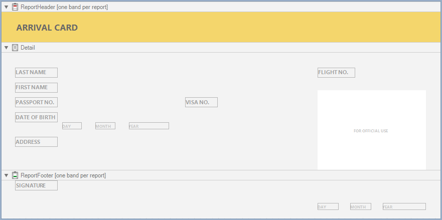

## Add Fillable Cells

Use the [Character Comb](..\use-report-elements\use-basic-report-controls\character-comb.md) control for the form's text fields. This control displays letters in individual cells and allows you to fill these cells in Print Preview.

1. Drop the Character Comb item from the Toolbox onto the report.
	
	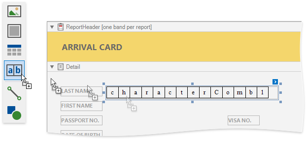
2. Select all the added Character Combs and set their properties in the **Property Grid**:
	- **Cell Size Mode**
	- **Cell Height**,
	- **Cell Width**,
	- and other cell settings.
	
	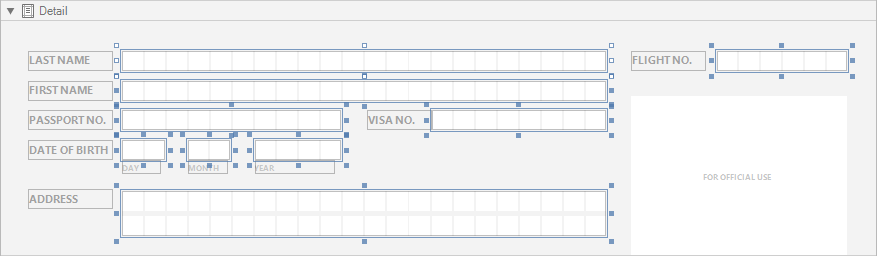
3. Enable the Character Combs' **Edit Options** 
| **Enabled** property.
	
	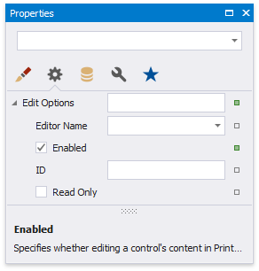
4. Choose editors for the Character Comb controls' edit mode.

	- Controls that allow you to enter letters  
		Invoke a drop-down list for the **Editor Name** property and select the **Only Uppercase Letters** item in the **Letters** category.
	
		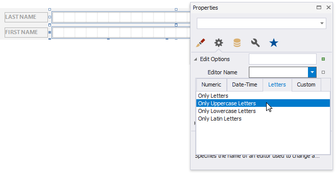

	- Controls that allow you to enter integers  
		Invoke a drop-down list for the **Editor Name** property and select the **Positive Integer** item in the **Numeric** category.
	
		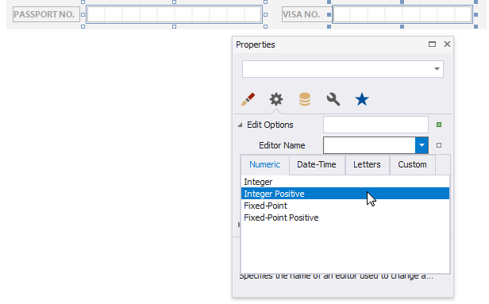

## Add Check Box Editors

Add [Check Box](..\use-report-elements\use-basic-report-controls\check-box.md) controls for the *Male/Female* fields.

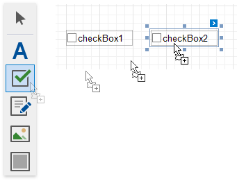

Use the following properties to set up these controls:

- Set the **Text** property.

- Set appearance properties.

- Enable the **Edit Options** | **Enabled** property switch check box states in Print Preview.

- Set the **Edit Options** | **Group ID** property to the same value to combine these two check boxes into a logical group. This allows you to select only one option at a time.
	
	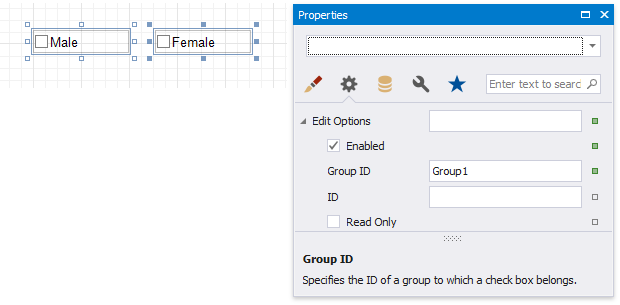

## Add the Signature Editor

Add the [PictureBox](..\use-report-elements\use-basic-report-controls\picture-box.md) report control for the form's *Signature* field.

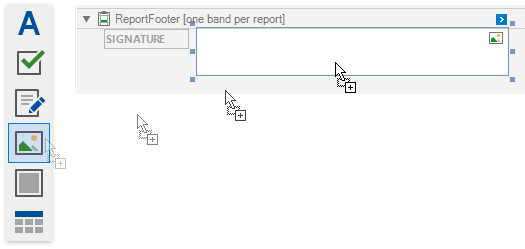

Do the following to enable drawing in Print Preview:

1. Enable the control's **Edit Options** | **Enabled** property.

2. Set the **Edit Options** | **Editor Name** property to **Signature**.

	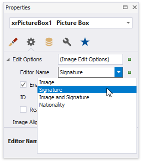

## Get the Result
Switch to the [Preview tab](..\preview-print-and-export-reports.md) to see the result.

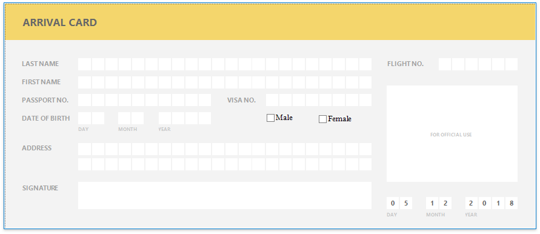

Click the  button on the Print Preview toolbar to highlight all the editable fields on the form.

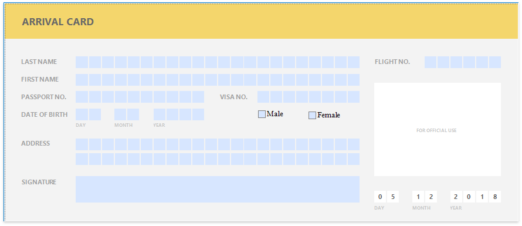

Click a field to invoke its editor. 

Use TAB and SHIFT+TAB to navigate between editable fields.