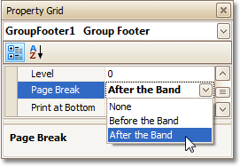
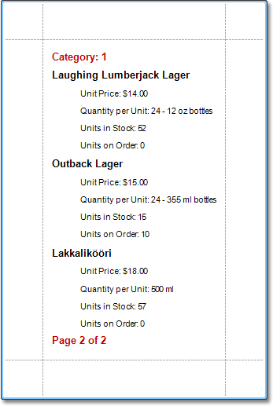

This tutorial demonstrates how to display page numbers individually, for each group in your report. To demonstrate this feature, we'll use a report, similar to the one created in the following tutorial: [Change or Apply Data Grouping to a Report](../../../../../../interface-elements-for-desktop/articles/report-designer/report-designer-for-winforms/report-editing-basics/change-or-apply-data-grouping-to-a-report.md).

To add page numbers for groups, do the following.
1. From the [Toolbox](../../../../../../interface-elements-for-desktop/articles/report-designer/report-designer-for-winforms/report-designer-reference/report-designer-ui/control-toolbox.md), drop the [Page Info](../../../../../../interface-elements-for-desktop/articles/report-designer/report-designer-for-winforms/report-designer-reference/report-controls/page-info.md) control onto the [Group Footer](../../../../../../interface-elements-for-desktop/articles/report-designer/report-designer-for-winforms/report-designer-reference/report-bands/grouping-bands.md).
	
	
2. Then, select the control, and set its **Running Band** to **GroupHeader1**.
	
	
	
	If required, you also can specify its **Format** property (e.g. **Page {0} of {1}**).
3. Now, you should force each new group to start on a separate page. Otherwise, group page numbers will be calculated incorrectly.
	
	To do this, select the Group Footer, and set its **Page Break** to **After the Band**.
	
	
4. Finally, select the Group Footer, and click its [Smart Tag](../../../../../../interface-elements-for-desktop/articles/report-designer/report-designer-for-winforms/report-designer-reference/report-designer-ui/smart-tag.md). In its actions list, check the **Repeat Every Page** option.
	
	
	
	Then, you can do the same for the Group Header, as well.

The report is now ready. Switch to the [Preview Tab](../../../../../../interface-elements-for-desktop/articles/report-designer/report-designer-for-winforms/report-designer-reference/report-designer-ui/preview-tab.md), and view the result.

