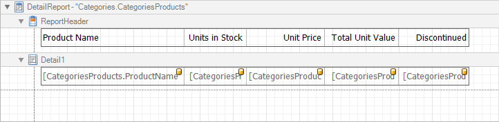
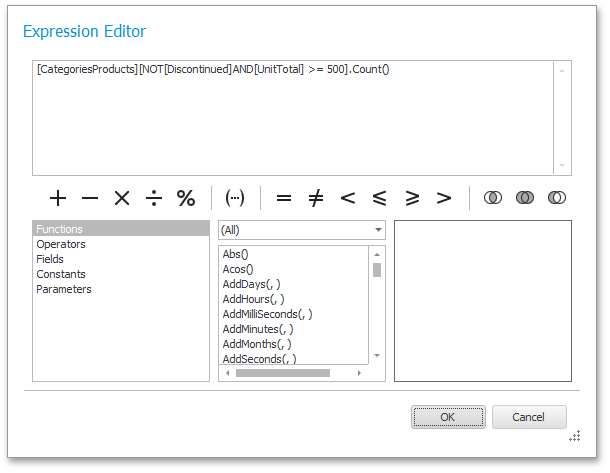

# Calculate an Aggregate Function
This tutorial describes the steps required to create a report with an _aggregate function_. In this example, products that are not discontinued and have a total unit value greater than _$500_ will be displayed.
* Create a [table report](../../../../../../interface-elements-for-desktop/articles/report-designer/report-designer-for-winforms/create-reports/report-types/table-report.md) with a layout similar to that appearing in the following illustration.
	
	
* Create a new [calculated field](../../../../../../interface-elements-for-desktop/articles/report-designer/report-designer-for-winforms/report-editing-basics/add-calculated-fields-to-a-report.md) and set the field name to "AggregateField".
* Click the ellipsis button in the **Expression** section. The **Expression Editor** dialog will appear.
* In this dialog, double click the **[CategoriesProducts]** field, then choose **Functions** | **Aggregate**. Next, double click the _Count()_ function. Insert the following text into the empty square brackets.
	
	_"Not[Discontinued]And[UnitTotal] >= 500"._
	
	
	
	Click **OK** to close the dialog and save the expression.
* Next, add three [Labels](../../../../../../interface-elements-for-desktop/articles/report-designer/report-designer-for-winforms/report-designer-reference/report-controls/label.md) to the [Detail Band](../../../../../../interface-elements-for-desktop/articles/report-designer/report-designer-for-winforms/report-designer-reference/report-bands/detail-band.md) and customize their content, as shown in the following image.
	
	

The report is now ready. Switch to the [Preview Tab](../../../../../../interface-elements-for-desktop/articles/report-designer/report-designer-for-winforms/report-designer-reference/report-designer-ui/preview-tab.md), and view the result.

You can also set [formatting rules](../../../../../../interface-elements-for-desktop/articles/report-designer/report-designer-for-winforms/create-reports/styles-and-conditional-formatting/conditionally-change-a-controls-appearance.md) for the report. The following image shows the sample report. The data rows that are not discontinued and have a total unit value greater than _$500_ are highlighted in red.

