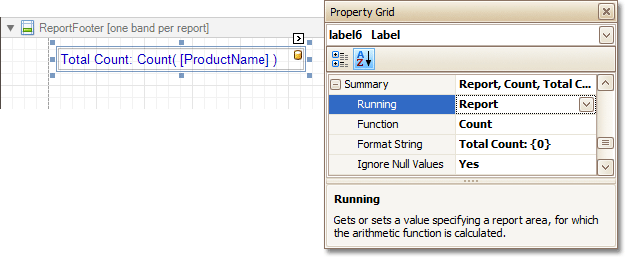
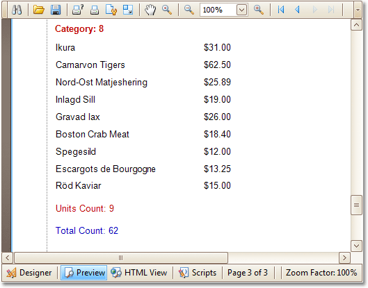

# Count the Number of Records in a Report or a Group
This tutorial describes how to count the number of records in a report or a group. To demonstrate this feature, we'll use a report with grouping, similar the one created in the following tutorial: [Change or Apply Data Grouping to a Report](../../report-editing-basics/change-or-apply-data-grouping-to-a-report.md).

This tutorial consists of the following sections.
* [Count the Number of Records in a Group](#group)
* [Count the Number of Records in a Report](#report)
* [Get the Result](#result)

## <a name="group"/>Count the Number of Records in a Group
To count the number of records in a group, do the following.
* Select the [Label](../../report-designer-reference/report-controls/label.md) in the [Group Footer](../../report-designer-reference/report-bands/grouping-bands.md) area, and in the [Property Grid](../../report-designer-reference/report-designer-ui/property-grid.md), expand its **Summary** category.
	
	
	
	Set the **Running** option to **Group** and the **Function** to **Count**.
	
	The **Ignore NULL values** option is useful for functions like **Count** or **Average**, because the number of elements counted will depend on it.
	
	If required, you can specify the **Format String** (e.g. as **Units Count: {0}**). Note that _value formatting_ is applied to a summary independently of the [general formatting](../../report-editing-basics/change-value-formatting-of-report-elements.md), and has a greater priority.

## <a name="report"/>Count the Number of Records in a Report
To count the number of records in a report, do the following.
1. To add a [Report Footer](../../report-designer-reference/report-bands/report-header-and-footer.md) band to your report, right-click anywhere on it, and in the invoked [Context Menu](../../report-designer-reference/report-designer-ui/context-menu.md), choose **Insert Band** | **ReportFooter**.
	
	
2. Then, place a [Label bound to a data field](../../report-editing-basics/displaying-values-from-a-database-(binding-report-elements-to-data).md) onto it, and in the Property Grid, expand its **Summary** category.
	
	
	
	Set the **Running** option to **Report** and **Function** to **Count**.
	
	The **Ignore NULL values** option is useful for functions like **Count** or **Average**, because the number of elements counted will depend on it.
	
	If required, you can specify the **Format String** (e.g. as **Total Count: {0}**). Note that _value formatting_ is applied to a summary independently of the [general formatting](../../report-editing-basics/change-value-formatting-of-report-elements.md), and has a greater priority.

## <a name="result"/>Get the Result
The report is now ready. Switch to the [Preview Tab](../../report-designer-reference/report-designer-ui/preview-tab.md), and view the result.

