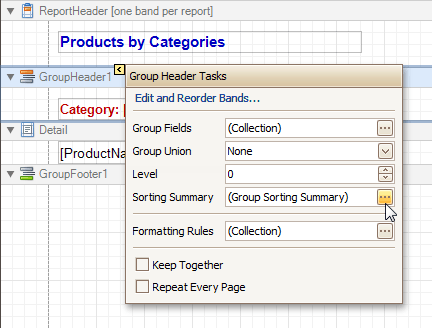
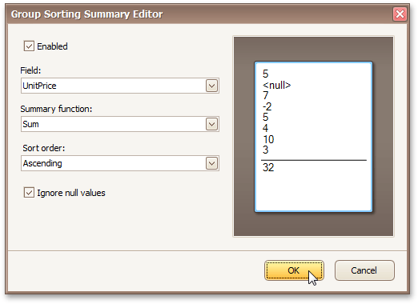
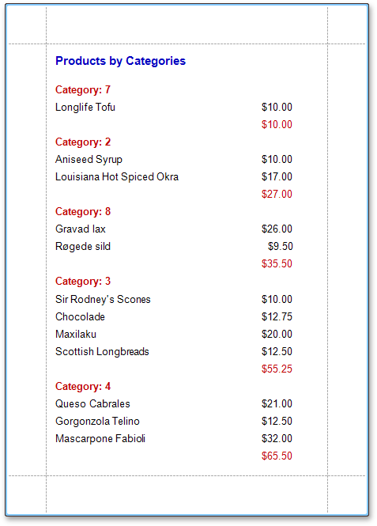

# Sort Groups by a Summary Function Result
This tutorial demonstrates how to sort groups based on the result of a function summary specified for them. To demonstrate this feature, we'll use a report similar to the one created in the following tutorial: [Change or Apply Data Grouping to a Report](../../report-editing-basics/change-or-apply-data-grouping-to-a-report.md).

To sort groups by a summary function result, do the following.
1. Select the Group Header band and click its [Smart Tag](../../report-designer-reference/report-designer-ui/smart-tag.md). In the invoked actions list, click the ellipsis button for the **Sorting Summary** option.
	
	
2. Then, in the invoked **Group Sorting Summary Editor**, check the **Enabled** option, and specify a field and summary function against which the group should be sorted.
	
	
	
	If required, you also can change the default sorting order (from descending to ascending), and choose to ignore null values.

Click **OK** to apply the changes, and switch to the [Preview Tab](../../report-designer-reference/report-designer-ui/preview-tab.md) to view the result.

