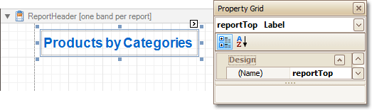

# Add a Cross-Reference
This tutorial demonstrates how to add a _cross-reference_ to your report. A cross-reference is simply a link whose target is located within the current document, which allows you to establish easy navigation through a report. In this example, we place a link at the bottom of each group, leading to the beginning of the report.

To demonstrate this feature, we'll use a report with grouping, similar the one created in the following tutorial: [Change or Apply Data Grouping to a Report](../../../../../../interface-elements-for-desktop/articles/report-designer/report-designer-for-winforms/report-editing-basics/change-or-apply-data-grouping-to-a-report.md).

To create a report with cross-references, do the following.
1. Drop a label onto the created **ReportHeader** band, which will serve as the report's headline. Click the label, to type the desired contents into it. Then, in the [Property Grid](../../../../../../interface-elements-for-desktop/articles/report-designer/report-designer-for-winforms/report-designer-reference/report-designer-ui/property-grid.md), set its **Name** property to **reportTop**.
	
	
2. To accompany the existing [Group Header](../../../../../../interface-elements-for-desktop/articles/report-designer/report-designer-for-winforms/report-designer-reference/report-bands/grouping-bands.md) with the corresponding Footer, in the [Group and Sort Panel](../../../../../../interface-elements-for-desktop/articles/report-designer/report-designer-for-winforms/report-designer-reference/report-designer-ui/group-and-sort-panel.md), check the **Show Footer** option.
	
	Then, drop a label onto it. As it will be the link, change its **Text** to **Top of Report**, and apply the desired formatting to it (e.g. the blue color and underlined text).
	
	Set its **Navigation Target** property to **_self**. Then, if you click the drop-down list of the **Navigation URL** property, you can see the controls available in your report. Choose the one named **reportTop**.
	
	

The report with cross-references is now ready. Switch to the [Preview Tab](../../../../../../interface-elements-for-desktop/articles/report-designer/report-designer-for-winforms/report-designer-reference/report-designer-ui/preview-tab.md) (or, [HTML View Tab](../../../../../../interface-elements-for-desktop/articles/report-designer/report-designer-for-winforms/report-designer-reference/report-designer-ui/html-view-tab.md)), and view the result.

