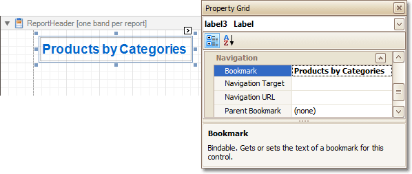

This tutorial describes the steps to create a report with _bookmarks_ (a so-called _Document Map_). This feature allows you to easily navigate through the report during print preview.

To demonstrate the Document Map feature, we'll use a report with grouping, similar the one created in the following tutorial: [Change or Apply Data Grouping to a Report](../../../../../../interface-elements-for-desktop/articles/report-designer/report-designer-for-winforms/report-editing-basics/change-or-apply-data-grouping-to-a-report.md).

To create a report with bookmarks, do the following.
1. Click the Label in the Report Header band, to select it, and in the [Property Grid](../../../../../../interface-elements-for-desktop/articles/report-designer/report-designer-for-winforms/report-designer-reference/report-designer-ui/property-grid.md), set its **Bookmark** property to the same value as its text (i.e. **Products by Categories**).
	
	
2. Now, select the Label in the report's Group Header band. As this control is bound to data, we will bind its **Bookmark** property to the same data field, using the **(Data Bindings)** property.
	
	
	
	Note that as with other bindable properties, you also can apply [value formatting](../../../../../../interface-elements-for-desktop/articles/report-designer/report-designer-for-winforms/report-editing-basics/change-value-formatting-of-report-elements.md) to the **Bookmark** property (e.g. **Category {0}**).
3. Then, for this Label, specify its **Bookmark**, and set the **Parent Bookmark** property to the Report Header's label, to define the document map's hierarchy.
	
	

The report with bookmarks is now ready. Switch to the [Preview Tab](../../../../../../interface-elements-for-desktop/articles/report-designer/report-designer-for-winforms/report-designer-reference/report-designer-ui/preview-tab.md), and view the result.

