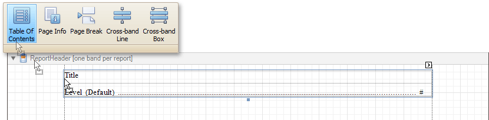
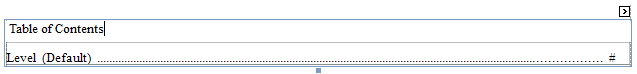
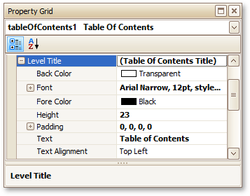
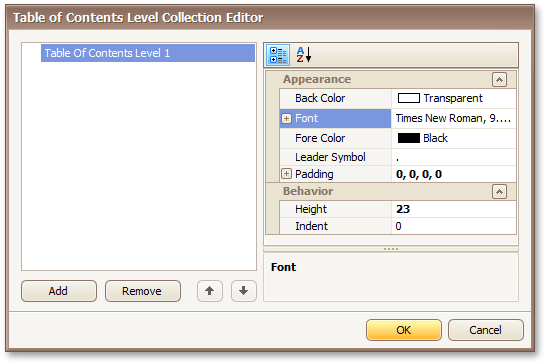
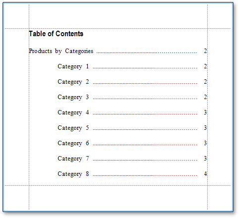

This tutorial describes the steps to create a report with a table of contents. A table of contents is automatically created based on the [bookmarks](../../../../../../interface-elements-for-desktop/articles/report-designer/report-designer-for-winforms/create-reports/report-navigation-and-interactivity-/add-bookmarks.md) existing in a report.

To create a table of contents in a report, do the following.
1. From the [Control Toolbox](../../../../../../interface-elements-for-desktop/articles/report-designer/report-designer-for-winforms/report-designer-reference/report-designer-ui/control-toolbox.md), drop the [Table of Contents](../../../../../../interface-elements-for-desktop/articles/report-designer/report-designer-for-winforms/report-designer-reference/report-controls/table-of-contents.md) control onto the [Report Header band](../../../../../../interface-elements-for-desktop/articles/report-designer/report-designer-for-winforms/report-designer-reference/report-bands/report-header-and-footer.md).
	
	
2. Double-click the title of the table of contents and specify its text.
	
	
3. To customize the title appearance, use the **Level Title** option's settings available in the **Properties** window.
	
	
4. To customize the appearance of all other levels, use the **Level Default** option's settings.
	
	
5. To customize a specific level individually, add a corresponding item to the **Levels** collection of the table of contents.
	
	
6. After adding a new level, you can access and customize its properties.
	
	

The table of contents is now ready. Switch to the [Preview Tab](../../../../../../interface-elements-for-desktop/articles/report-designer/report-designer-for-winforms/report-designer-reference/report-designer-ui/preview-tab.md), and view the result.

