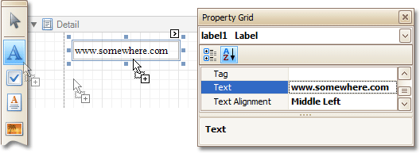

This tutorial demonstrates how to embed a _hyperlink_ into your report.

Note that a label will behave as a hyperlink both in a report's [Print preview](../../../../../../interface-elements-for-desktop/articles/report-designer/report-designer-for-winforms/report-designer-reference/report-designer-ui/preview-tab.md), [HTML preview](../../../../../../interface-elements-for-desktop/articles/report-designer/report-designer-for-winforms/report-designer-reference/report-designer-ui/html-view-tab.md) and when the report is exported to PDF, HTML, MHT, RTF, XLS and XLSX formats.

To insert a hyperlink into your report, do the following.
1. [Create a new report](../../../../../../interface-elements-for-desktop/articles/report-designer/report-designer-for-winforms/create-reports/basic-operations/create-a-new-report.md).
2. Drop a [Label](../../../../../../interface-elements-for-desktop/articles/report-designer/report-designer-for-winforms/report-designer-reference/report-controls/label.md) onto the report, and in the [Property Grid](../../../../../../interface-elements-for-desktop/articles/report-designer/report-designer-for-winforms/report-designer-reference/report-designer-ui/property-grid.md), change its **Text** to the one required for the link.
	
	
	
	In addition, to make the Label look like a typical link, you can change its appearance appropriately (e.g. make it blue and underlined).
3. Now, set its **Navigation Target** to the required value (__blank_, __parent_, __search_, __self_, or __top_), and define the required **Navigation URL**.
	
	

The hyperlink is now ready. Switch to the [Preview Tab](../../../../../../interface-elements-for-desktop/articles/report-designer/report-designer-for-winforms/report-designer-reference/report-designer-ui/preview-tab.md) (or, [HTML View Tab](../../../../../../interface-elements-for-desktop/articles/report-designer/report-designer-for-winforms/report-designer-reference/report-designer-ui/html-view-tab.md)), and view the result.

