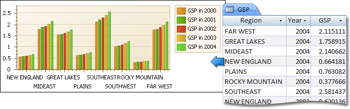
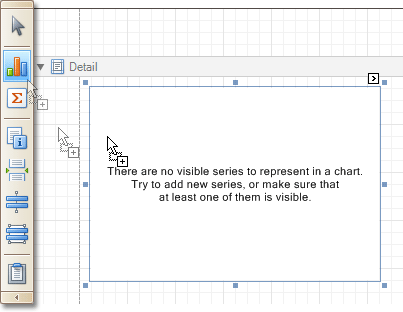
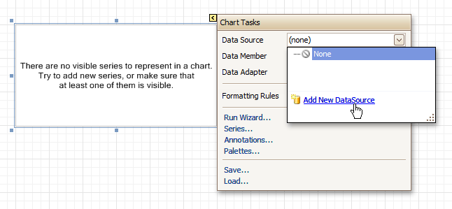
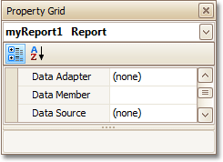
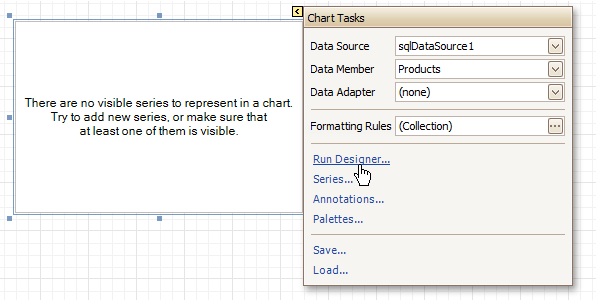
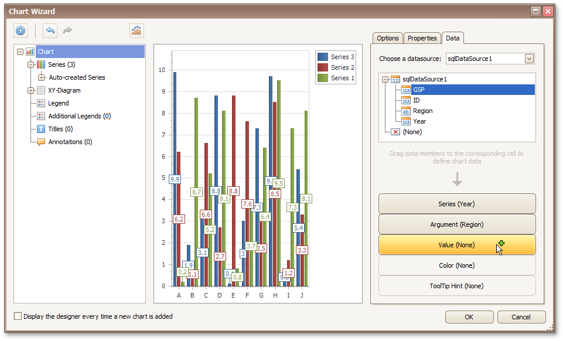
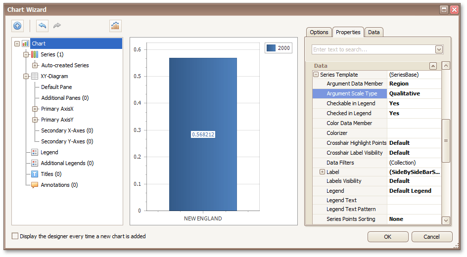
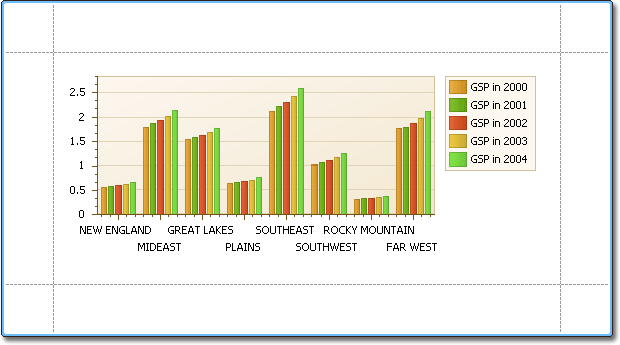

# Chart with Dynamic Series
This document describes how to create a report with a [Chart](../../report-designer-reference/report-controls/chart.md) control bound to data, so that all series are auto-created based on a common _template_, which specifies universal options for all series. This is possible when the data for all series (their names, along with point arguments and values) are stored in the same _data table_.

Note that in this scenario, the _view type_ and certain other settings will be the same for all series.

To adjust a Chart with automatically created series, do the following.
1. [Create a new report](../basic-operations/create-a-new-report.md).
2. Drop the [Chart](../../report-designer-reference/report-controls/chart.md) control from the [Toolbox](../../report-designer-reference/report-designer-ui/control-toolbox.md) onto the report's [Detail band](../../report-designer-reference/report-bands/detail-band.md).
	
	
	
	After you drop the Chart, the **Chart Wizard** is automatically invoked if its "Display the designer every time a new chart is added" option is enabled. At this step, click **Cancel** to close the window, it will be used later.
3. To bind the Chart to a data source, click its [Smart Tag](../../report-designer-reference/report-designer-ui/smart-tag.md). In the invoked actions list, expand the **Data Source** drop-down and click **Add New DataSource**.
	
	
	
	The invoked **Data Source Wizard** will guide you through the process of assigning a data source to the Chart. For detailed instructions on the Wizard's steps, refer to [Binding a Report to Data](../binding-a-report-to-data.md).
	
	After the data source is created, it is assigned to the Chart's **Data Source** property. Its **Data Member** property defines from which table or view of your data source the Chart obtains its data.
	
	> [!NOTE]
	> Since you have placed the Chart in the Detail band, the [report](../../report-designer-reference/report-settings.md)'s **Data Source** property should be set to **None**. Otherwise, the Chart will be repeated at the preview as many times as there are records in the data source.
	> 
	> 
4. Once again, click the Chart's Smart Tag, and in the invoked actions list, click the **Run Designer...** link.
	
	
5. In the invoked **Chart Wizard**, go to the **Data** tab at the right of the designer's window. Choose an existing data source in the dedicated drop-down list and drag-and-drop the required data fields to the corresponding cells.
	
	The **Series** cell specifies the data field, which should provide data for the series names, so that a new series is created for each record in that data field. Use the **Argument** and **Value** cells to define from where the data for point arguments and values is obtained.
	
	
6. Switch to the **Properties** tab and expand the **Series Template** option. As you can see, the **Argument Data Member** and **Value Data Members** properties has been automatically assigned to the corresponding data fields. Make sure that the **Argument Scale Type** and **Value Scale Type** properties are set to appropriate values.
	
	
7. At this point, the chart's data options are completely defined, so in this step, specific additional customization capabilities are described.
	* **Adjust the Series Name Template**
		
		By default, the name for every auto-created series is obtained directly from an appropriate data field in the bound data source. However, you can add some text to the beginning or to the end of every series name using the **Series Name Template** property. For instance, set the **Begin Text** property to "GSP in ".
	* **Customize Axis Labels**
		
		To avoid the overlapping of series labels, expand the Chart's **Series Template** property and set the **Labels Visibility** property to **No**.
	* **Customize the Chart Appearance**
		
		Specify the color settings used to draw the chart's series. For instance, in the **Palette** drop-down list, select **Nature Colors**.
	
	If required, it is possible to customize many other properties for the Chart, which are not described here.

The chart is now ready. Switch to the [Preview Tab](../../report-designer-reference/report-designer-ui/preview-tab.md) and view the result.

