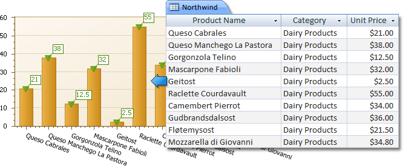
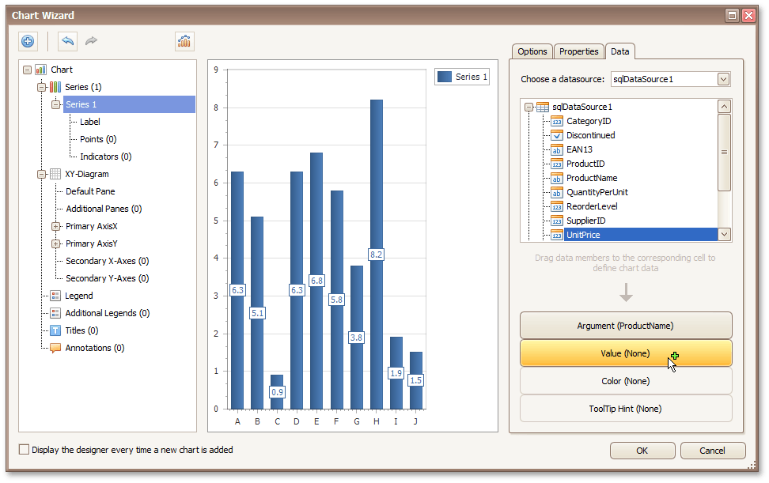
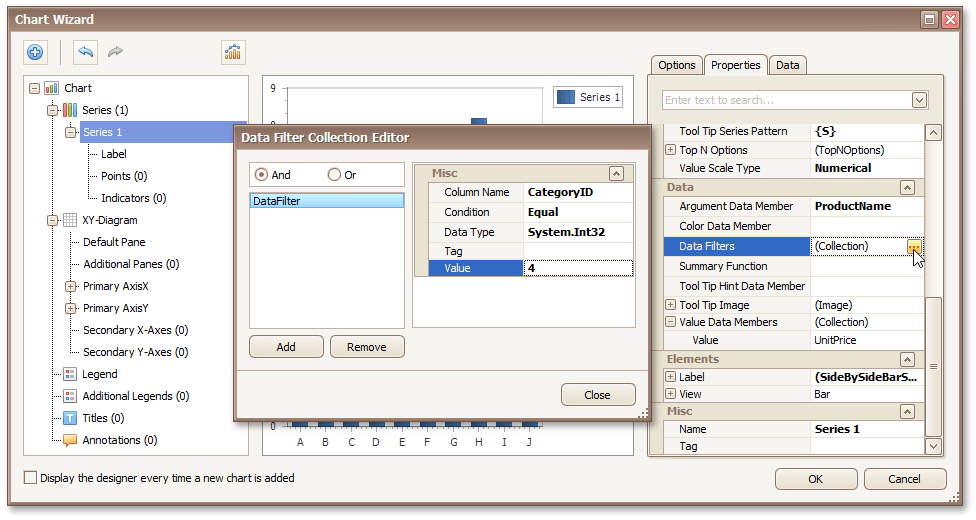
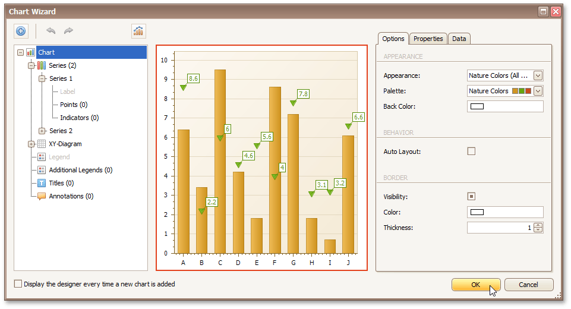

# Chart with Static Series
This document describes how to create a report with a [Chart](../../report-designer-reference/report-controls/chart.md) control bound to data, so that a particular _series_ has its own _data source_ and other settings. To simplify the example, both series obtain their data from the same data source. However, different data sources can be used for different series, if necessary.

This example describes how to construct a chart of products and their prices for a chosen category.

To adjust a Chart by manually creating its series, do the following.
1. [Create a new report](../basic-operations/create-a-new-report.md).
2. Drop the [Chart](../../report-designer-reference/report-controls/chart.md) control from the [Toolbox](../../report-designer-reference/report-designer-ui/control-toolbox.md) onto the report's [Detail band](../../report-designer-reference/report-bands/detail-band.md).
	
	
	
	After you drop the Chart, the **Chart Wizard** is automatically invoked, if its "Display the designer every time a new chart is added" option is enabled. At this step, click **Cancel** to close the window, it will be used later.
3. To bind the Chart to a data source, click its [Smart Tag](../../report-designer-reference/report-designer-ui/smart-tag.md). In the invoked actions list, expand the **Data Source** drop-down, and click **Add New DataSource**.
	
	
	
	The invoked **Data Source Wizard** will guide you through the process of assigning a data source to the Chart. For detailed instructions on the Wizard's steps, refer to [Binding a Report to Data](../binding-a-report-to-data.md).
	
	After the data source is created, it is assigned to the Chart's **Data Source** property. Its **Data Member** property defines the table or view of your data source from which the Chart obtains its data.
	
	> [!NOTE]
	> Since you have placed the Chart in the Detail band, the [report](../../report-designer-reference/report-settings.md)'s **Data Source** property should be set to **None**. Otherwise, the Chart will be repeated at the preview as many times as there are records in the data source.
	> 
	> 
4. Once again, click the Chart's Smart Tag, and in the invoked actions list, click the **Run Designer...** link.
	
	
5. In the invoked **Chart Wizard**, add a new series to the Chart Control. To do this, locate the **Series** element in the chart elements tree and click the plus button. In the invoked list of series types, select the required type (e.g., **Bar**).
	
	
6. The next step is to populate the created series with points. Select the series in the tree and switch to the **Data** tab at the right of the designer's window. Choose an existing data source in the dedicated drop-down list. Then, drag-and-drop the required data fields to the **Argument** and **Value** cells to define the coordinates for series points.
	
	
7. Go to the **Properties** tab to see that the **Argument Data Member** and **Value Data Members** settings are automatically assigned to the corresponding fields.
	
	In addition, you can filter the series data. To do this, click the ellipsis button for the **Data Filters** property, and in the invoked dialog, create and adjust the filtering criteria.
	
	
	
	To save the changes and quit the dialog, click **Close.**
8. Create one more series with the same settings, but this time, select the **Point** view type.
9. Finally, to improve your Chart's appearance, you can make the following adjustments.
	* Remove the Chart's legend, as it shows the same data for both series. To do this, select the Legend in the chart elements tree, and in the **Options** tab, disable the **Visibility** check box.
	* The point labels for **Series 1** are unnecessary, so select the **Label** node under this series and disable the **Visibility** check box.
	* Customize the appearance of the **Series 2** markers (e.g., replace the default circle with the upside-down triangle). For this, select the series, set its **View.Point Marker Options.Kind** property to **Inverted Triangle** and **Size** to **12**).
	* Customize the chart appearance settings. For instance, in the **Palette** drop-down list, select **Nature Colors**.
	
	
	
	If required, it is possible to customize many other properties for the Chart and its elements, which are not described here.

The chart is now ready. Switch to the [Preview Tab](../../report-designer-reference/report-designer-ui/preview-tab.md), and view the result.

