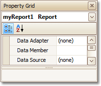
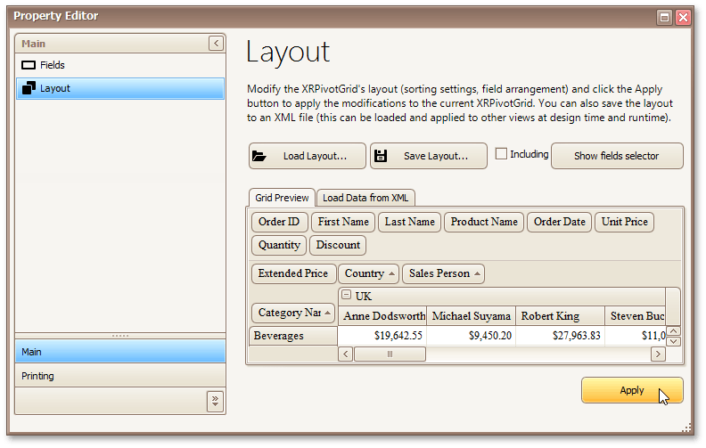
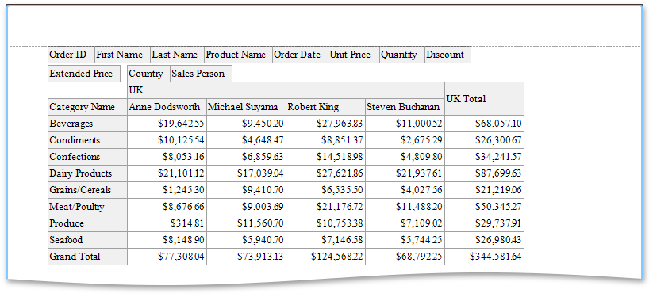
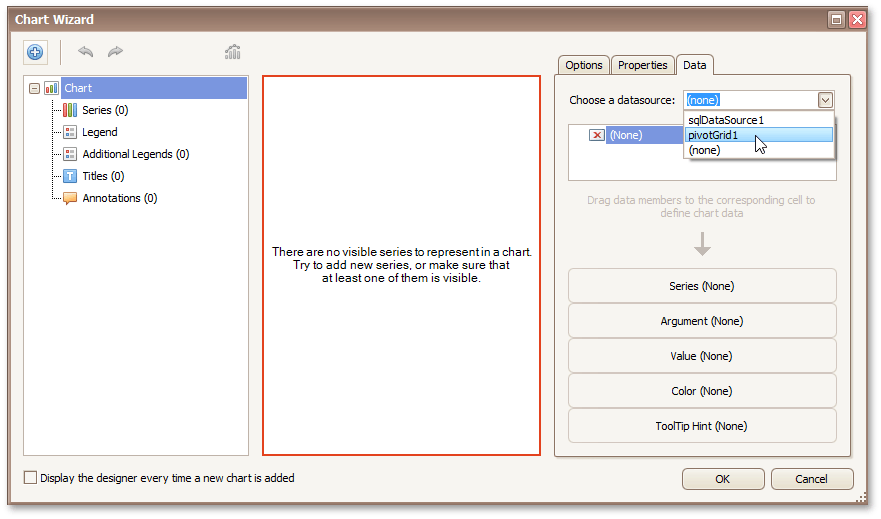

# Cross-Tab Report
This tutorial describes the steps needed to create a _cross-tab report_ using a [Pivot Grid](../../../../../../interface-elements-for-desktop/articles/report-designer/report-designer-for-winforms/report-designer-reference/report-controls/pivot-grid.md) control. This feature should not be confused with the [master-detail report](../../../../../../interface-elements-for-desktop/articles/report-designer/report-designer-for-winforms/create-reports/report-types/master-detail-report-(detail-report-bands).md) or [table report](../../../../../../interface-elements-for-desktop/articles/report-designer/report-designer-for-winforms/create-reports/report-types/table-report.md). Additionally, the document demonstrates how to visualize data displayed in the Pivot Grid by linking it with the [Chart](../../../../../../interface-elements-for-desktop/articles/report-designer/report-designer-for-winforms/report-designer-reference/report-controls/chart.md) control.

## Create a Cross-Tab Report
To create a cross-tab report, do the following.
1. [Create a new report](../../../../../../interface-elements-for-desktop/articles/report-designer/report-designer-for-winforms/create-reports/basic-operations/create-a-new-report.md).
2. Drop the [Pivot Grid](../../../../../../interface-elements-for-desktop/articles/report-designer/report-designer-for-winforms/report-designer-reference/report-controls/pivot-grid.md) control from the [Toolbox](../../../../../../interface-elements-for-desktop/articles/report-designer/report-designer-for-winforms/report-designer-reference/report-designer-ui/control-toolbox.md) onto the report's [Detail band](../../../../../../interface-elements-for-desktop/articles/report-designer/report-designer-for-winforms/report-designer-reference/report-bands/detail-band.md).
	
	
3. To bind the pivot grid to a data source, click its [Smart Tag](../../../../../../interface-elements-for-desktop/articles/report-designer/report-designer-for-winforms/report-designer-reference/report-designer-ui/smart-tag.md), and in the invoked actions list, expand the **Data Source** drop-down and click **Add New DataSource**.
	
	
	
	The invoked **Data Source Wizard** will guide you through the process of assigning a data source to the grid. For detailed instructions on the Wizard's steps, refer to [Binding a Report to Data](../../../../../../interface-elements-for-desktop/articles/report-designer/report-designer-for-winforms/create-reports/binding-a-report-to-data.md), as this process is similar.
	
	After the data source is created, it is assigned to the grid's **Data Source** property. Its **Data Member** property defines the table or view of your data source from which the grid obtains its data.
	
	> Since you have placed the Pivot Grid in the Detail band, the [report](../../../../../../interface-elements-for-desktop/articles/report-designer/report-designer-for-winforms/report-designer-reference/report-settings.md)'s **Data Source** property should be set to **None**. Otherwise, the Pivot Grid will be repeated at the preview as many times as there are records in the data source.
	> 
	> 
4. Once again, click the grid's Smart Tag, and in the invoked actions list, click the **Run Designer...** link.
	
	
5. In the invoked **Property Editor**, click **Retrieve Fields**.
	
	
6. Then, switch to the **Layout** section in the navigation bar on the left.
	
	Drag-and-drop the required fields to the **Row Fields**, **Column Fields** and **Data Items** areas.
	
	
	
	Click **Apply** and close the editor.
7. In the last step, you can set your report's **Vertical Content Splitting** option to **Smart**. This will split the grid's columns precisely by their borders in the Print Preview.
	
	

The cross-tab report is now ready. Switch to the [Preview Tab](../../../../../../interface-elements-for-desktop/articles/report-designer/report-designer-for-winforms/report-designer-reference/report-designer-ui/preview-tab.md) and view the result.

## Integrate with a Chart Control
The next step is to visualize data displayed in the Pivot Grid using a Chart control. To accomplish this, perform the following steps.
1. Drop the [Chart](../../../../../../interface-elements-for-desktop/articles/report-designer/report-designer-for-winforms/report-designer-reference/report-controls/chart.md) control from the [Toolbox](../../../../../../interface-elements-for-desktop/articles/report-designer/report-designer-for-winforms/report-designer-reference/report-designer-ui/control-toolbox.md) onto the report's [Detail band](../../../../../../interface-elements-for-desktop/articles/report-designer/report-designer-for-winforms/report-designer-reference/report-bands/detail-band.md) below the Pivot Grid.
2. After you drop the Chart, the **Chart Wizard** is automatically invoked. Switch to the **Data** tab at the right of the designer's window, and then, choose the pivot grid in the dedicated drop-down list.
	
	
3. After this, all the Chart's binding and layout settings are automatically adjusted. Make sure that **Series**, **Argument** and **Value** cells have been automatically filled with the corresponding fields. Note that values for these fields are generated based on the Pivot Grid's columns, rows and data items, respectively.
	
	
4. To avoid the overlapping of series labels, select the auto-generated series in the chart elements tree, and in the **Options** tab, disable the **Labels Visibility** check box.
	
	
5. If required, you can customize various settings that determine the common behavior for a bridged Chart and Pivot Grid pair. To do this, use the Chart's **Pivot Grid Data Source Options** property. This property, in turn, is linked to the **Options Chart Data Source** property of the associated Pivot Grid.
6. Finally, reset the report's **Vertical Content Splitting** option and switch to the [Preview Tab](../../../../../../interface-elements-for-desktop/articles/report-designer/report-designer-for-winforms/report-designer-reference/report-designer-ui/preview-tab.md) to see the result.
	
	