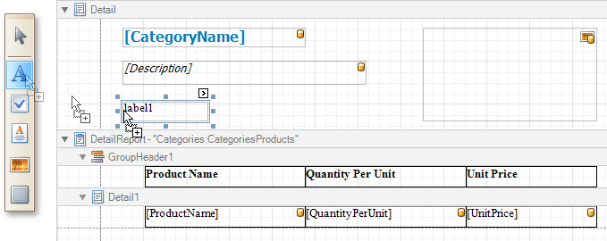
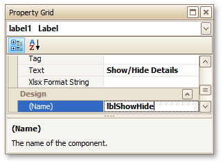
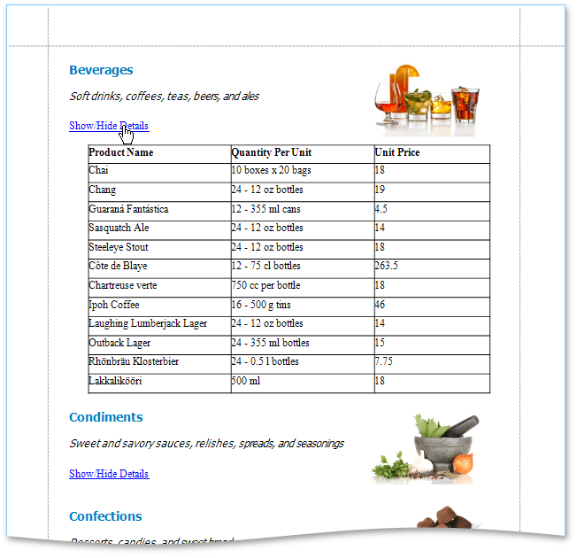

# Drill-Down Report
This tutorial describes the steps needed to create a drill-down report. Drill-down reports display data partially - certain data is hidden and not printed on report pages. Hidden data can be accessed in the [Preview mode](../../report-designer-reference/report-designer-ui/preview-tab.md) by clicking a designated element, such as a label or image.

To create a drill-down report, do the following.
1. [Create a new master-detail report using the Detail Report band](master-detail-report-(detail-report-bands).md)
2. To create a link for showing/hiding the detail report, drag the [Label](../../report-designer-reference/report-controls/label.md) report control from the [Toolbox](../../report-designer-reference/report-designer-ui/control-toolbox.md) and drop it onto the report's [Detail Band](../../report-designer-reference/report-bands/detail-band.md).
	
	
3. Go to the [Property Grid](../../report-designer-reference/report-designer-ui/property-grid.md) and change the label's **Text** to **Show/Hide Details**, and **Name** to **lblShowHide**.
	
	
4. Select the [Detail Report Band](../../report-designer-reference/report-bands/detail-report-band-for-master-detail-reports.md), and in the Property Grid, expand the drop-down list for the band's **DrillDownControl** property. The list displays all report controls available on the report band that is one level above the current band in the report bands hierarchy. Select the **lblShowHide** label in the list. This will make the label expand or collapse the Detail Report band when clicked in Preview mode.
	
	
	
	You can also use the band's **DrillDownExpanded** property to specify whether or not the band is initially expanded. By default, this property is enabled.

The drill-down report is now ready. Switch the report to the Preview mode to view the result.

