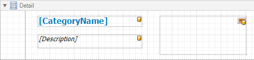
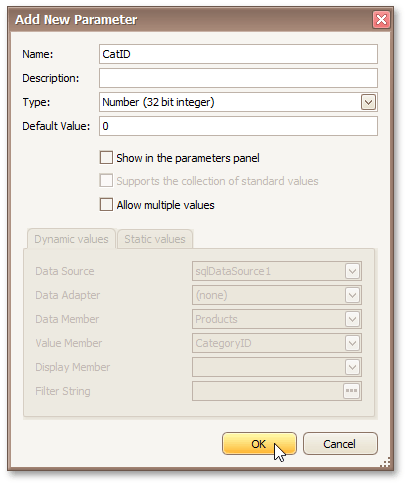
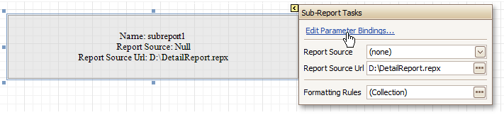

This tutorial describes the steps needed to create a master-detail report using the [Subreport](../../../../../../interface-elements-for-desktop/articles/report-designer/report-designer-for-winforms/report-designer-reference/report-controls/subreport.md) control. For an alternative approach, refer to [Master-Detail Report (Detail Report Bands)](../../../../../../interface-elements-for-desktop/articles/report-designer/report-designer-for-winforms/create-reports/report-types/master-detail-report-(detail-report-bands).md).
 

To create a master-detail report using the subreport controls, do the following.
* [Create a Master Report](#create)
* [Create and Customize a Detail Report](#detail)
* [Embed the Subreport](#subreport)
* [Get the Result](#result)

<a name="create"/>

## Create a Master Report
1. [Create a new report](../../../../../../interface-elements-for-desktop/articles/report-designer/report-designer-for-winforms/create-reports/basic-operations/create-a-new-report.md) and [bind it to a data source](../../../../../../interface-elements-for-desktop/articles/report-designer/report-designer-for-winforms/create-reports/binding-a-report-to-data.md). This report will be used as the master report.
2. Drop the required fields from the [Field List](../../../../../../interface-elements-for-desktop/articles/report-designer/report-designer-for-winforms/report-designer-reference/report-designer-ui/field-list.md) panel onto the [Detail Band](../../../../../../interface-elements-for-desktop/articles/report-designer/report-designer-for-winforms/report-designer-reference/report-bands/detail-band.md). In this example, the following report layout is used.
	
	
3. Drag the [Subreport](../../../../../../interface-elements-for-desktop/articles/report-designer/report-designer-for-winforms/report-designer-reference/report-controls/subreport.md) control from the **Toolbox** and drop it onto the [Detail Band](../../../../../../interface-elements-for-desktop/articles/report-designer/report-designer-for-winforms/report-designer-reference/report-bands/detail-band.md).
	
	

<a name="detail"/>

## Create and Customize the Detail Report
1. Next, [add one more blank report](../../../../../../interface-elements-for-desktop/articles/report-designer/report-designer-for-winforms/create-reports/basic-operations/create-a-new-report.md) and [bind it to the same data source](../../../../../../interface-elements-for-desktop/articles/report-designer/report-designer-for-winforms/create-reports/binding-a-report-to-data.md). It will be used as a detail report.
2. Drop the required fields from the [Field List](../../../../../../interface-elements-for-desktop/articles/report-designer/report-designer-for-winforms/report-designer-reference/report-designer-ui/field-list.md) panel onto the [Detail Band](../../../../../../interface-elements-for-desktop/articles/report-designer/report-designer-for-winforms/report-designer-reference/report-bands/detail-band.md). This tutorial uses the following layout for the detail report.
	
	
3. To add a parameter to the report, right-click the **Parameters** section and choose **Add Parameter** in the [Field List](../../../../../../interface-elements-for-desktop/articles/report-designer/report-designer-for-winforms/report-designer-reference/report-designer-ui/field-list.md).
	
	
4. In the invoked **Add New Parameter** dialog, specify the parameter's options as shown in the image below.
	
	
5. Then, click the report's [Smart Tag](../../../../../../interface-elements-for-desktop/articles/report-designer/report-designer-for-winforms/report-designer-reference/report-designer-ui/smart-tag.md), and in its actions list, click the ellipsis button for the **Filter String** property.
	
	In the invoked **FilterString Editor**, construct an expression where the **Category ID** data field is compared to the **CatID** parameter. To access the parameter, click the icon on the right until it turns into a question mark.
	
	
6. To save the detail report, select **File | Save As** in the [Main Menu](../../../../../../interface-elements-for-desktop/articles/report-designer/report-designer-for-winforms/report-designer-reference/report-designer-ui/main-menu.md). Then, in the invoked standard **Save** dialog, specify the folder and file name.
	
	

<a name="subreport"/>

## Embed the Subreport
1. Next, switch back to the master report. Click the subreport control's smart tag, then click the ellipsis button for the **ReportSource URL** property and select the previously saved detail report.
	
	
2. Then, bind the subreport's **CatID** parameter used as a filtering criterion to the master report's **CategoryID** data field, which will serve as a source of the parameter value. To do this, click the subreport's smart tag and select **Edit Parameter Bindings** in the invoked actions list.
	
	
	
	This will invoke a **Parameter Binding Collection Editor**. Click **Add** to add new binding. In the binding properties list, specify the data field to which you want to bind a subreport parameter and the name of the parameter that you want to bind.
	
	

<a name="result"/>

## Get the Result
The master-detail report is now ready to be generated. You can view the result by switching to the [Preview Tab](../../../../../../interface-elements-for-desktop/articles/report-designer/report-designer-for-winforms/report-designer-reference/report-designer-ui/preview-tab.md).

