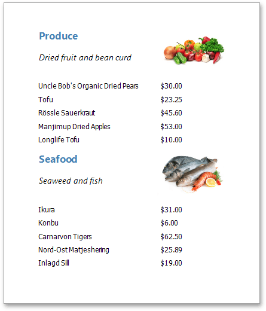

# Master-Detail Report
A report is usually called **Master-Detail** if it is used to display data from a hierarchical data source.

There are two main approaches for creating a master-detail report. The first approach is based on using the Detail Report band. The second approach is to create two different reports and incorporate the detail report into the master report as a subreport.

To see a detailed step-by-step demonstration of how detail report bands and subreports are used to create a master-detail report, refer to the following tutorials.
* [Master-Detail Report (Detail Report Bands)](master-detail-report-(detail-report-bands).md)
* [Master-Detail Report (Subreports)](master-detail-report-(subreports).md)