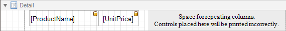

# Multi-Column Report
This tutorial describes the steps to create a _multi-column report_, meaning that each page of the report document is laid out in a specified number of columns.

To demonstrate the multi-column feature, we'll use a report with grouping, similar the one created in the following tutorial: [Change or Apply Data Grouping to a Report](../../../../../../interface-elements-for-desktop/articles/report-designer/report-designer-for-winforms/report-editing-basics/change-or-apply-data-grouping-to-a-report.md).
1. Select the [Detail band](../../../../../../interface-elements-for-desktop/articles/report-designer/report-designer-for-winforms/report-designer-reference/report-bands/detail-band.md), and in the [Property Grid](../../../../../../interface-elements-for-desktop/articles/report-designer/report-designer-for-winforms/report-designer-reference/report-designer-ui/property-grid.md), expand the **Multi-Column Options** section.
	
	First, set the required **Mode**. It determines whether the number of columns is manually specified, or it depends on the fixed column width.
	
	
2. Then, if you've chosen to **Use Column Count**, set the **Column Count** to **2**, and **Column Spacing** to **10**.
	
	The **Direction** determines the order in which records of the same group are processed.
	
	
3. Now, on the Detail band's surface a grey area appears, delimiting the available column's width. Adjust the controls width, so that they fit within the effective borders.
	
	

The multi-column report is now ready. Switch to the [Preview Tab](../../../../../../interface-elements-for-desktop/articles/report-designer/report-designer-for-winforms/report-designer-reference/report-designer-ui/preview-tab.md), and view the result.

