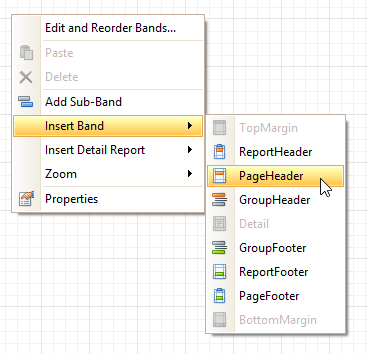

This tutorial describes the steps to create a _table report_, which means that the report's data is arranged into a table-like layout. This feature should not be confused with the [master-detail report](../../../../../../interface-elements-for-desktop/articles/report-designer/report-designer-for-winforms/create-reports/report-types/master-detail-report.md) or [cross-tab report](../../../../../../interface-elements-for-desktop/articles/report-designer/report-designer-for-winforms/create-reports/report-types/cross-tab-report.md).

To create a table report, follow the steps below.
1. [Create a new report](../../../../../../interface-elements-for-desktop/articles/report-designer/report-designer-for-winforms/create-reports/basic-operations/create-a-new-report.md).
2. [Bind the report to a data source](../../../../../../interface-elements-for-desktop/articles/report-designer/report-designer-for-winforms/create-reports/binding-a-report-to-data.md).
3. To add a [Page Header](../../../../../../interface-elements-for-desktop/articles/report-designer/report-designer-for-winforms/report-designer-reference/report-bands/page-header-and-footer.md) to the report, right-click anywhere on the report's surface, and in the invoked [Context Menu](../../../../../../interface-elements-for-desktop/articles/report-designer/report-designer-for-winforms/report-designer-reference/report-designer-ui/context-menu.md), choose **Insert Band** | **Page Header**.
	
	
4. Now, add two [Table](../../../../../../interface-elements-for-desktop/articles/report-designer/report-designer-for-winforms/report-designer-reference/report-controls/table.md) controls to the report's Page Header and [Detail band](../../../../../../interface-elements-for-desktop/articles/report-designer/report-designer-for-winforms/report-designer-reference/report-bands/detail-band.md).
	
	To do this, in the [Toolbox](../../../../../../interface-elements-for-desktop/articles/report-designer/report-designer-for-winforms/report-designer-reference/report-designer-ui/control-toolbox.md), click the **Table** icon. Then, in the Page Header's content area, click and hold down the left mouse button while dragging the mouse cursor across the Detail band.
	
	
	
	As a result, two tables are created. One will be used as a header, and the other one - for the report's detail information.
5. Type the headers into the upper table's cells, and bind the corresponding cells in the detail section to the appropriate data fields. This can be done by simply dropping these fields from the [Field List](../../../../../../interface-elements-for-desktop/articles/report-designer/report-designer-for-winforms/report-designer-reference/report-designer-ui/field-list.md) onto the cells.
	
	
6. Finally, you can customize various properties of the tables, to improve their appearance. For example, using the [Property Grid](../../../../../../interface-elements-for-desktop/articles/report-designer/report-designer-for-winforms/report-designer-reference/report-designer-ui/property-grid.md) you can define their **Borders**, as well as **Background Color**. To customize the cells' text options, use the [Formatting Toolbar](../../../../../../interface-elements-for-desktop/articles/report-designer/report-designer-for-winforms/report-designer-reference/report-designer-ui/formatting-toolbar.md).
	
	A noteworthy feature is the capability to specify [odd-even styles](../../../../../../interface-elements-for-desktop/articles/report-designer/report-designer-for-winforms/create-reports/styles-and-conditional-formatting/use-odd-and-even-styles.md) for the detail table.

The table report is now ready. Switch to the [Preview Tab](../../../../../../interface-elements-for-desktop/articles/report-designer/report-designer-for-winforms/report-designer-reference/report-designer-ui/preview-tab.md), and view the result.

