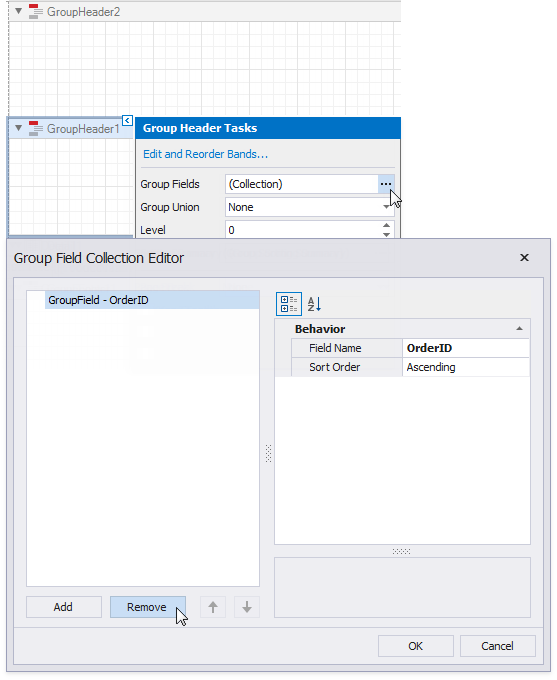
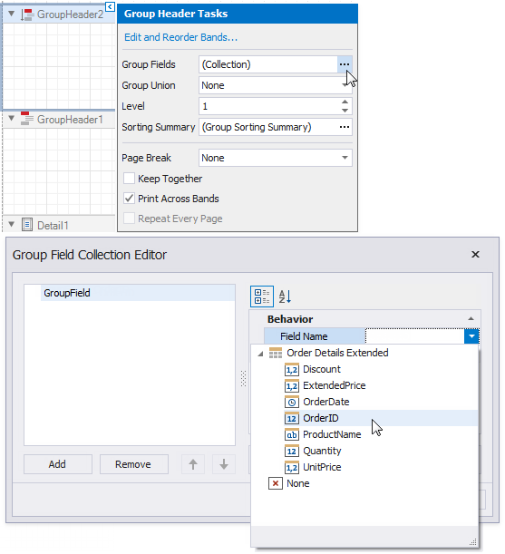

# Reports with Cross-Band Content and Populated Empty Space

This document describes how to create a report with the following layout options:

- Print part of the content across bands (the blue panel);
- Populate the empty space between the detail and footer information with blank rows.

## Initial Report

In this tutorial, the report [groups data](../shape-report-data/group-and-sort-data.md) by a data source field (the report's group field).

The _GroupFooter_ band is displayed at the bottom of the page (the **Print At Bottom** property is enabled). There is an empty space between the _Detail_ band's data and the footer.

## Add Line Numbers

1. Right-click the first cell in the [Detail band](../introduction-to-banded-reports.md)'s table and select **Insert** / **Column to Left** from the context menu.

	

1. Select the new cell and specify the following property values:

	* **Summary**: _Group_
	* **Expression**: _sumRecordNumber()_

	

Each row now includes a number.

## Populate the Empty Space

Populate the empty space between the _Detail_ band's data and footer.

Click the _Detail_ band's smart tag and enable the **Fill Empty Space** property.

The empty space is now populated with numbered lines.

> [!NOTE]
> Set the **Text** properties of the _Detail_ band's controls to display static text within the added lines.

## Add Cross-Band Content to Report Groups

1. Right-click the design surface. Select **Insert Band** / **GroupHeader** from the context menu.

	

	> [!Tip]
	> Choose a _PageHeader_ band instead to display the cross-band content on an entire page.

1. Click the added band's smart tag and enable the **Print Across Bands** property.  This displays the band content on the background of the _GroupHeader1_, _Detail_, and _GroupFooter1_ bands.

	

2. The report's group field is in the _GroupHeader1_ band's **Group Fields** collection. The new band is above _GroupHeader1_ and does not participate in the report's group. Move the group field to the new band.

	- Click _GroupHeader1_'s smart tag, click the **Group Fields** property's ellipsis button and remove the group field from the invoked **Group Field Collection Editor**.

		

	- Click the new band's smart tag, click the **Group Fields** property's ellipsis button and add the group field in **Group Field Collection Editor**.

		

1. Add a [Panel](../use-report-elements/use-basic-report-controls/panel.md) control to the _GroupHeader_. Specify the panel's **Background Color** and drop fields onto the panel.

	

4. Adjust the panel's width and height. The height should match the page height, as the footer is printed at the bottom of the page (the _GroupFooter_'s **Print At Bottom** property is enabled).

	

1. Switch to Print Preview. The panel is printed on the background of the group content.

	

1. Resize the content in other bands to print it side-by-side with the panel.

	

See the final report in Print Preview.

