# Reports with Embedded PDF Content

This tutorial explains how to use the [PdfContent](TODO) control to do the following:

* Append PDF file pages to a report and make their paper kind the same as in the inital report.
* Add sequential page numbers to the report and PDF file pages.
* Include additional information in the embedded PDF file pages.

The image below shows an invoice report that contains information about order items.

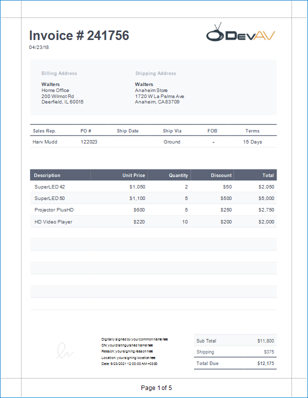

The following image illustrates the first PDF file page embedded to the invoice report. This page has the same paper kind as the initial report. [Report controls](TODO) are used to add item title, item price, line, logo image, and sequential page numbers to this page.

To create the above report with PDF content, follow the steps described in these sections:

* [Create the Main Report](#create-the-main-report)
* [Create a Report with PDF Content](#create-a-report-with-pdf-content)
* [Add the Report with PDF content to the Main Report](#add-the-report-with-pdf-content-to-the-main-report)

## Create the Main Report

1. Create a new Visual Studio project and add a new blank report to it. Refer to the following topic for instructions: .
2. Design the report layout. In this tutorial, we create an invoice report that contains information about order items.
    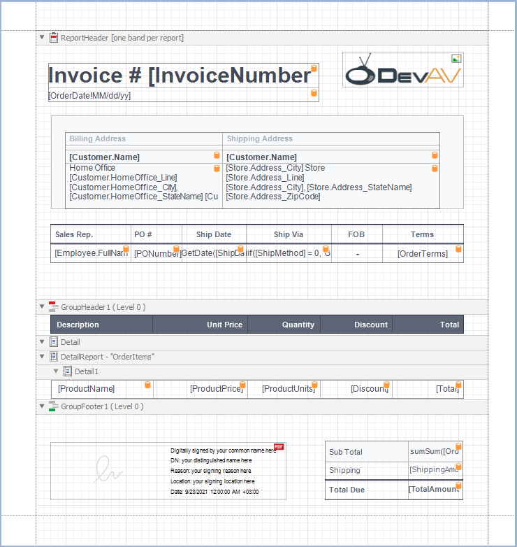

    To supply the report with data, use the following JSON string:

    [!include]

The following image illustrates the main report's **Preview**:

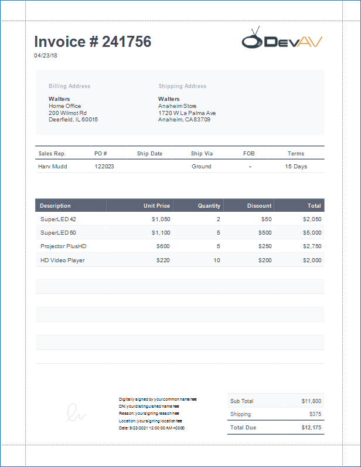

## Create a Report with PDF Content

1. [Add](TODO) a new blank report to your project. Remove the report's margins.

    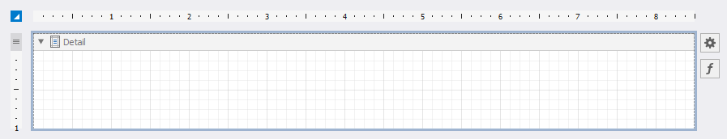

2. Drop the  control from the **Toolbox** onto the *Detail* [band](TODO).

    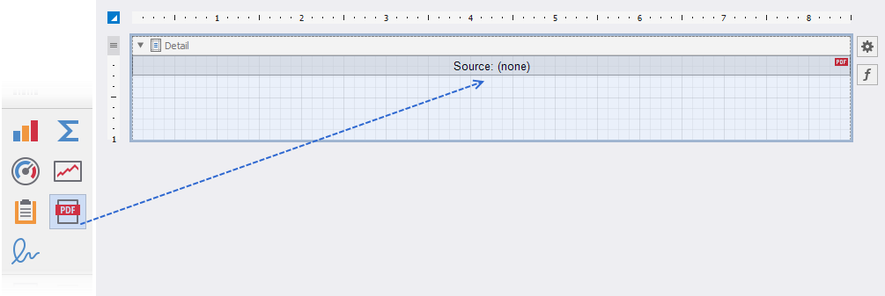

3. Expand the control's smart tag, click the [Source](TODO) or [SourceURL](TODO) property's ellipsis button, and select PDF file. In this demo, we use the following PDF specification: [Specification.pdf](https://github.com/DevExpress-Examples/DataSources/blob/master/Specification.pdf).

    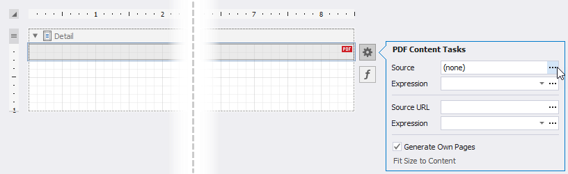

4. Disable the control's [Generate Own Pages](xref:DevExpress.XtraReports.UI.XRPdfContent.GenerateOwnPages) property. Adjust the control size to make PDF content fit the entire *Detail* band. For this, set the *Detail* band's [Height](xref:DevExpress.XtraReports.UI.XRControl.HeightF) to *1095* and the control's [Width](xref:DevExpress.XtraReports.UI.XRControl.WidthF) and [Height](xref:DevExpress.XtraReports.UI.XRControl.HeightF) to *850* and *1095*.

    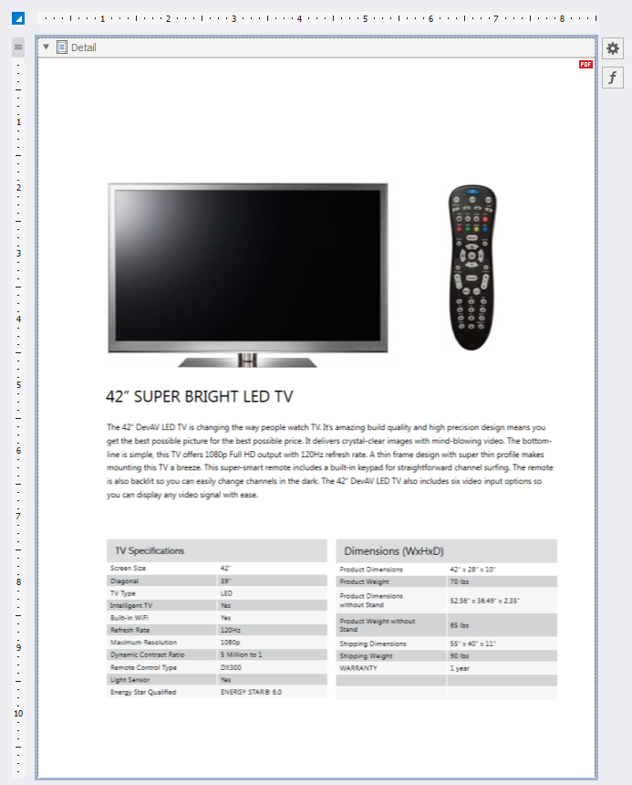

5. Disable the report's [DesignerOptions.ShowExportWarnings](xref:DevExpress.XtraReports.UI.DesignerOptions.ShowExportWarnings) property. [Bind](xref:400379) the report to the following JSON data:
    
    [!include]
    
6. Place two [labels](xref:DevExpress.XtraReports.UI.XRLabel), a [line](xref:DevExpress.XtraReports.UI.XRLine), and a [picture box](xref:DevExpress.XtraReports.UI.XRPictureBox) on the PDF page header as shown below:

    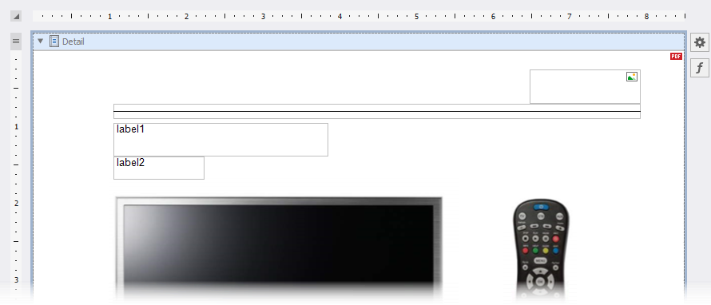

    Use the following locations and sizes:

    {|
    |-
    ! Control Name !! Location !! Size
    |-
    | xrLabel1 || 105, 94 || 280, 44
    |-
    | xrLabel2 || 105, 138 || 118, 30
    |-
    | xrLine1 || 105, 69 || 687, 20
    |-
    | xrPictureBox1 || 647, 24 || 145, 45
    |}

7. Set the line's [Width](xref:DevExpress.XtraReports.UI.XRLine.LineWidth) and [Fore Color](xref:DevExpress.XtraReports.UI.XRControl.ForeColor) to *2* and *Orange* respectively. Assign the following image to the picture box's [Image Source](xref:DevExpress.XtraReports.UI.XRPictureBox.ImageSource) property:

    

    Make xrLabel1's font bold. Set up label appearance as shown in the table below:

    {|
    |-
    ! Control Name !! Font !! Font Size !! Text Property's Expression
    |-
    | xrLabel1 || Segoe UI || 21 || *ProductName*
    |-
    | xrLabel2 || Segoe UI || 12 || *ProductPrice*
    |}

    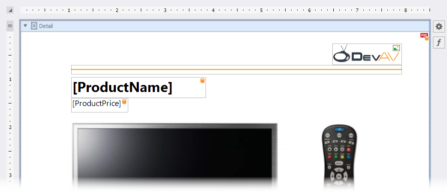

    To display a product name and price of each order item on a corresponding PDF file page, set the [XRPdfContent.PageRange](xref:DevExpress.XtraReports.UI.XRPdfContent.PageRange) property's [expression](xref:403357) to *[DataSource.CurrentRowIndex] + 1*.

    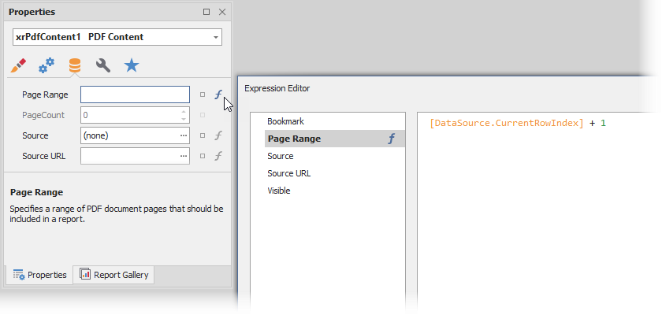

8. Add the [XRPageInfo](xref:DevExpress.XtraReports.UI.XRPageInfo) control to the PDF page footer. Use the following settings for this control:

    {|
    |-
    ! Location !! Size !! Font !! Font Size !! Text Alignment !! Text Format String
    |-
    | 0, 1045 || 850, 50 || Segoe UI || 12 || Middle Center || Page {0} of {1}
    |}

    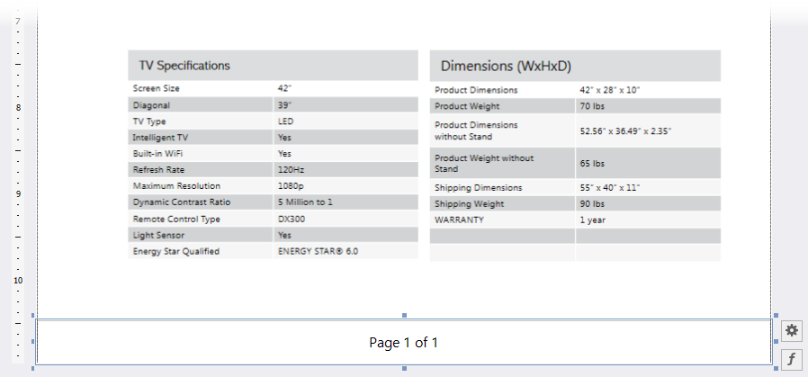

Open **Preview** to show the result. The image below shows the report's first page:

## Add the Report with PDF Content to the Main Report

1. Add a [footer](xref:DevExpress.XtraReports.UI.ReportFooterBand) to the main report. Right-click the design surface, choose **Insert Band**, and select **ReportFooter**.

    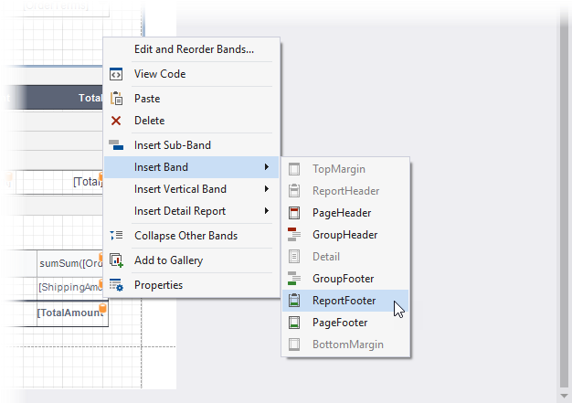

2. Add the  control to the footer. Assign the report with PDF content to the control's [Report Source](xref:DevExpress.XtraReports.UI.SubreportBase.ReportSource) property. Enable the control's [Generate Own Pages](xref:DevExpress.XtraReports.UI.SubreportBase.GenerateOwnPages) property.

    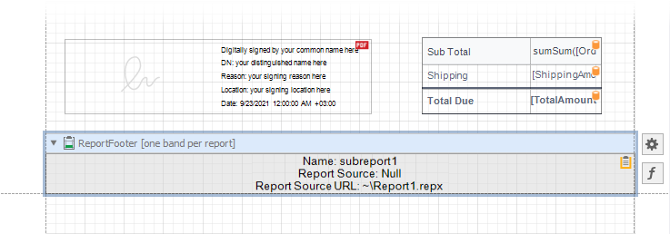

3. Add the [XRPageInfo](xref:DevExpress.XtraReports.UI.XRPageInfo) control to the report's [Bottom Margin](xref:DevExpress.XtraReports.UI.BottomMarginBand) band. Set the control's [Text Alignment](xref:DevExpress.XtraReports.UI.XRControl.TextAlignment) to *Middle Center* and [Text Format String](xref:DevExpress.XtraReports.UI.XRPageInfo.TextFormatString) to *Page {0} of {1}*.

    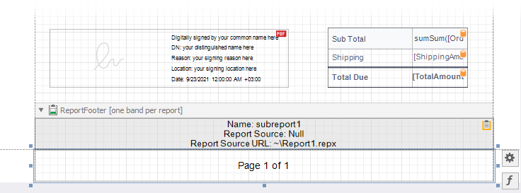

Open **Preview** to show the result.

