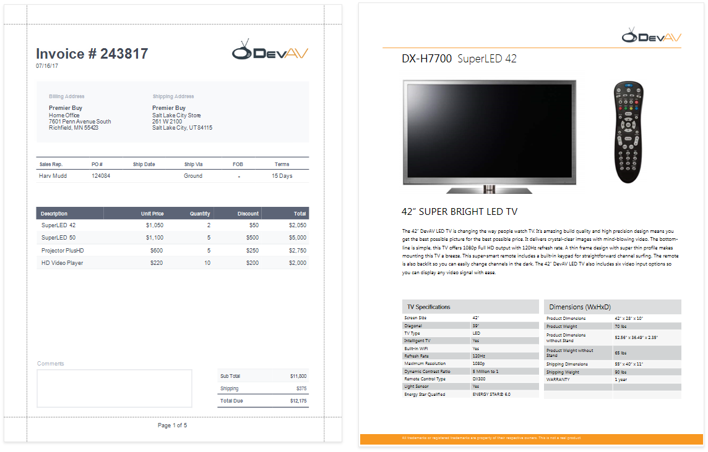
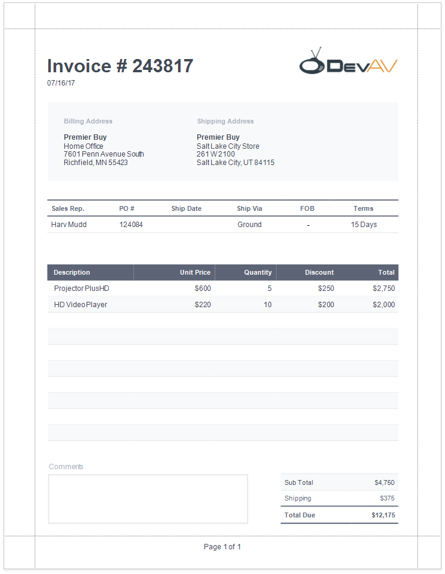

# Reports with PDF Content

This tutorial describes how to add PDF content to a report.

> [!TIP]
> The [Create a Master-Detail Report (Use Subreports)](master-detail-reports-with-detail-report-bands.md) topic describes another way to create a report that merges different documents.

## Create a Report Layout

Create a report that should include PDF content.

In this tutorial, the report shows a purchase order. A **Detail Report** band displays order details and customer information. An inner **Detail Report** band lists products included in an order.

## Add PDF Content

Add a PDF document for each product listed in an order.

1. Add a **Detail Report** band at the location where you want to place PDF content. As PDF content is rendered on separate pages, the report from this tutorial includes this band at the bottom. Bind the new band to the same data member as in the [Create a Report Layout](#create-a-report-layout) section above.

    

1. Drop the **PDF Content** item from the **Toolbox** onto the added band.

    

1. Bind the dropped control to the source of PDF data. Expand the control's smart tag and click the **Expression** property's ellipsis button below the **Source** property. In the invoked **Expression Editor**, select the data source field that stores PDF documents and click **OK**.

    

    > [!TIP]
    > Other options are available to bind the **PDF Content** control to PDF data:  
    > * **Bind to a PDF file**  
    >   Specify the file's path or URL in the control's **Source URL** property. The specified file should be available when a report is generated.
    > * **Save the PDF content in the report**  
    >   Click the **Source** property's ellipsis button and select the file from which to load content.

The report is ready and can be viewed in the **Preview** tab. Each PDF document is printed on a separate page and uses its own page settings.

