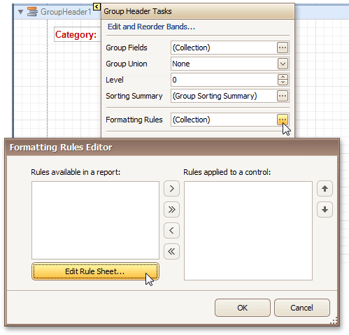
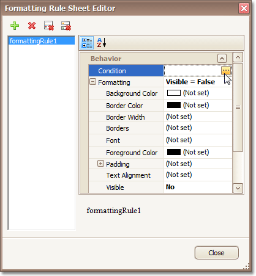
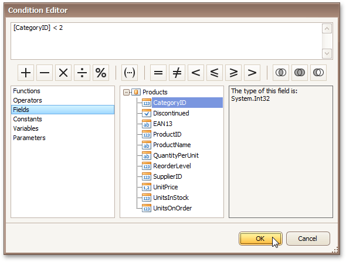
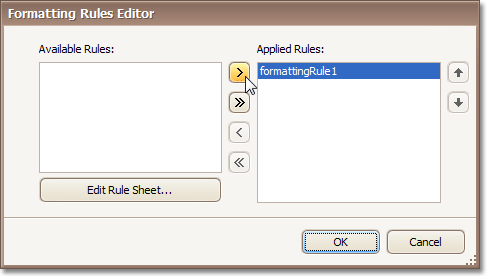
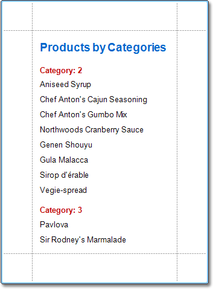

# Conditionally Hide Bands
This tutorial describes how to hide bands if a certain logical condition is met. Note that no [scripts](../miscellaneous/handle-events-via-scripts.md) are required to accomplish this task.

To demonstrate this feature, we'll use a report with grouping, similar to the one created in the following tutorial: [Change or Apply Data Grouping to a Report](../../report-editing-basics/change-or-apply-data-grouping-to-a-report.md).

To conditionally hide bands in a report, do the following.
1. Select the [Group Header](../../report-designer-reference/report-bands/grouping-bands.md), and click its [Smart Tag](../../report-designer-reference/report-designer-ui/smart-tag.md). Then, in the invoked actions list, click the ellipsis button for the **Formatting Rules** option.
	
	
	
	In the invoked **Formatting Rules Editor**, click the **Edit Rule Sheet...** button.
2. Now, in the invoked **Formatting Rule Sheet Editor**, click the  button, to create a new rule. Then, set its **Visible** property to **False**, and click the ellipsis button for the **Condition** property.
	
	
3. Construct the required logical expression (e.g. **[CategoryID] &lt; 2**), and click **OK**.
	
	
	
	To quit the **Formatting Rule Sheet Editor**, click **Close**.
4. Back in the **Formatting Rules Editor**, move the created rule to the dialog's right section (**Applied Rules**), to make it active.
	
	
	
	And, do the same for the report's [Detail band](../../report-designer-reference/report-bands/detail-band.md). That is, click the ellipsis button for its **Formatting Rules** property, and in the invoked dialog, apply the same rule to this band, as well.

Switch to the [Preview Tab](../../report-designer-reference/report-designer-ui/preview-tab.md), and view the result. In our example, you can see that the first category isn't shown. So, the conditional formatting was applied properly.

