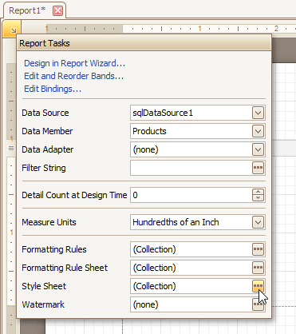
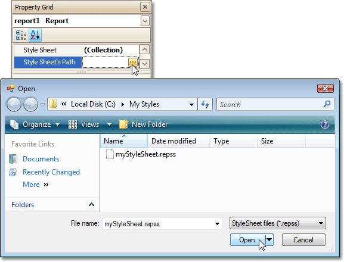
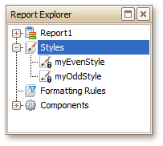

# Store and Restore Style Sheets
This tutorial describes how you can save a report's style sheet into an external file, and then load it back to the report.

You can store a report's style sheet (containing all the report styles) in an external REPSS file. This makes it possible to easily restore a report's appearance from this file. For general information, refer to [Understanding Style Concepts](understanding-style-concepts.md).

To learn how to store and restore report style sheets, do the following.
1. [Create a new report](../basic-operations/create-a-new-report.md) and [bind it to a data source](../binding-a-report-to-data.md).
2. Click the report's [Smart Tag](../../report-designer-reference/report-designer-ui/smart-tag.md), and in the invoked actions list, click the ellipsis button for the **Style Sheet** property.
	
	
3. In the invoked **Styles Editor**, use the  button to create new styles. Specify the desired options (e.g., **Background Color**) for these styles, and click the **Save** button.
	
	
	
	Then, in the invoked **Save** dialog, define a name for the style sheet file (.REPSS), and click **Save**.
4. Next, delete the created styles using the  button, and close the dialog.
5. Select the report, and in the [Property Grid](../../report-designer-reference/report-designer-ui/property-grid.md), click the ellipsis button for the **Style Sheet Path** property. In the invoked **Open** dialog, load the created REPSS file.
	
	
	
	The loaded styles will be displayed inside the **Styles** node of the [Report Explorer](../../report-designer-reference/report-designer-ui/report-explorer.md). These styles cannot be edited in a report, so they are marked as read-only in the Report Explorer and are not displayed in the **Styles Editor**.
	
	
	
	If you then reset the **Style Sheet Path** property, all the styles loaded from the style sheet file will be removed.
	
	Another option for obtaining style sheets from an external file is to use the **Open** button in the **Styles Editor**. In this case, the loaded style sheets will be stored within a report, and will thus be editable.

To learn how you can assign styles to report elements, refer to the [Understanding Style Concepts](understanding-style-concepts.md) and [Use Odd and Even Styles](use-odd-and-even-styles.md) documents.

> [!NOTE]
> Note that the styles loaded from a style sheet file have priority over the styles that exist in a report's style sheet. So, if the styles stored in the report have the same names as the styles loaded from a style sheet file, then the styles from the file will become substitutes for their namesakes.