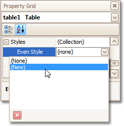
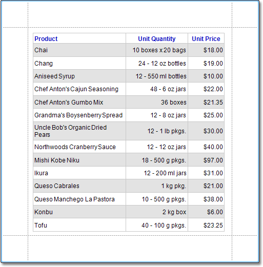

# Use Odd and Even Styles
This tutorial describes how to apply _odd and even styles_ to [report controls](../../report-designer-reference/report-controls.md), e.g. to alternate the background color for each record.

To utilize odd and even styles, do the following.
1. Create a [table report](../report-types/table-report.md).
2. Select the detail table, and in the [Property Grid](../../report-designer-reference/report-designer-ui/property-grid.md), expand its **Styles**.
	
	Invoke the drop-down list for the **Even Style**, and click **(New)**.
	
	
	
	This will create a style and assign it to the control's **Even Style**.
3. Now, expand the **Even Style** property, and adjust the required options, e.g. set the **Background Color** to **ControlLight**.
	
	

If required, perform the same steps, to create and assign an odd style, as well.

Switch to the [Preview Tab](../../report-designer-reference/report-designer-ui/preview-tab.md), and view the result.

