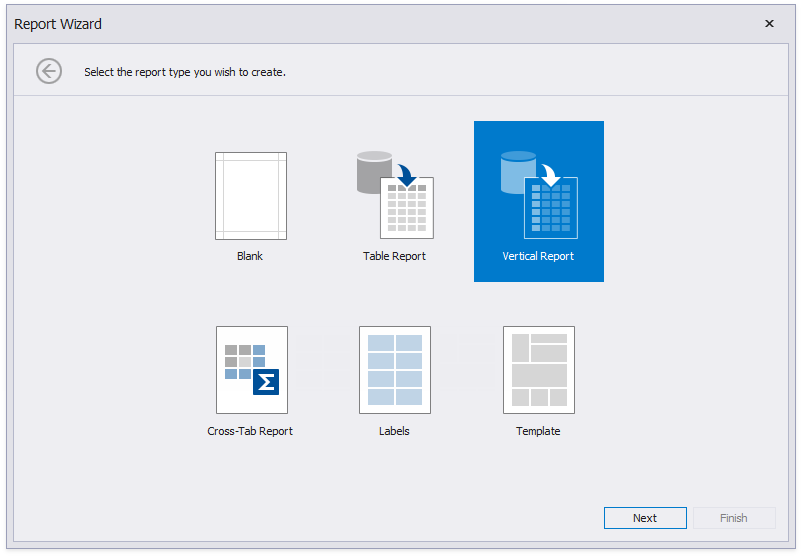

# Vertical Reports

This tutorial describes how to use vertical bands to create a report where record fields are arranged vertically and data records are printed horizontally.

1. [Create a new report](../add-new-reports.md) or [open an existing one](../open-reports.md).

2. [Bind the report](../bind-to-data.md) to a required data source.

3. Click the report's smart tag and choose **Design in Report Wizard...**.

    

    

4. In the invoked [Report Wizard](..\report-designer-tools\report-wizard.md), select **Vertical Report** and click **Next**.

    

5. Select the data fields that should be included in the report.

    

6. Specify group data fields to create a report with grouped data (the report in this tutorial does not have group fields).

7. Add summary fields to the report.

    

8. Change the report page layout to *landscape* so that the vertical table fit the report.

    

9. You can set the report's color scheme.
    
    

10. Specify the report's title.
    
    

Click **Finish** and the generated report opens in the Report Designer.

The wizard adds report controls to the following [bands](..\introduction-to-banded-reports.md):

- **Vertical Header band**  
    Contains a table with a single column that displays headers of the report's data fields.
- **Vertical Details band**  
    Contains a table with a single column that is printed so many times as there are records in the report's data source.
- **Vertical Total band**  
    Contains a table with a single column that has so many labels in cells as there are summary functions you specified for each field in the Report Wizard (only the **sum** function for each field in this demo).

Switch to the Preview tab to see the result.

> [!Tip]
> You can create a vertical report without using the Report Wizard. Right-click the report in the Report Designer and choose **Insert Vertical Band** in the invoked context menu. Refer to the [Introduction to Banded Reports](..\introduction-to-banded-reports.md#vertical-bands) topic for more information.

## Set Vertical Table Options

You can set the following options in the [Property Grid](..\report-designer-tools\ui-panels\property-grid-tabbed-view.md) to modify the vertical table:

- Disable the Vertical Header band's **Repeat Every Page** property to display field headers once - on the first report page.

- Set the Vertical Detail band's **Band Layout** property to *Across Then Down* to print the data records that do not fit a page on the same page, otherwise, they are printed on the next page (as in this demo).

- Specify the Vertical Detail band's **Sort Fields** property to sort the report's data.