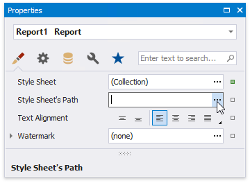
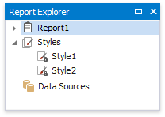

# Report Style Sheets

You can combine [report styles](customize-appearance\report-visual-styles.md) into a style sheet to reuse them between reports. This topic explains how to create and use style sheets in reports.

## Save Styles as Style Sheets

Press the caption button on the toolbar's Styles group to invoke the Styles Editor.

Press the  button to save the styles as a style sheet. This saves the newly created style sheet to an external file with the REPSS extension.

## Add a Style Sheet to a Report

Do the following to embed the styles that a style sheet provides to a report:

- invoke the Styles Editor;

- press  and choose the required style sheet file in the Open dialog.

All the styles become available in the report's toolbar and the Report Explorer.

## Reuse Style Sheets in Reports

You can utilize styles from a style sheet in a report. To do this, specify the path to the style sheet file for the report's **StyleSheetPath** property.

The styles that the attached style sheet contains become available in the report's toolbar and the Report Explorer. Note that you can apply these styles, but **can not edit them**.

