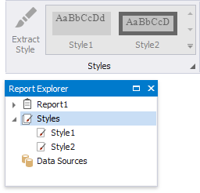

# Report Style Sheets

You can combine [report styles](report-visual-styles.md) into a style sheet and reuse them in reports. This topic explains how to create and use style sheets in reports.

## Save Styles as Style Sheets

Press the caption button in the toolbar's Styles group to invoke the Style Editor.

Press the  button to save the styles as a style sheet (external REPSS file).

## Add a Style Sheet to a Report

Do the following to embed a style sheet's styles in a report:

- invoke the Styles Editor;

- press  and choose a style sheet file in the Open dialog.

All the styles are now available in the report's toolbar and Report Explorer.

## Reuse Style Sheets in Reports

You can utilize styles from a style sheet in a report. To do this, specify the path to the style sheet file in the report's **StyleSheetPath** property.

The attached style sheet's styles are now available in the report's toolbar and the Report Explorer. You **cannot edit these styles**.

