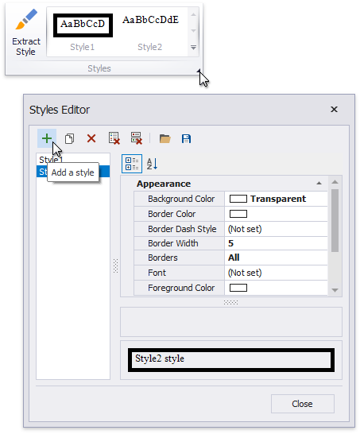
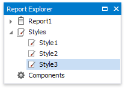
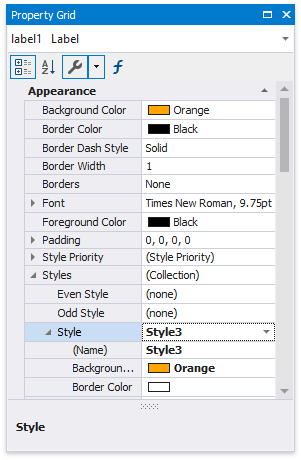
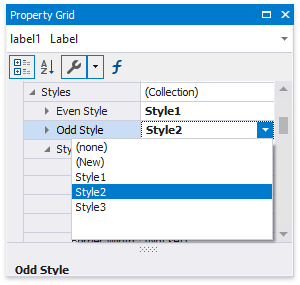
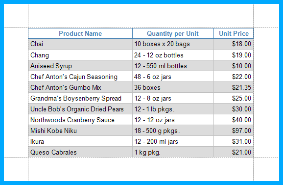
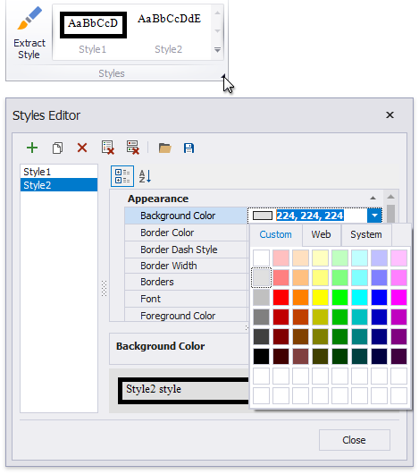
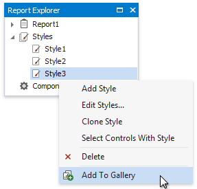
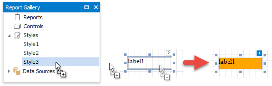

# Report Visual Styles

This topic describes how to combine [appearance properties](appearance-properties.md) into styles and apply them to report elements.

## Create a Report Style

Use the following approaches to create a visual style in your report:

- **Extract a Style**

    Specify a report control's [appearance properties](appearance-properties.md) and press **Extract Style** in the report's [toolbar](..\report-designer-tools\toolbar.md).

    

- **Create a new Style**

    Press the caption button in the toolbar's Styles group to invoke the Styles Editor.

    

    Press the **Add a style** button and specify the new style's appearance properties. Close the Styles Editor.

The created style is added to the Style gallery. You can access this gallery in the following places:

- the Styles group in the report's [toolbar](..\report-designer-tools\toolbar.md);

    

- the Styles group in the [Report Explorer](..\report-designer-tools\ui-panels\report-explorer.md).

    

## Assign a Style to a Report Element

Select a report element and press a style in the toolbar's Styles group.

This assigns the style to the report element's **Style** property.

## Assign Odd and Even Styles

You can use the **Odd Style** and **Even Style** properties to apply different styles to alternating rows in a report.

## Customize a Style

Press the caption button in the toolbar's Styles group to invoke the Styles Editor.

Select a style and modify its property values. All the report elements apply the updated style immediately.

## Style Inheritance

Nested elements inherit their parent element's style if they do not have an applied style. 

## Override Styles

You can specify a different value for a report element's appearance property to override the corresponding property value in the report element's style.

> [!NOTE]
> If you apply [conditional formatting](..\shape-report-data\shape-data-expression-bindings\conditionally-change-a-control-appearance.md), its appearance property values have a higher priority than both the individually specified properties and the style's properties.

## Reuse Styles

You can add a style to the [Report Gallery](..\report-designer-tools\ui-panels\report-gallery.md) and use it across different reports.

In the [Report Explorer](..\report-designer-tools\ui-panels\report-explorer.md), right-click a style and choose **Add to Gallery**.

The styles that the Report Gallery includes are available across reports. Drag a style from the **Report Gallery** to a report element.

This embeds the style to the report and set's the report element's **Style** property.

> [!NOTE]
> You can combine styles into [style sheets](report-style-sheets.md) and reuse them in reports.
