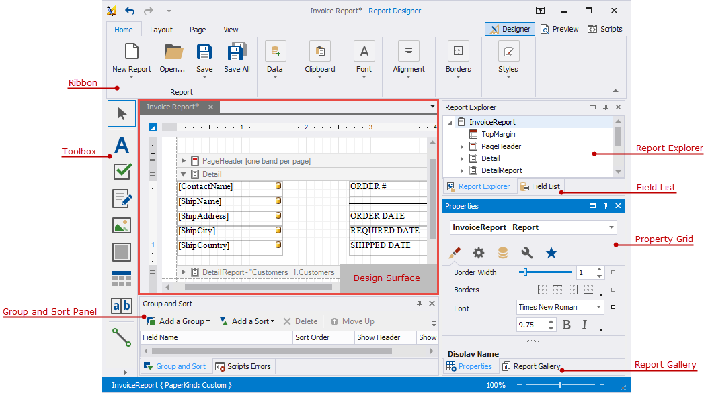
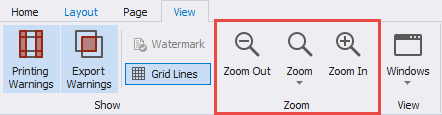

# First Look at the Report Designer

The _design surface_ displays a report's structure and contents. You can use the tools on the Report Designer's panels to design the report:

- access the report's data source schema in the [Field List](report-designer-tools\ui-panels\field-list.md);

- drop report controls from the [Toolbox](report-designer-tools\toolbox.md) to the design surface;

- use the [Ribbon](report-designer-tools\toolbar.md) toolbar and [Property Grid](report-designer-tools\ui-panels\property-grid.md) to set up the report controls;

- access the report's elements in the [Report Explorer](report-designer-tools\ui-panels\report-explorer.md);

- use the [Group and Sort](report-designer-tools\ui-panels\group-and-sort-panel.md) panel to manage the report's group and sort settings.

A blank report's design surface displays page margins and an empty [detail band](introduction-to-banded-reports.md).

Use the zoom panel to change the Report Designer's default zoom factor.

Switch to the **Preview** tab. This opens a [Print Preview](preview-print-and-export-reports.md) and displays the generated report document with the data source's data.

Switch to the **Scripts** tab to manage and customize [report scripts](use-report-scripts.md).
