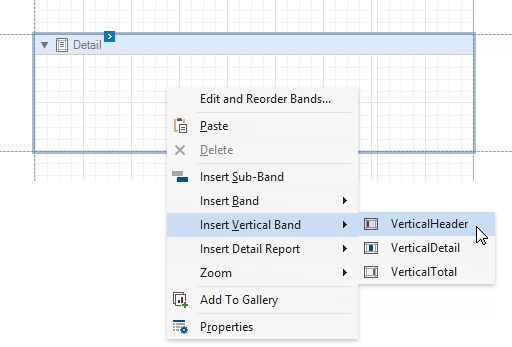
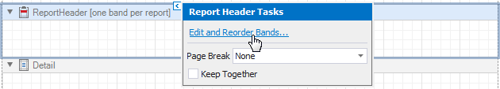
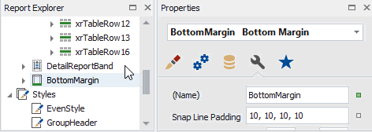
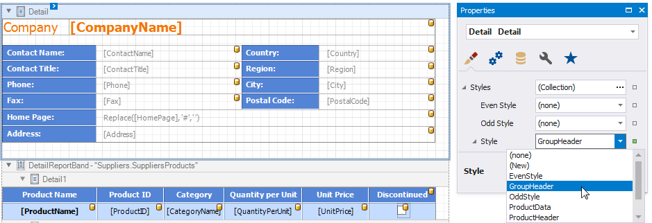

# Introduction to Banded Reports

Banded reports provide a generalized report layout notion. When you preview a banded report, a report document is generated based on the report layout and data source.

## Report Bands

A report layout consists of bands that contain report controls and define their location on document pages. A blank report contains the following bands:

- The **Detail Band** is printed for every record in a data source unless you filtered the data.

    Every report should have a detail band, and you cannot delete it.

- The **Top Margin** and **Bottom Margin** bands. These bands are repeated once on every document page.

You can also add the following bands:

- **Report Header** and **Report Footer**  

    The **Report Header** is the report's first band (margins are "out-of-page" zones). Use this band to display the report's name, company logo, [date of creation, username](add-extra-information.md), etc.

    The **Report Footer** is placed before the Page Footer and Bottom Margin on the report's last page. You can use the Report Footer band for report [summaries](shape-report-data\calculate-summaries\calculate-a-summary.md) or conclusions.
    
- **Page Header** and **Page Footer**

    These bands are at the top and bottom of every page in a report. They display information that should be printed on every page.

- **Group Header** and **Group Footer**

    These bands are above and below each [group](shape-report-data\group-and-sort-data.md). The [Group and Sort Panel](report-designer-tools\ui-panels\group-and-sort-panel.md) create these bands automatically.

> [!TIP]
> Only the detail and group bands can be used to display dynamic data source contents. Other bands display titles, summaries, and [extra information](add-extra-information.md).

The following image illustrates a sample report layout and the [Report Explorer](report-designer-tools\ui-panels\report-explorer.md) that reflects the report's structure:

## Add a Detail Band to a Master-Detail Band

Use the **Detail Report** band to create hierarchical [master-detail reports](create-reports/master-detail-reports-with-detail-report-bands.md). Detail report bands provide detailed information about each record in the master report's detail band (for example, orders shipped to each customer). You can create such reports when master-detail relationships are defined between data source tables:

The Detail Report band is a separate report (subreport) with its own data source and different bands. A report can have any number of detail reports that can also be nested.

The following image illustrates a master-detail report and the [Report Explorer](report-designer-tools\ui-panels\report-explorer.md) that reflects the report's structure:

## Vertical Bands

You can replace the Detail band with the Vertical Header, Vertical Detail and Vertical Total bands to display record fields vertically and print data records horizontally - from left to right (and vise versa if the report's RTL mode is enabled).

To add vertical bands to your report, right-click the report in the Report Designer and choose **Insert Vertical Band** in the invoked context menu.

> [!Note]
> If your report's **Detail** band contains report controls, this band and all these controls are lost when you add a vertical band (the same behavior takes place in the opposite situation).

The following vertical bands are available:

- **Vertical Header**    
    Contains headers of the report's data fields. These headers are arranged vertically.
- **Vertical Details**   
    This band is printed for every record in a data source unless you filtered the data. The records are displayed one after another in a horizontal direction.
- **Vertical Total**   
    This band is placed at the rightmost position (leftmost when RTL is enabled). You can use the Vertical Total band for report [summaries](shape-report-data\calculate-summaries\calculate-a-summary.md) or conclusions.

You can use the [Report Wizard](report-designer-tools\report-wizard.md) to create a report with vertical bands. Refer to the [Vertical Reports](create-reports\vertical-reports.md) topic for instructions on how to create a report with vertical bands.

## Create Band Copies

You can create functional copies of a band, for example, to display different contents based on a specific condition. To do this, add **sub-bands** to bands.

> [!TIP]
> See [Lay out Dynamic Report Content](lay-out-dynamic-report-content.md) for details on how to specify the location of bands' content on document pages.

## Manage Report Bands
### Expand or Collapse Bands in the Report Designer

Click the arrow button on a band's title to collapse or expand that band.

Click **Collapse All** on the [Toolbar](report-designer-tools/toolbar.md)'s [View Tab](report-designer-tools/toolbar.md#view-tab) to collapse all bands in a report. Click **Expand All** to expand all report bands.

Right-click a band and select **Collapse Other Bands** from the context menu to collapse all bands except the clicked band.

### Hide Bands in the Report Document

You can avoid printing band content in a document. To do this, select the band and set the band's **Height** property to zero or disable its **Visible** property in the [Property Grid](report-designer-tools\ui-panels\property-grid-tabbed-view.md).

### Remove Bands

Select a band on the report design surface and press DELETE. This removes the band and all its content.

### Add Bands

To add a band, right-click a report's design surface, and in the invoked context menu, choose **Insert Band**.

You can insert a detail report band if the report's data source has [master-detail relations](create-reports/master-detail-reports-with-detail-report-bands.md).

### Access the Bands Collection

Click the **Edit and Reorder Bands** context link in a report's smart tag to access the report's bands collection.

This command is also available in a band's context and smart tag menus.

The invoked editor allows you to reorder bands and change their properties.

Alternatively, use the [Report Explorer](report-designer-tools/ui-panels/report-explorer.md) to edit and reorder bands. Select a band and edit its properties in the **Property Grid**.

Drag a band to change its order or move inside/outside of another band. The drop targets are highlighted when you drag a band over them.

You can drag bands to the following targets:

| Dragged Band | Drop Targets |
| --- | --- |
| **SubBand** | All bands except **TopMargin** and **BottomMargin** |
| **GroupHeader**, **GroupFooter** | **XtraReport** (root node), **DetailReport** |
| **DetailReport** | **XtraReport** (root node), **DetailReport** |

## Apply Styles to Bands

Select a band and switch to the **Property Grid**. Expand the **Styles** group and set the **Style** property to the style name.

As an alternative, you can drag a style from the [Report Explorer](report-designer-tools/ui-panels/report-explorer.md) onto a band. This is applicable to all bands except **DetailReport**.

